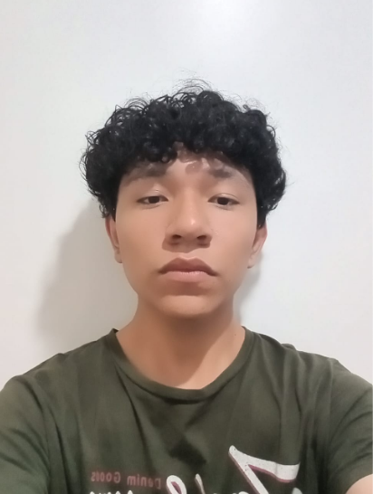

# 1.1. Startup Profile

Esta sección presenta a Titan, la startup responsable de AniTec, y resume la orientación que guiará la evolución del producto durante el curso de Fundamentos de Arquitectura de Software. El equipo tomará como punto de partida la solución web desarrollada previamente y la transformará progresivamente en una solución empresarial cloud-native basada en microservicios, Domain-Driven Design (DDD) y el método Attribute-Driven Design (ADD). Los perfiles de los integrantes permiten identificar los conocimientos y habilidades disponibles para abordar este proceso.

## 1.1.1. Descripción del Startup

Titan es una startup de base tecnológica orientada a resolver problemas de gestión, trazabilidad y colaboración dentro del sector ganadero. Su propuesta busca acercar capacidades digitales a pequeños y medianos productores y a los veterinarios que los atienden, considerando las condiciones reales del trabajo de campo: información dispersa, baja alfabetización digital, conectividad intermitente y necesidad de consultar datos de manera rápida y segura.

El principal producto de la startup es AniTec, una plataforma que centraliza la información sanitaria, operativa y económica relacionada con el ganado. La solución existente constituye la línea base funcional del proyecto. Durante este curso será refactorizada para evolucionar de una aplicación monolítica modular hacia una arquitectura empresarial orientada a microservicios, con servicios desplegables de manera independiente, contratos REST documentados mediante OpenAPI, persistencia delimitada por servicio y mecanismos de integración síncrona y asíncrona.

El ecosistema objetivo de AniTec estará compuesto por:

- Una aplicación móvil Android enfocada en las tareas de campo de ganaderos y veterinarios.
- Vistas web administrativas para la consulta y actualización de información.
- Una API Gateway como punto de entrada controlado a las capacidades del sistema.
- Microservicios alineados con los bounded contexts de identidad, gestión ganadera, sanidad, operaciones, telemetría IoT, suscripciones y analítica.
- Infraestructura cloud con seguridad, observabilidad, escalabilidad y automatización del despliegue.

El trabajo arquitectónico se realizará de forma iterativa. Los architectural drivers, atributos de calidad, restricciones y riesgos del producto orientarán las decisiones mediante ADD. DDD permitirá conservar límites de dominio explícitos y evitar que la separación técnica de los microservicios pierda relación con las necesidades del negocio.

**Misión:** Facilitar una gestión ganadera trazable, segura y accesible mediante soluciones digitales que ayuden a productores y veterinarios a registrar información confiable, coordinar actividades sanitarias y tomar mejores decisiones.

**Visión:** Consolidar a AniTec como una plataforma cloud-native confiable para la gestión ganadera en el Perú y, progresivamente, en Latinoamérica, capaz de evolucionar mediante servicios independientes, interoperables y adaptados a las condiciones del trabajo rural.

**Objetivo de la startup para el curso:** Diseñar, implementar, validar y desplegar la evolución arquitectónica de AniTec aplicando microservicios, DDD, ADD y patrones cloud, demostrando mediante escenarios medibles que la solución mejora atributos como modificabilidad, disponibilidad, seguridad, rendimiento y escalabilidad.

## 1.1.2. Perfiles de los integrantes del equipo

<table>
  <tr>
    <td width="30%" align="center">
      
    </td>
    <td width="70%">
      <h3>Manuel Fernando Joao Castro Picón</h3>
      <h4>U20231G159</h4>
      

        Mi nombre es Manuel Fernando Joao Castro Picón, tengo 20 años y vivo en Chaclacayo, Lima – Perú; actualmente estudio el séptimo ciclo de Ingeniería de Software en la UPC porque me apasiona la tecnología y todo lo innovador que se puede crear con ella, especialmente a través de la programación; en mi tiempo libre disfruto ver anime, leer mangas o novelas ligeras, además de jugar fútbol con mis amigos y con mi equipo en campeonatos, y también me gusta escuchar música, hacer ejercicio y practicar otros deportes; finalmente, me comprometo a ser responsable y atento en las labores del equipo, aportando siempre mi mayor esfuerzo para lograr los objetivos en conjunto.
      

    </td>
  </tr>

   <tr>
    <td width="30%" align="center">
      
    </td>
    <td width="70%">
      <h3>Josep Eliu Melgarejo Quiroz</h3>
      <h4>u202315165</h4>
      

        Mi nombre es Josep Eliu Melgarejo Quiroz, tengo 21 años y mi lugar de nacimiento es Huaral pero vivo actualmente en Lima - San miguel, me encuentro cursando el 5to ciclo de la carrera de ingenieria de software en la UPC debido a que siempre me fascino el tema tecnologico, y como era un apasionado por lo juegos que luego me conllevaron a conocer el mundo de la programacion decidi estudiar mi carrera. Me comprometo a siempre apoyar y motivar a mis compañeros en hacer el mejor trabajo posible y dar el 100% de capacidad en este trabajo
      

    </td>
  </tr>
   <tr>
    <td width="30%" align="center">
      
    </td>
    <td width="70%">
      <h3>Santiago Armando Baldeon Vivar</h3>
      <h4>u202319881</h4>
      

        Mi nombre es Santiago Armando Baldeon y tengo 20 años. Actualmente estoy cursando la carrera de Ingeniería de Software en la Universidad Peruana de Ciencias Aplicadas. En mi caso elegí esta carrera porque desde chico sentí gran pasión por la tecnología y siempre quise ser alguien importante en este mundo, brindando mis aportes a la humanidad. Creo que voy por buen camino y espero en un futuro cumplir estos sueños y objetivos que tengo. 
      

    </td>
  </tr>

 
</table>
