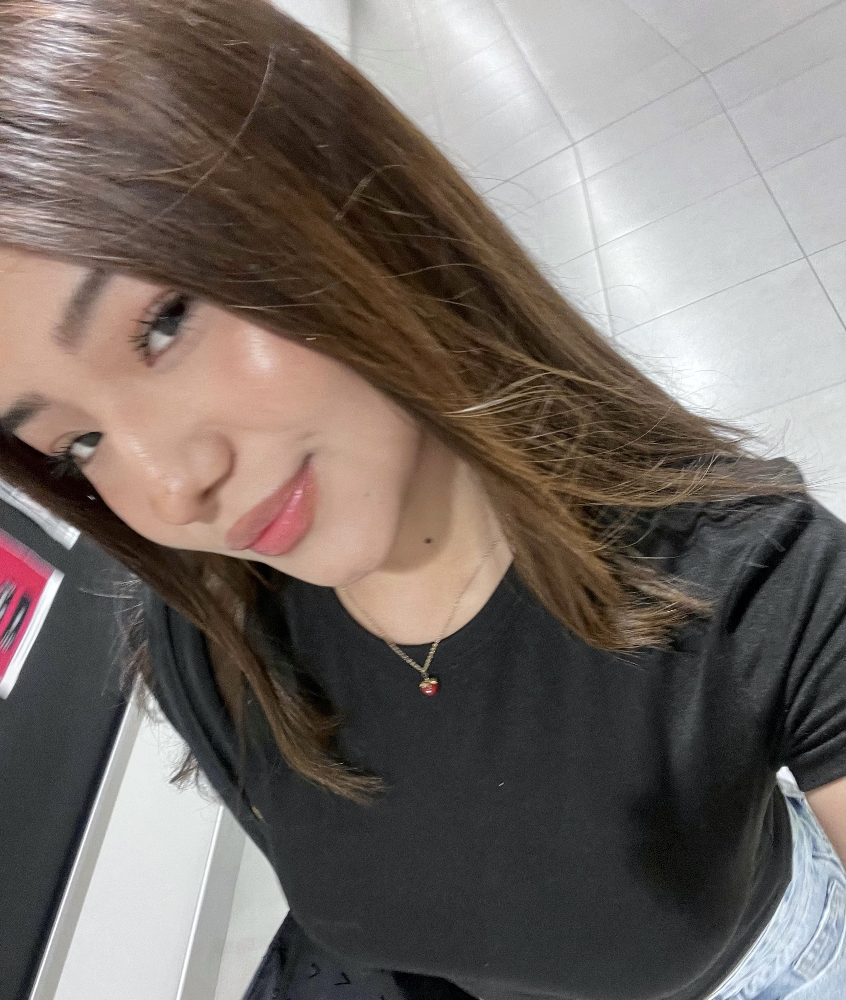
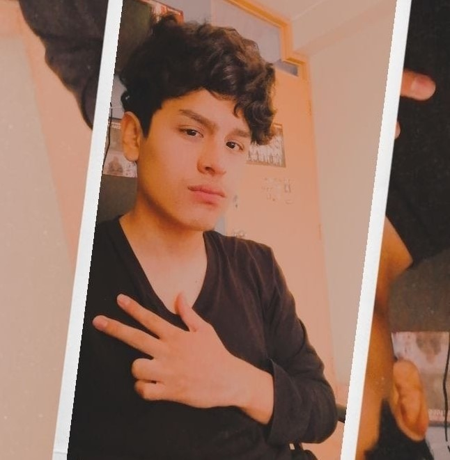
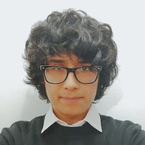

# 1.1. Startup Profile

Esta sección presenta a Titan, la startup responsable de AniTec, y resume la orientación que guiará la evolución del producto durante el curso de Fundamentos de Arquitectura de Software. El equipo tomará como punto de partida la solución web desarrollada previamente y la transformará progresivamente en una solución empresarial cloud-native basada en microservicios, Domain-Driven Design (DDD) y el método Attribute-Driven Design (ADD). Los perfiles de los integrantes permiten identificar los conocimientos y habilidades disponibles para abordar este proceso.

## 1.1.1. Descripción del Startup

Titan es una startup de base tecnológica orientada a resolver problemas de gestión, trazabilidad y colaboración dentro del sector ganadero. Su propuesta busca acercar capacidades digitales a pequeños y medianos productores y a los veterinarios que los atienden, considerando las condiciones reales del trabajo de campo: información dispersa, baja alfabetización digital, conectividad intermitente y necesidad de consultar datos de manera rápida y segura.

El principal producto de la startup es AniTec, una plataforma que centraliza la información sanitaria, operativa y económica relacionada con el ganado. La solución existente constituye la línea base funcional del proyecto. Durante este curso será refactorizada para evolucionar de una aplicación monolítica modular hacia una arquitectura empresarial orientada a microservicios, con servicios desplegables de manera independiente, contratos REST documentados mediante OpenAPI, persistencia delimitada por servicio y mecanismos de integración síncrona y asíncrona.

El ecosistema objetivo de AniTec estará compuesto por:

- Una aplicación móvil Android enfocada en las tareas de campo de ganaderos y veterinarios.
- Vistas web administrativas para la consulta y actualización de información.
- Una API Gateway como punto de entrada controlado a las capacidades del sistema.
- Microservicios alineados con los bounded contexts de identidad, gestión ganadera, sanidad, operaciones, telemetría IoT, suscripciones y analítica.
- Infraestructura cloud con seguridad, observabilidad, escalabilidad y automatización del despliegue.

El trabajo arquitectónico se realizará de forma iterativa. Los architectural drivers, atributos de calidad, restricciones y riesgos del producto orientarán las decisiones mediante ADD. DDD permitirá conservar límites de dominio explícitos y evitar que la separación técnica de los microservicios pierda relación con las necesidades del negocio.

**Misión:** Facilitar una gestión ganadera trazable, segura y accesible mediante soluciones digitales que ayuden a productores y veterinarios a registrar información confiable, coordinar actividades sanitarias y tomar mejores decisiones.

**Visión:** Consolidar a AniTec como una plataforma cloud-native confiable para la gestión ganadera en el Perú y, progresivamente, en Latinoamérica, capaz de evolucionar mediante servicios independientes, interoperables y adaptados a las condiciones del trabajo rural.

**Objetivo de la startup para el curso:** Diseñar, implementar, validar y desplegar la evolución arquitectónica de AniTec aplicando microservicios, DDD, ADD y patrones cloud, demostrando mediante escenarios medibles que la solución mejora atributos como modificabilidad, disponibilidad, seguridad, rendimiento y escalabilidad.

## 1.1.2. Perfiles de los integrantes del equipo

<table>
  <tr>
    <td width="30%" align="center">
      
    </td>
    <td width="70%">
      <h3>Luciana Celeste Sanchez Silva</h3>
      <h4>U202215979</h4>
      

        Mi nombre es Luciana Celeste Sanchez Silva, tengo 20 años y vivo en Lima. En la actualidad, me encuentro estudiando el 6to ciclo de la carrera de ingeniería de software en la UPC debido a que desde una edad temprana tuve una fascinación relacionada con el uso de la tecnología y la programación. En mi tiempo libre trato de crecer y expandir mi conocimiento en todas las áreas posibles. De igual forma, me gusta nadar, escuchar música y tocar la guitarra. Me comprometo a colaborar en todo momento con la elaboración de esta startup, y llegar a un trabajo sobresaliente. Mis habilidades son: responsabilidad, resolución de problemas, y disciplina.
      

    </td>
  </tr>

   <tr>
    <td width="30%" align="center">
      
    </td>
    <td width="70%">
      <h3>Josep Eliu Melgarejo Quiroz</h3>
      <h4>u202315165</h4>
      

        Mi nombre es Josep Eliu Melgarejo Quiroz, tengo 21 años y mi lugar de nacimiento es Huaral pero vivo actualmente en Lima - San miguel, me encuentro cursando el 5to ciclo de la carrera de ingenieria de software en la UPC debido a que siempre me fascino el tema tecnologico, y como era un apasionado por lo juegos que luego me conllevaron a conocer el mundo de la programacion decidi estudiar mi carrera. Me comprometo a siempre apoyar y motivar a mis compañeros en hacer el mejor trabajo posible y dar el 100% de capacidad en este trabajo
      

    </td>
  </tr>

   <tr>
    <td width="30%" align="center">
      
    </td>
    <td width="70%">
      <h3>Abigail Nadhim Raymundo Villarroel</h3>
      <h4>U202318001</h4>
      

        Mi nombre es Abigail Nadhim Raymundo Villarroel, tengo 20 años y vivo en Lima. Actualmente estoy cursando el 5° ciclo de Ingeniería de Software, avanzando algunos cursos del ciclo superior. Desde siempre me ha apasionado crear, diseñar y programar para ofrecer soluciones, me gusta aprender constantemente para ampliar mis conocimientos y perfil profesional. Además, me encuentro en el nivel intermedio de inglés y me interesan mucho los idiomas, por lo que también estoy aprendiendo francés y portugués. En mi tiempo libre, disfruto dibujar, bailar y cantar, actividades que me ayudan a mantener mi creatividad y energía. Me comprometo a aportar con responsabilidad y dedicación al equipo, trabajar de manera colaborativa y contribuir a que juntos podamos desarrollar un proyecto sobresaliente. Mis principales habilidades incluyen creatividad, disciplina y trabajo en equipo, cualidades que aplico para lograr resultados efectivos y de calidad.
      

    </td>
  </tr>

   <tr>
    <td width="30%" align="center">
      
    </td>
    <td width="70%">
      <h3>Bruno Aldair Huaman Gallardo</h3>
      <h4>U202117762</h4>
      

        Mi nombre es Bruno Aldair Huaman Gallardo, tengo 21 años y vivo en Lima. Actualmente soy estudiante de Ingeniería de Software, me apasiona transformar ideas en realidades funcionales; desde el diseño de arquitecturas de red hasta la implementación de sistemas inteligentes. Soy una persona que valora el aprendizaje continuo, lo que me ha llevado a dominar herramientas como SQL Server, Node.js y Java, además de mantenerme en constante mejora de mi nivel de inglés para fortalecer mi perfil global. Me distingo por mi autodisciplina y mentalidad analítica, lo que me permite abordar desafíos técnicos con orden y eficiencia. Busco sumar al equipo no solo mis conocimientos en desarrollo, sino también mi compromiso con la calidad y la mejora continua. Soy un convencido de que la tecnología, cuando se maneja con creatividad y rigor, puede optimizar cualquier entorno.
      

    </td>
  </tr>

   <tr>
    <td width="30%" align="center">
      
    </td>
    <td width="70%">
      <h3>Jorge Brayan Ayala Fernandez</h3>
      <h4>U20241C030</h4>
      

        Mi nombre es Jorge Brayan Ayala Fernandez, tengo 20 años y vivo en Lima - Comas. Actualmente estoy cursando el 5to ciclo de la carrera de Ingeniería de Software. Me encanta examinar diversas problemáticas y crear soluciones a los retos que ocurren en el día a día. Me desempeño principalmente en el área de desarrollo web, mobile y desktop en lo cuales tuve experiencia anteriormente trabajando para proyectos relacionados a ello donde se desplegaron aplicaciones a producción satisfaciendo las demandas de los clientes en ese entonces. En cuanto a mis pasatiempos, me encanta salir a hacer todo tipo de deporte, escuchar música, mirar películas, series y programar activamente. En la medida de lo posible aportaré al grupo de manera colaborativa en las diversas tareas que haya para mejorar el producto que estamos creando.
      

    </td>
  </tr>
</table>
