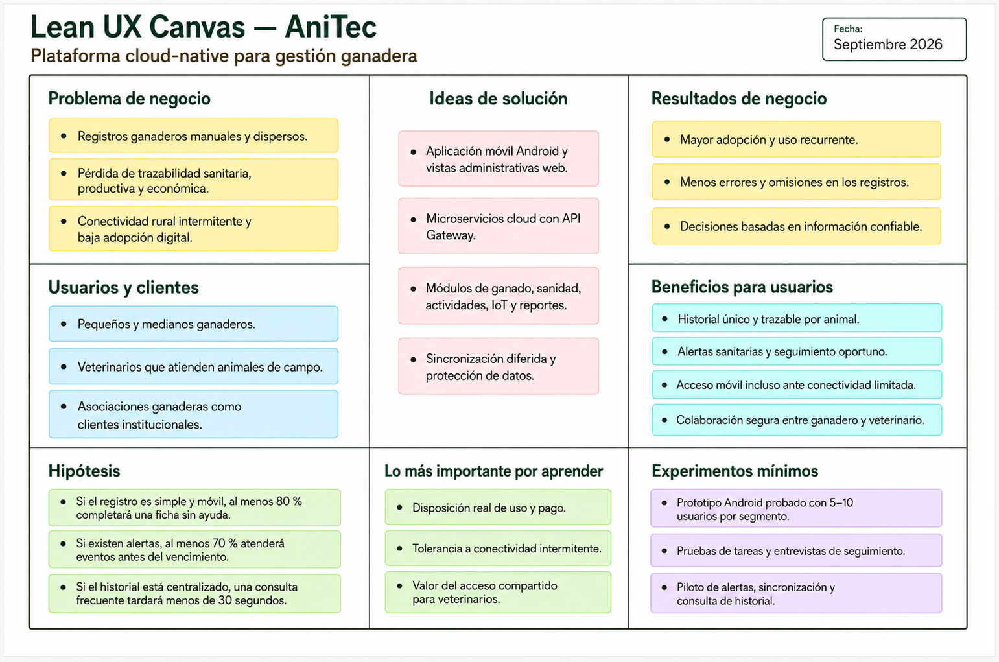

# 1.2. Solution Profile

Esta sección define el producto que soportará el modelo de negocio de Titan, explica el problema que busca resolver y establece las principales decisiones de alcance que guiarán su evolución durante el curso. La propuesta combina la perspectiva de negocio y experiencia de usuario de Lean UX con una evolución técnica basada en microservicios, Domain-Driven Design (DDD), Attribute-Driven Design (ADD) y arquitectura cloud-native.

## 1.2.1. Nombre del producto

El producto se denomina **AniTec**. El nombre combina la idea de gestión animal con el uso de tecnología y comunica de forma breve el propósito de la solución: facilitar el registro, seguimiento y análisis de información ganadera.

AniTec será una plataforma digital multicanal compuesta por una aplicación móvil Android para tareas de campo, vistas web administrativas y servicios backend desplegados en la nube. Su propuesta de valor es ofrecer a ganaderos y veterinarios una fuente de información única, trazable y segura para coordinar el cuidado de los animales y tomar decisiones sanitarias, productivas y económicas con menor dependencia de cuadernos, hojas de cálculo o conversaciones dispersas.

La solución desarrollada previamente funciona como línea base. En este curso se realizará su evolución desde un monolito modular hacia una arquitectura orientada a microservicios. Esta transformación permitirá que las capacidades principales del negocio puedan evolucionar y desplegarse de forma independiente, manteniendo contratos de integración explícitos y atributos de calidad verificables.

## 1.2.2. Antecedentes y Problemática

La caracterización preliminar del problema se realizó mediante la técnica **5W + 2H**: What, When, Where, Who, Why, How y How Much.

### Qué (What)

Pequeños y medianos ganaderos registran información sanitaria, productiva y económica mediante cuadernos, hojas sueltas, archivos de cálculo y mensajes. Esta dispersión dificulta reconstruir el historial de un animal, recordar controles sanitarios, compartir información con el veterinario y tomar decisiones con datos completos.

Los veterinarios que trabajan en campo también reciben información fragmentada o incompleta. Cuando no existe un historial confiable deben invertir tiempo en recopilar antecedentes o tomar decisiones con evidencia limitada.

Desde la perspectiva técnica, la solución inicial de AniTec concentra sus módulos en una única aplicación backend y una única base de datos. Aunque esta línea base permitió validar funcionalidades, limita el despliegue independiente, el escalamiento selectivo, el aislamiento de fallos y la evolución autónoma de los bounded contexts.

### Cuándo (When)

El problema aparece durante todo el ciclo de manejo del animal: registro, alimentación, vacunación, tratamiento, seguimiento, traslado y comercialización. Se vuelve especialmente crítico durante emergencias sanitarias, campañas de vacunación, visitas veterinarias y momentos en los que la conectividad es limitada.

### Dónde (Where)

La problemática se manifiesta principalmente en unidades ganaderas rurales y semiurbanas del Perú, así como en asociaciones de productores y servicios veterinarios que atienden animales en campo. La información puede originarse en lugares sin una conexión estable y ser consultada posteriormente desde una vivienda, consultorio u oficina administrativa.

### Quién (Who)

Los actores directamente afectados son:

- Pequeños y medianos ganaderos responsables del manejo diario de los animales.
- Veterinarios que realizan atención clínica y sanitaria en campo.
- Trabajadores o técnicos autorizados que apoyan las operaciones del hato.
- Asociaciones ganaderas que requieren información consolidada para brindar asistencia o seguimiento.

El segmento inicial estará formado por pequeños y medianos ganaderos y por los veterinarios que atienden sus animales. Las asociaciones se consideran clientes institucionales potenciales para una etapa posterior.

### Por qué (Why)

Las principales causas identificadas son la falta de una fuente única de información, el uso de herramientas no especializadas, la baja alfabetización digital de una parte de los usuarios, el costo percibido de adoptar nuevas soluciones y las limitaciones de conectividad rural. A esto se suma la dificultad de compartir información sanitaria de manera controlada entre productores y veterinarios.

En la línea base técnica, la concentración de capacidades en un solo backend genera acoplamiento operativo: un cambio, despliegue o fallo puede afectar a todo el sistema. El nuevo curso brinda la oportunidad de rediseñar esta estructura a partir de los límites del dominio y de los atributos de calidad prioritarios.

### Cómo (How)

AniTec abordará el problema mediante una aplicación móvil Android orientada a operaciones de campo, vistas administrativas web y una plataforma backend cloud-native. La solución permitirá registrar animales, consultar historiales, administrar eventos sanitarios, coordinar actividades, integrar datos de dispositivos IoT y visualizar indicadores.

El backend evolucionará hacia microservicios alineados con bounded contexts. Un API Gateway centralizará el acceso de los clientes; los contratos REST se documentarán con OpenAPI; cada servicio será responsable de sus datos; y los procesos que atraviesen varios servicios utilizarán mecanismos de integración síncrona o eventos asíncronos según sus necesidades de consistencia, disponibilidad y rendimiento.

### Cuánto (How Much)

El mercado potencial es significativo. El Ministerio de Desarrollo Agrario y Riego informó en 2023 que el Perú contaba con **452 218 productores de ganado vacuno lechero** y que **85,9 %** eran pequeños productores con menos de diez cabezas de ganado. Estas cifras respaldan la necesidad de soluciones accesibles para unidades productivas de menor escala.

La conectividad condiciona la experiencia de uso. Según el Instituto Nacional de Estadística e Informática, durante el primer trimestre de 2025 el **52,4 %** de la población rural de seis o más años utilizó Internet, frente al **79,0 %** nacional. Por ello, AniTec no debe asumir conectividad permanente y deberá considerar operaciones resilientes, mensajes claros ante fallos de red y sincronización diferida para las tareas móviles prioritarias.

### Enunciado consolidado del problema

Los pequeños y medianos ganaderos necesitan mantener información confiable sobre sus animales, pero suelen utilizar registros manuales o herramientas dispersas que producen omisiones, duplicidad y baja trazabilidad. Los veterinarios necesitan consultar esos antecedentes y registrar sus atenciones, pero no siempre disponen de una fuente compartida, actualizada y segura. Esta situación afecta la continuidad del seguimiento sanitario y la capacidad de tomar decisiones oportunas.

AniTec busca reducir esta brecha mediante una plataforma accesible que centralice la información relevante y permita la colaboración controlada entre ganaderos y veterinarios. Su arquitectura debe soportar el crecimiento del producto sin reproducir las limitaciones del monolito inicial.

### Objetivos del producto

- Centralizar la información esencial de animales, hatos, eventos sanitarios, actividades, dispositivos y operaciones económicas.
- Reducir el tiempo necesario para registrar y consultar información frecuente.
- Mejorar la trazabilidad de los eventos sanitarios y la coordinación entre ganadero y veterinario.
- Permitir el uso de las tareas prioritarias desde dispositivos Android en condiciones de conectividad variable.
- Evolucionar la línea base hacia microservicios desplegables de manera independiente.
- Verificar mediante escenarios medibles los atributos de calidad que dirijan el diseño.

### Alcance inicial

El alcance comprende la experiencia móvil Android, las vistas administrativas necesarias, los servicios REST, la documentación OpenAPI, las pruebas, los mecanismos de integración y el despliegue cloud de los microservicios seleccionados. Las capacidades se desarrollarán de manera iterativa de acuerdo con el Product Backlog y el Architectural Design Backlog.

No se asume que todos los módulos del sistema anterior serán extraídos simultáneamente. La priorización se realizará mediante ADD, considerando valor de negocio, riesgo, dependencias y atributos de calidad.

### Restricciones

- La solución debe aplicar una arquitectura orientada a microservicios, DDD y ADD.
- Los servicios deben exponer API REST documentadas mediante OpenAPI/Swagger.
- El despliegue final debe realizarse en AWS, Microsoft Azure o Google Cloud.
- Las tareas de campo deben considerar una experiencia móvil Android.
- La conectividad rural puede ser intermitente y no debe asumirse disponibilidad permanente de red.
- La información de usuarios, animales y atenciones sanitarias debe protegerse mediante autenticación, autorización, cifrado en tránsito y mínimo privilegio.
- El proyecto está condicionado por el tiempo académico, el tamaño del equipo y el uso responsable de servicios cloud.
- Cada decisión arquitectónica debe mantener trazabilidad con drivers, escenarios de calidad o restricciones documentadas.

## 1.2.3. Lean UX Process

Lean UX se utilizará para relacionar las necesidades de los usuarios con resultados de negocio y aprendizaje verificable. El equipo trabajará con supuestos explícitos, formulará hipótesis medibles y realizará experimentos pequeños antes de ampliar el alcance. Los resultados obtenidos podrán confirmar, rechazar o modificar las decisiones iniciales del producto.

En AniTec, Lean UX también servirá para evitar que la evolución arquitectónica se convierta en un objetivo aislado. La separación en microservicios, el soporte de conectividad intermitente y los mecanismos de seguridad deberán contribuir a experiencias concretas de los ganaderos y veterinarios.

### 1.2.3.1. Lean UX Problem Statement

| Elemento | Definición para AniTec |
|---|---|
| **Domain** | Gestión y trazabilidad sanitaria, operativa y económica del ganado. |
| **Customer segments** | Pequeños y medianos ganaderos; veterinarios que atienden animales de campo; posteriormente, asociaciones ganaderas. |
| **Pain points** | Registros manuales, información dispersa, dificultad para recordar eventos, historiales incompletos, conectividad limitada y poca coordinación entre productor y veterinario. |
| **Gap** | Las herramientas genéricas o manuales no ofrecen una fuente única, sencilla, móvil y adaptada al trabajo rural que permita compartir información de forma controlada. |
| **Vision / Strategy** | Proporcionar una plataforma multicanal sustentada en microservicios cloud, diseñada alrededor de tareas simples, trazabilidad por animal, operación resiliente y acceso seguro por roles. |
| **Initial segment** | Ganaderos de pequeña y mediana escala que usan registros manuales y los veterinarios que atienden sus animales. |

**Problem Statement:**

El estado actual de la gestión ganadera de pequeña y mediana escala se caracteriza por el uso de registros manuales y herramientas digitales dispersas para administrar datos sanitarios, operativos y económicos. Los productos existentes no siempre responden a la necesidad de una solución sencilla, asequible, móvil y tolerante a conectividad limitada que permita compartir información confiable entre ganaderos y veterinarios.

AniTec abordará esta brecha mediante una aplicación móvil Android, vistas administrativas web y servicios cloud que centralicen el historial de los animales, las actividades y los eventos sanitarios. El enfoque inicial estará dirigido a productores que dependen de cuadernos, hojas de cálculo o mensajes y a los veterinarios responsables de su seguimiento.

El éxito se evaluará mediante la capacidad de los usuarios para completar tareas sin asistencia, el tiempo de registro y consulta, la atención oportuna de alertas, la ausencia de pérdida de datos durante la sincronización y la percepción de utilidad de ambos segmentos.

### 1.2.3.2. Lean UX Assumptions

#### Business Assumptions

1. Creemos que los ganaderos necesitan una forma confiable de registrar y consultar información del hato sin depender de documentos dispersos.
2. Creemos que los veterinarios valoran acceder, con autorización, al historial de los animales atendidos y registrar seguimientos desde el campo.
3. Creemos que una experiencia móvil sencilla generará mayor adopción que una solución disponible únicamente desde una computadora.
4. Creemos que las asociaciones ganaderas pueden actuar como canal de adopción y como clientes institucionales en etapas posteriores.
5. Creemos que un modelo de suscripción escalonado puede ser viable si el valor percibido supera el costo y existe una opción accesible para hatos pequeños.
6. Creemos que la confianza, la seguridad y la claridad sobre el uso de los datos influirán directamente en la adopción.
7. Creemos que las funciones con mayor valor inicial son el registro de animales, historial sanitario, alertas, actividades y colaboración con el veterinario.
8. Creemos que el uso recurrente dependerá más de la facilidad y confiabilidad de las tareas diarias que de la cantidad total de funcionalidades.

#### User Assumptions

1. Los ganaderos del segmento inicial utilizan principalmente teléfonos Android y canales como WhatsApp, pero presentan distintos niveles de alfabetización digital.
2. Los usuarios necesitan formularios breves, lenguaje directo, botones visibles y recuperación clara ante errores.
3. Los ganaderos quieren conservar el control sobre quién puede consultar o modificar la información de sus animales.
4. Los veterinarios necesitan encontrar antecedentes y registrar una atención sin recorrer procesos extensos.
5. Los usuarios pueden iniciar una tarea con conectividad limitada y esperan que la aplicación no pierda la información registrada.
6. Ganaderos y veterinarios valorarán alertas útiles si pueden entender su prioridad y confirmar su atención.

#### Feature Assumptions

| Id | Supuesto de funcionalidad | Señal inicial de valor |
|---|---|---|
| FA-01 | Un registro móvil simplificado facilitará la creación y actualización de fichas de animales. | La mayoría de participantes completa una ficha válida sin ayuda. |
| FA-02 | Las alertas sanitarias ayudarán a priorizar vacunaciones, tratamientos y seguimientos. | Los usuarios identifican el evento prioritario y la acción requerida. |
| FA-03 | Un historial centralizado reducirá el tiempo de búsqueda de antecedentes. | Ganaderos y veterinarios encuentran un registro solicitado en menos de 30 segundos. |
| FA-04 | El acceso por roles facilitará la colaboración sin perder control sobre los datos. | Los usuarios comprenden qué puede consultar y modificar cada rol. |
| FA-05 | La sincronización diferida evitará pérdida de trabajo ante cortes de conexión. | Los registros pendientes se conservan y sincronizan al recuperar conectividad. |
| FA-06 | Los reportes resumidos apoyarán decisiones sanitarias y operativas. | Los usuarios interpretan correctamente los indicadores principales. |

#### Assumptions técnicas y de riesgo

- Los bounded contexts identificados proporcionan fronteras iniciales útiles, pero deberán validarse mediante ADD antes de convertirse en microservicios.
- Una base de datos por servicio mejorará la autonomía, aunque introducirá consistencia eventual y mayor complejidad operativa.
- La comunicación asíncrona será útil para telemetría, notificaciones y analítica, mientras que algunas consultas requerirán interacción síncrona.
- El costo y la complejidad cloud pueden superar el beneficio si se extraen demasiados servicios desde el primer sprint.
- La seguridad centralizada en identidad y acceso debe evitar que los demás servicios dependan del código interno del módulo IAM.

### 1.2.3.3. Lean UX Hypothesis

| Id | Hipótesis | Experimento | Criterio de éxito inicial |
|---|---|---|---|
| H-01 | Creemos que una experiencia móvil sencilla aumentará la capacidad de los ganaderos para registrar información porque podrán hacerlo durante su trabajo de campo. | Prueba de usabilidad del registro de un animal con 5 a 10 ganaderos. | Al menos 80 % completa una ficha válida sin ayuda y en menos de 3 minutos. |
| H-02 | Creemos que las alertas mejorarán el seguimiento sanitario porque mostrarán eventos y prioridades de forma oportuna. | Prototipo de bandeja de alertas y entrevista posterior. | Al menos 70 % identifica correctamente la alerta prioritaria y la acción que debe realizar. |
| H-03 | Creemos que un historial único mejorará la toma de decisiones porque reducirá el tiempo dedicado a buscar antecedentes. | Prueba de consulta con ganaderos y veterinarios. | Al menos 80 % encuentra el antecedente solicitado en menos de 30 segundos. |
| H-04 | Creemos que el acceso compartido por roles mejorará la colaboración porque el veterinario podrá consultar pacientes autorizados y registrar una atención. | Prueba del flujo ganadero-veterinario con usuarios de ambos segmentos. | Al menos 80 % completa el flujo sin ayuda y comprende los permisos aplicados. |
| H-05 | Creemos que la sincronización diferida generará confianza porque evitará perder registros cuando falle la conexión. | Piloto técnico que simule pérdida y recuperación de conectividad. | 100 % de los registros aceptados localmente se conserva y al menos 95 % se sincroniza dentro de los 5 minutos posteriores al retorno de la conexión. |

Los porcentajes y tiempos anteriores constituyen umbrales iniciales. Deberán revisarse con los resultados de las entrevistas, pruebas de usabilidad y pilotos técnicos de cada entrega.

### 1.2.3.4. Lean UX Canvas

El Lean UX Canvas consolida el problema de negocio, los segmentos, los resultados esperados, los beneficios, las ideas de solución, las hipótesis prioritarias y los experimentos mínimos. La versión actualizada elimina referencias al producto anterior, incorpora explícitamente a ganaderos y veterinarios y relaciona la experiencia móvil con las decisiones arquitectónicas que serán evaluadas durante el curso.

  
<i><b>Fuente:</b> Elaboración propia, septiembre de 2026.</i>

