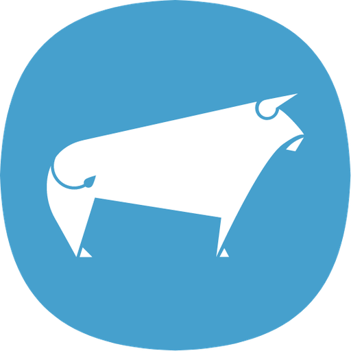

# 2.1. Competidores

El análisis competitivo permite comprender cómo otras soluciones digitales atienden la gestión ganadera y qué vacíos puede aprovechar AniTec. Para esta revisión se seleccionaron tres productos vigentes con ofertas similares: **CattleMax**, **AgriWebb** y **BovControl**. CattleMax y AgriWebb son competidores directos por sus capacidades de registro y gestión de ganado; BovControl es un competidor directo regional por su orientación a la digitalización de la cadena pecuaria en América. La comparación se realizó con información pública de sus sitios oficiales consultada el **7 de septiembre de 2026**.

El análisis no pretende afirmar que los tres productos operen con las mismas condiciones comerciales en el Perú. Sus precios, disponibilidad, integraciones y soporte pueden variar por país, tamaño del hato y modalidad de contratación. Por ello, los campos sin una tarifa pública verificable se indican como **“cotización o cálculo requerido”**, en vez de estimar valores.

## 2.1.1. Análisis competitivo

**Objetivo del análisis:** determinar cómo puede diferenciarse AniTec frente a soluciones consolidadas de gestión pecuaria, considerando las necesidades del segmento inicial peruano: uso móvil sencillo, conectividad intermitente, trazabilidad sanitaria, colaboración controlada entre ganaderos y veterinarios y un costo compatible con pequeños y medianos hatos.

<table>
  <tr>
    <th colspan="2">Competitive Analysis Landscape</th>
    <th>AniTec </th>
    <th>CattleMax </th>
    <th>AgriWebb </th>
    <th>BovControl </th>
  </tr>
  <tr><th colspan="2">Tipo de competidor</th><td>Startup analizada</td><td>Directo</td><td>Directo</td><td>Directo regional</td></tr>
  <tr>
    <th rowspan="2">Perfil</th><th>Overview</th>
    <td>Plataforma multicanal en evolución, orientada a pequeños y medianos ganaderos peruanos y a los veterinarios que atienden sus animales.</td>
    <td>Software web de registro para operaciones de ganado bovino comercial y registrado, accesible desde teléfono, tableta o computadora.</td>
    <td>Plataforma de gestión de ganado y pasturas con modalidades por lote e individuo, aplicación móvil y operación sin conexión.</td>
    <td>Plataforma de productos cloud y móviles para digitalizar datos de productores, fincas y animales dentro de la cadena pecuaria.</td>
  </tr>
  <tr>
    <th>Ventaja competitiva y valor</th>
    <td>Adaptación al contexto peruano; flujo conjunto ganadero-veterinario; aplicación Android sencilla; permisos explícitos; historial sanitario y sincronización diferida como capacidades prioritarias.</td>
    <td>Madurez del producto, soporte dirigido por ganaderos, registros completos, usuarios ilimitados y herramientas específicas para ganado registrado.</td>
    <td>Amplia cobertura funcional: mapas, movimientos, tratamientos, reproducción, tareas, inventario, reportes e integraciones con hardware; registra datos offline y los sincroniza al recuperar conexión.</td>
    <td>Portafolio especializado que cubre gestión de animales, carne, leche, reproducción, asistencia técnica, indicadores ambientales y analítica corporativa.</td>
  </tr>
  <tr>
    <th rowspan="2">Perfil de marketing</th><th>Mercado objetivo</th>
    <td>Pequeños y medianos ganaderos del Perú y veterinarios de campo; asociaciones y cooperativas se consideran un segmento institucional posterior.</td>
    <td>Productores cow-calf comerciales y criadores de ganado registrado; ofrece planes según tipo de operación y número de animales activos.</td>
    <td>Productores y equipos de operaciones ganaderas que gestionan animales individualmente o por lotes y requieren información productiva y de pasturas.</td>
    <td>Productores, empresas pecuarias, agentes de campo e instituciones que participan en las cadenas de carne y leche, con presencia en América.</td>
  </tr>
  <tr>
    <th>Estrategias de marketing observables</th>
    <td>Propuesta inicial: alianzas locales, acompañamiento de adopción, demostraciones y contenido educativo en español.</td>
    <td>Prueba gratuita de 21 días, clases y capacitación sin costo, soporte especializado y comunicación basada en más de 25 años de experiencia.</td>
    <td>Prueba gratuita, demostración interactiva, contenido educativo, casos de clientes, soporte local en mercados como Brasil e integraciones con hardware.</td>
    <td>Oferta de soluciones por caso de uso y alianzas institucionales; su portafolio comunica valor para productores, asistencia técnica, industria y sostenibilidad.</td>
  </tr>
  <tr>
    <th rowspan="3">Perfil del producto</th><th>Productos y servicios</th>
    <td>Aplicación Android, vistas administrativas web, gestión de animales y hatos, eventos sanitarios, actividades, colaboración por roles, telemetría y analítica; el alcance se implementará iterativamente.</td>
    <td>Fichas de ganado, salud, reproducción, partos, destete, pasturas, equipos, ingresos y gastos, calendario, tareas, reportes y funciones para asociaciones de razas.</td>
    <td>Registros individuales y por lotes, movimientos, tratamientos, alimentación, pesos, reproducción, mapas, pasturas, tareas, inventario, reportes e integraciones EID/IoT.</td>
    <td>BovPilot, BovMilk, BovAssist, BovImpact y BovInsights, entre otros componentes para gestión animal, producción, rutinas de campo, sostenibilidad y análisis.</td>
  </tr>
  <tr>
    <th>Precios y costos</th>
    <td>Modelo de suscripción escalonado por validar. No se publica un precio definitivo hasta contrastar disposición de pago, alcance y costos cloud.</td>
    <td>La página oficial calcula el precio según plan y animales activos. Como referencia consultada, hasta 250 animales: Commercial USD 30/mes y Registered USD 41/mes, ambos facturados anualmente.</td>
    <td>Calculadora según cantidad y tipo de ganado, modalidad y plan. La tarifa final requiere ingresar datos; existen complementos publicados, como Movement Planner (USD 100/año) y Grazing Planner (USD 150/año).</td>
    <td>Servicio por suscripción; las condiciones oficiales remiten el importe a la orden de compra o plan contratado. No se encontró una tarifa pública única verificable.</td>
  </tr>
  <tr>
    <th>Canales de distribución</th>
    <td>Aplicación Android, acceso web administrativo y API; adquisición digital y alianzas con asociaciones, veterinarios y programas de capacitación.</td>
    <td>Acceso web adaptable desde teléfono, tableta y computadora; TagMax está disponible para iOS y Android en escenarios con lectores RFID o balanzas.</td>
    <td>Web y aplicación móvil para iOS y Android, con prueba gratuita, demostración y venta asistida.</td>
    <td>Sitios y aplicaciones web/móviles, complementados por programas y alianzas para cadenas pecuarias.</td>
  </tr>
  <tr>
    <th rowspan="4">Análisis SWOT</th><th>Fortalezas</th>
    <td>Conocimiento del problema local; español; prioridad móvil; colaboración productor-veterinario; arquitectura preparada para evolución independiente de capacidades.</td>
    <td>Producto maduro, soporte especializado, usuarios ilimitados, amplitud de registros y herramientas para ganado comercial y registrado.</td>
    <td>Gran amplitud funcional, trabajo offline, sincronización cloud, colaboración con roles e integraciones con dispositivos.</td>
    <td>Orientación latinoamericana, portafolio especializado y cobertura de distintos actores y procesos de la cadena pecuaria.</td>
  </tr>
  <tr>
    <th>Debilidades</th>
    <td>Producto en evolución; reconocimiento de marca y evidencia comercial todavía limitados; modelo de precios por validar; mayor complejidad operativa por la transición a microservicios.</td>
    <td>Enfoque comercial y normativo principalmente norteamericano; el acceso web general depende de Internet y el trabajo offline especializado utiliza TagMax u hojas de trabajo.</td>
    <td>Amplitud que puede elevar la curva de aprendizaje; precios variables y no visibles sin configurar la calculadora; localización peruana no demostrada.</td>
    <td>Portafolio amplio que puede dificultar identificar una experiencia única para el pequeño productor; precios no públicos y poca evidencia pública de una experiencia localizada para Perú.</td>
  </tr>
  <tr>
    <th>Oportunidades</th>
    <td>Digitalización de pequeños productores; necesidad de trazabilidad; adopción de Android; colaboración sanitaria y demanda de operaciones resilientes ante conectividad rural variable.</td>
    <td>Expansión a nuevos países y asociaciones; mayor integración de hardware y servicios de analítica.</td>
    <td>Localización regional, integraciones de precisión, programas de sostenibilidad y analítica productiva.</td>
    <td>Alianzas con cooperativas, industria, asistencia técnica y programas de sostenibilidad o inclusión productiva.</td>
  </tr>
  <tr>
    <th>Amenazas</th>
    <td>Competidores con mayor capital, madurez e integraciones; resistencia al cambio; baja conectividad; sensibilidad al precio y riesgos de seguridad o pérdida de confianza.</td>
    <td>Competidores móviles con una experiencia offline más integrada y soluciones locales de menor costo.</td>
    <td>Soluciones regionales más simples o económicas y barreras de adopción por complejidad funcional.</td>
    <td>Competidores especializados por nicho, cambios regulatorios y dificultad de sostener un portafolio amplio en contextos heterogéneos.</td>
  </tr>
</table>

### Síntesis del análisis

La comparación muestra que competir únicamente por cantidad de funcionalidades no es conveniente. AgriWebb posee una cobertura operativa e integraciones difícil de replicar en la etapa inicial, CattleMax cuenta con madurez y especialización en registros bovinos, y BovControl cubre distintos eslabones de la cadena pecuaria. El espacio de diferenciación de AniTec se encuentra en combinar una experiencia sencilla y localizada para el Perú con colaboración sanitaria entre ganadero y veterinario, control explícito de permisos y resiliencia ante conectividad intermitente.

Las características de AniTec descritas en la matriz constituyen el **alcance objetivo** del producto durante el curso, no evidencia de que todas estén actualmente desplegadas. Su priorización deberá validarse con el Product Backlog, las iteraciones ADD y las pruebas de cada entrega.

## 2.1.2. Estrategias y tácticas frente a competidores

Las estrategias responden directamente a los hallazgos del Landscape. Cada una se acompaña de tácticas observables para evitar declaraciones generales sin una forma de ejecución o medición.

| Estrategia | Hallazgo que atiende | Tácticas preliminares | Indicador inicial |
|---|---|---|---|
| **Diferenciación por contexto local y simplicidad** | Los competidores consolidados ofrecen muchas funciones, pero no demuestran una experiencia específicamente diseñada para pequeños productores peruanos. | Probar lenguaje, navegación y formularios con los dos segmentos; ofrecer configuración inicial guiada; priorizar las cinco tareas más frecuentes; preparar material en español y ejemplos ganaderos locales. | Al menos 80 % completa las tareas críticas sin ayuda en pruebas de usabilidad. |
| **Operación resiliente en campo** | La conectividad rural variable amenaza la continuidad del registro; AgriWebb ya compite con una propuesta offline sólida. | Implementar almacenamiento local para operaciones prioritarias, cola de sincronización, estados visibles y recuperación ante conflictos; realizar pruebas con pérdida y retorno de red. | 100 % de registros aceptados localmente se conserva y al menos 95 % se sincroniza dentro de 5 minutos tras recuperar conexión. |
| **Colaboración segura entre ganadero y veterinario** | Los competidores permiten colaboración, pero AniTec puede especializar el flujo clínico y la autorización del propietario. | Definir roles de mínimo privilegio; permitir asignar y revocar veterinarios; registrar auditoría; diseñar historial sanitario y seguimiento compartido sin exponer información no autorizada. | Al menos 80 % comprende los permisos y completa el flujo de atención compartida sin ayuda. |
| **Adopción mediante confianza y acompañamiento** | La resistencia al cambio y la baja alfabetización digital pueden impedir la adopción aun cuando exista valor funcional. | Pilotos con veterinarios y asociaciones; tutoriales breves; soporte por canales conocidos; mensajes claros ante errores; demostraciones con datos de ejemplo y política de datos comprensible. | Tasa de finalización del onboarding y porcentaje de usuarios que realiza un segundo registro durante el piloto. |
| **Precio accesible y validado** | Los precios internacionales pueden ser una barrera para hatos pequeños, pero un precio bajo sin validar puede comprometer la sostenibilidad. | Probar niveles de suscripción por tamaño y capacidad; mantener una prueba o alcance básico; contrastar disposición de pago; calcular costo cloud por usuario/hato antes de publicar tarifas. | Conversión por plan, disposición de pago y margen estimado positivo. |
| **Evolución enfocada, no imitación funcional** | Los competidores poseen portafolios amplios y años de madurez. | Mantener un backlog guiado por valor, riesgo y atributos de calidad; implementar primero registro, historial, alertas, actividades y colaboración; integrar IoT y analítica mediante iteraciones posteriores verificables. | Porcentaje de drivers prioritarios cubiertos y validados en cada iteración ADD. |

Estas estrategias son preliminares. Los resultados mock del apartado 2.2 permiten explorar coherencia y diseñar los artefactos del curso, pero no sustituyen validación comercial real. Antes de tomar decisiones de precio, adquisición o expansión, Titan deberá contrastarlas con usuarios y organizaciones reales.

### Fuentes de la comparación

- [CattleMax — Pricing](https://www.cattlemax.com/pricing), características, planes y referencia de precios. Consulta: 7 de septiembre de 2026.
- [CattleMax — App](https://www.cattlemax.com/app), acceso móvil, TagMax y alternativas de trabajo sin conexión. Consulta: 7 de septiembre de 2026.
- [AgriWebb — Our Product](https://www.agriwebb.com/us/our-product/), gestión, colaboración, seguridad y operación offline. Consulta: 7 de septiembre de 2026.
- [AgriWebb — Pricing](https://www.agriwebb.com/us/pricing/), modalidades, calculadora y complementos. Consulta: 7 de septiembre de 2026.
- [AgriWebb — Mobile App](https://www.agriwebb.com/mobile-app/), plataformas y capacidades móviles. Consulta: 7 de septiembre de 2026.
- [BovControl — Terms of Service](https://web.bovpilot.bovcontrol.com/terms), descripción oficial del portafolio y modalidad de suscripción. Consulta: 7 de septiembre de 2026.

Los nombres y logotipos de terceros se emplean únicamente con fines académicos de identificación y comparación; pertenecen a sus respectivos titulares.
