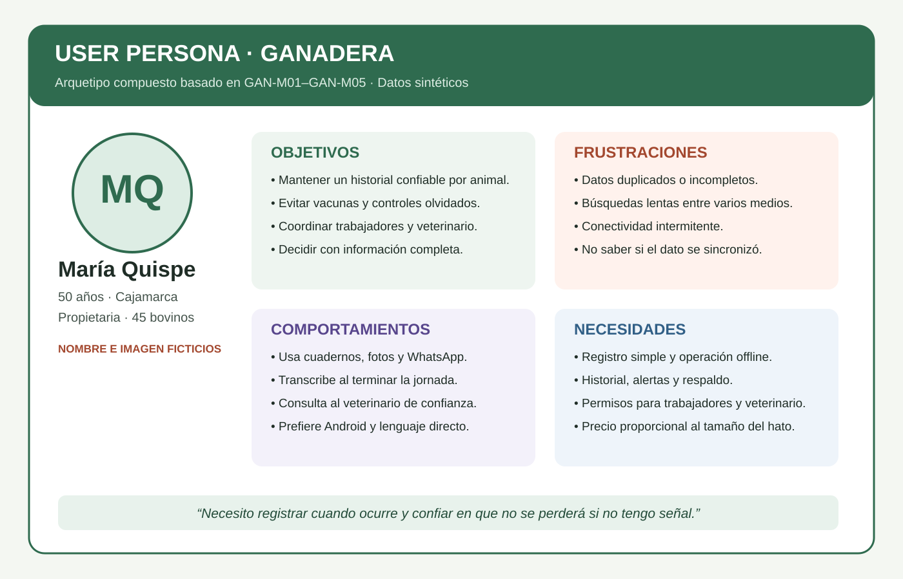
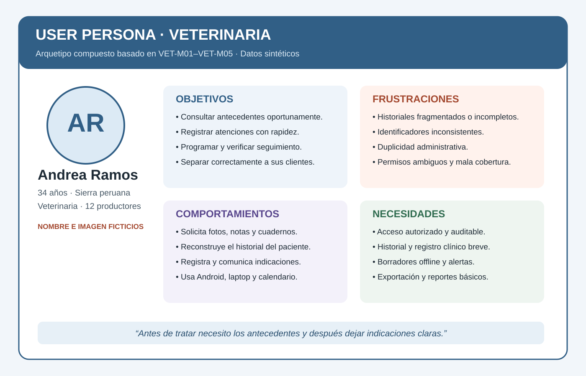
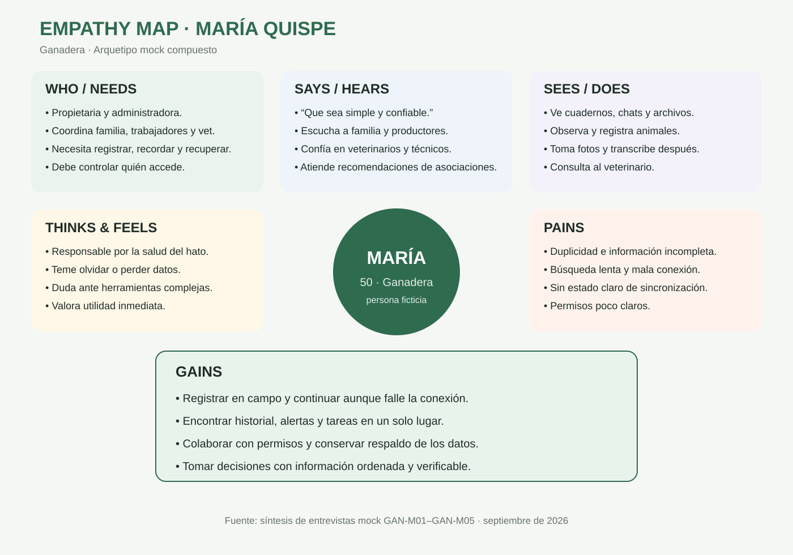
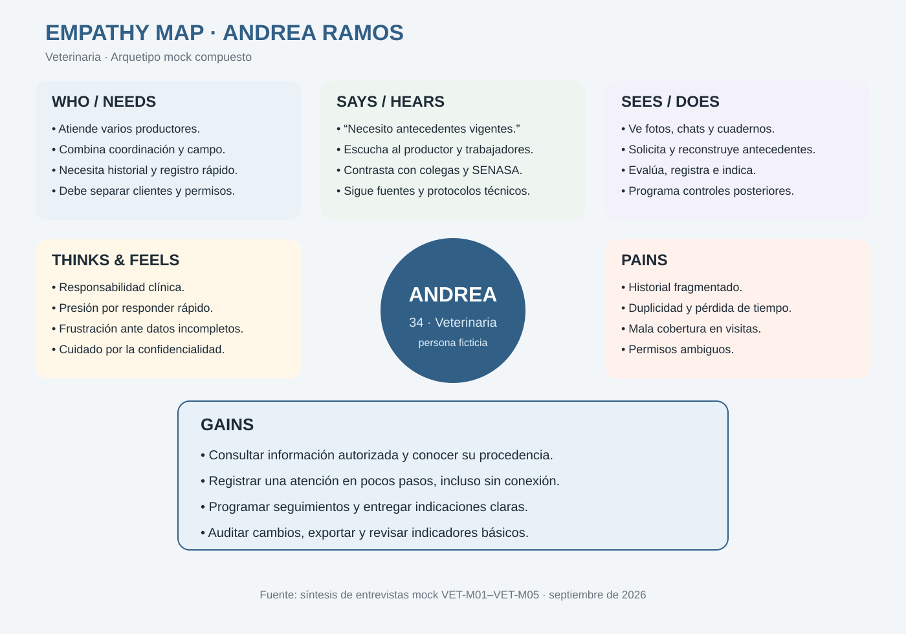
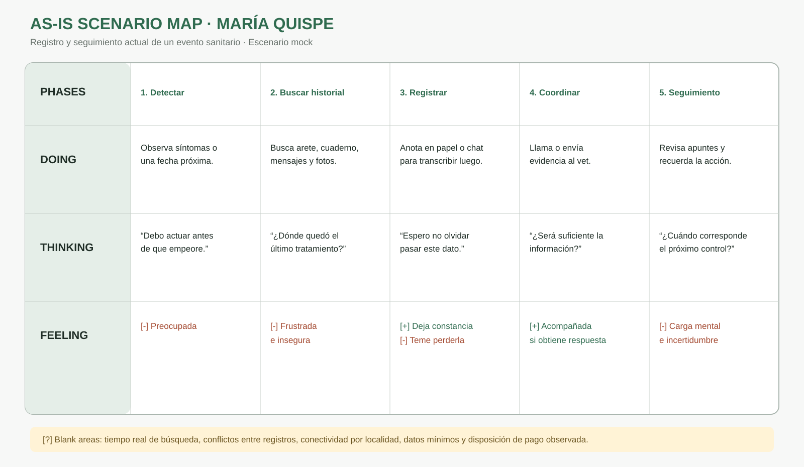
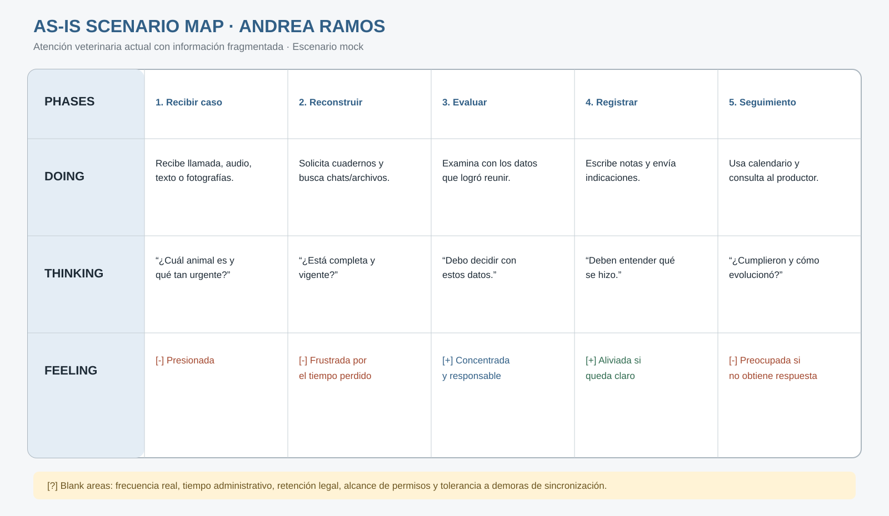

# 2.3. Needfinding

El proceso de Needfinding transforma los hallazgos de las entrevistas mock en representaciones coherentes del contexto de uso. Los artefactos de esta sección no agregan evidencia nueva: sintetizan la matriz del apartado 2.2 y los vacíos identificados en el análisis competitivo. Por esta razón, cada característica relevante se relaciona con códigos de entrevistas mock y se mantiene la misma identidad en User Persona, User Task Matrix, Empathy Map y As-Is Scenario Mapping.

Las entrevistas son sintéticas y fueron autorizadas para fines académicos. En consecuencia, estos artefactos sirven para diseñar y priorizar el trabajo del curso, pero deberán contrastarse posteriormente con investigación y pruebas realizadas con usuarios reales.

## 2.3.1. User Personas

Se elaboró un User Persona por segmento objetivo. Ambos son **arquetipos compuestos**: sus nombres y datos biográficos son ficticios, mientras que sus comportamientos, necesidades y frustraciones sintetizan patrones de los cinco perfiles mock de cada segmento. La comparación con CattleMax, AgriWebb y BovControl añadió dos criterios de diseño: AniTec no debe competir inicialmente por amplitud funcional, sino por simplicidad localizada, colaboración sanitaria controlada y operación resiliente.

### User Persona 1 — María Quispe, ganadera

| Dimensión | Especificación del arquetipo |
|---|---|
| **Identidad** | María Quispe, 50 años, propietaria y administradora de una explotación familiar de aproximadamente 45 bovinos en Cajamarca. Nombre e imagen ficticios. |
| **Frase representativa sintética** | “Necesito registrar las cosas cuando ocurren y confiar en que no se perderán si no tengo señal.” |
| **Biografía** | Trabaja con familiares y personal eventual. Aprendió el manejo ganadero mediante experiencia familiar y asistencia técnica. Coordina controles con un veterinario y consolida apuntes al terminar la jornada. |
| **Personalidad** | Responsable, práctica, preventiva y cautelosa ante herramientas nuevas. Adopta cambios cuando percibe utilidad inmediata y soporte cercano. |
| **Habilidades** | Alto conocimiento práctico del hato; uso básico-intermedio de Android, WhatsApp y hojas de cálculo simples. |
| **Dispositivos y canales** | Smartphone Android como dispositivo principal; WhatsApp y llamadas como canales habituales; laptop compartida para consolidaciones ocasionales. |
| **Objetivos** | Mantener un historial confiable, evitar fechas olvidadas, coordinar al equipo y al veterinario, y tomar decisiones con información completa. |
| **Comportamientos** | Anota en cuadernos o mensajes, captura información en campo y la transcribe después, consulta al veterinario y revisa calendarios manualmente. |
| **Frustraciones** | Datos duplicados o incompletos, búsqueda lenta, conectividad intermitente, incertidumbre sobre la sincronización y herramientas complejas. |
| **Necesidades** | Registro móvil simple, historial por animal, alertas, operación offline, estados de sincronización, permisos y exportación/recuperación de datos. |
| **Influencias** | Familia, veterinario, asociaciones de productores, técnicos agropecuarios y recomendaciones de pares. |
| **Criterios de adopción** | Facilidad, confiabilidad, funcionamiento sin conexión, precio proporcional al hato, soporte y control sobre quién accede a sus datos. |

**Trazabilidad:** registros dispersos (GAN-M01–GAN-M05); dificultad para encontrar datos (GAN-M01, GAN-M02, GAN-M03, GAN-M05); conectividad limitada y alertas (GAN-M01–GAN-M05); permisos (GAN-M01, GAN-M03, GAN-M04, GAN-M05); necesidad de ayuda o simplicidad (GAN-M01, GAN-M02, GAN-M03, GAN-M05).

### User Persona 2 — Andrea Ramos, veterinaria de campo

| Dimensión | Especificación del arquetipo |
|---|---|
| **Identidad** | Andrea Ramos, 34 años, médica veterinaria que atiende aproximadamente doce productores recurrentes en zonas rurales y semiurbanas de la sierra peruana. Nombre e imagen ficticios. |
| **Frase representativa sintética** | “Antes de tratar necesito conocer los antecedentes y, después, dejar indicaciones que el productor pueda seguir.” |
| **Biografía** | Divide su tiempo entre coordinación remota, visitas de campo, registro clínico y seguimiento. Recibe información en distintos formatos y debe mantener separados los datos de cada propietario. |
| **Personalidad** | Metódica, empática, rigurosa y resolutiva; mantiene cautela respecto a la confidencialidad y las recomendaciones automáticas. |
| **Habilidades** | Conocimiento clínico; uso intermedio-avanzado de Android, laptop, documentos compartidos, calendarios y hojas de cálculo. |
| **Dispositivos y canales** | Android y laptop; en algunos contextos tableta. WhatsApp, correo, llamadas y documentos cloud. |
| **Objetivos** | Consultar antecedentes antes o durante la visita, registrar atenciones rápidamente, programar seguimiento y evitar mezclar información de clientes. |
| **Comportamientos** | Solicita fotos o cuadernos, reconstruye historiales, toma notas, envía indicaciones y usa recordatorios personales o calendarios. |
| **Frustraciones** | Historiales incompletos, identificadores inconsistentes, duplicidad administrativa, falta de cobertura y ausencia de permisos claros. |
| **Necesidades** | Acceso autorizado, historial sanitario, registro clínico breve, borradores offline, alertas, auditoría, separación por propietario y reportes básicos. |
| **Influencias** | SENASA, colegas, asociaciones, universidad, literatura técnica y protocolos profesionales. |
| **Criterios de adopción** | Rapidez, precisión, permisos revocables, auditoría, exportación, soporte multi-cliente y reducción del trabajo administrativo. |

**Trazabilidad:** historial fragmentado y acceso previo (VET-M01–VET-M05); conectividad limitada (VET-M01, VET-M02, VET-M04, VET-M05); seguimiento (VET-M01–VET-M04); roles y auditoría (VET-M01–VET-M05); analítica útil (VET-M01, VET-M02, VET-M03, VET-M05).

## 2.3.2. User Task Matrix

La matriz reúne tareas que María y Andrea realizan para cumplir sus objetivos **sin depender de la existencia de AniTec**. No se incluyen opciones de software como “sincronizar en AniTec”. Se usa la escala de frecuencia `Diaria`, `Semanal`, `Mensual`, `Ocasional` y `No aplica`, y la importancia `Alta`, `Media`, `Baja` y `No aplica`.

| Tarea actual | María — Frecuencia | María — Importancia | Andrea — Frecuencia | Andrea — Importancia |
|---|---|---|---|---|
| Observar el estado y comportamiento de los animales | Diaria | Alta | Diaria, durante visitas | Alta |
| Identificar animales y actualizar altas, bajas o movimientos | Semanal | Alta | Ocasional | Media |
| Registrar vacunas, tratamientos y otros eventos sanitarios | Semanal | Alta | Diaria | Alta |
| Revisar fechas de vacunas, controles y tratamientos pendientes | Semanal | Alta | Diaria | Alta |
| Registrar producción, peso o reproducción | Semanal | Alta | Ocasional | Media |
| Consolidar apuntes de trabajadores o familiares | Diaria | Alta | No aplica | No aplica |
| Solicitar y reconstruir antecedentes antes de una atención | Ocasional | Alta | Diaria | Alta |
| Evaluar animales y definir diagnóstico o tratamiento | No aplica | No aplica | Diaria | Alta |
| Entregar y explicar indicaciones sanitarias | Ocasional | Alta | Diaria | Alta |
| Coordinar una visita o emergencia mediante llamada/mensajería | Ocasional | Alta | Diaria | Alta |
| Compartir cuadernos, fotos o archivos con la contraparte | Semanal | Alta | Diaria | Alta |
| Programar y verificar seguimiento posterior | Semanal | Alta | Semanal | Alta |
| Separar y organizar información de distintos propietarios | No aplica | No aplica | Diaria | Alta |
| Preparar reportes sanitarios, productivos o administrativos | Mensual | Media | Mensual | Media |

### Análisis de la matriz

Las tareas de mayor frecuencia e importancia para María son observar el hato, consolidar información y registrar o revisar eventos sanitarios. Su mayor carga aparece antes de cualquier solución digital: debe unir datos producidos por varias personas y medios. Para Andrea, las tareas críticas son revisar antecedentes, evaluar, registrar una atención, comunicar indicaciones y mantener separados varios clientes.

La principal coincidencia es la gestión del ciclo sanitario: ambos necesitan identificar el animal, comprender antecedentes, registrar lo ocurrido y realizar seguimiento. También comparten información mediante llamadas, mensajes, fotografías y documentos. La principal diferencia corresponde a la responsabilidad: María conserva el control integral del hato y autoriza accesos; Andrea ejerce funciones clínicas sobre los pacientes y propietarios que le fueron asignados. Esta diferencia debe reflejarse en los permisos y en las interfaces, no ocultarse tras un único tipo de usuario.

## 2.3.3. Empathy Mapping

El equipo preparó un mapa por User Persona. Para cada uno colocó el arquetipo en el centro, revisó las cinco fichas mock del segmento y agrupó observaciones repetidas. Después clasificó cada observación en `Who`, `Needs`, `Says`, `Sees`, `Does`, `Hears`, `Thinks & Feels`, `Pains` y `Gains`. Las frases atribuidas a los arquetipos son síntesis ficticias y no testimonios de personas reales.

### Empathy Map — María Quispe

- **Who:** propietaria y administradora de un hato pequeño o mediano; coordina familiares, trabajadores y veterinario.
- **Needs:** registrar en campo, recordar eventos, recuperar información y controlar accesos.
- **Says:** “Lo simple me sirve si puedo confiar en que el dato quedó guardado”.
- **Sees:** cuadernos, mensajes, hojas de cálculo y herramientas internacionales con demasiadas opciones.
- **Does:** observa animales, anota eventos, toma fotografías, transcribe y consulta al veterinario.
- **Hears:** recomendaciones de familiares, productores, técnicos, asociaciones y proveedores.
- **Thinks & Feels:** responsabilidad por la salud del hato; temor a olvidar fechas, perder datos o pagar por algo difícil de usar.
- **Pains:** duplicidad, información incompleta, búsqueda lenta, mala conexión y falta de claridad sobre permisos.
- **Gains:** continuidad del registro, alertas claras, colaboración controlada, respaldo y decisiones con información ordenada.

### Empathy Map — Andrea Ramos

- **Who:** veterinaria que atiende varios productores y combina coordinación remota con visitas de campo.
- **Needs:** conocer antecedentes, registrar rápido, separar clientes, programar seguimiento y demostrar trazabilidad.
- **Says:** “Un historial incompleto me obliga a reconstruir el caso antes de poder avanzar”.
- **Sees:** fotos, mensajes, cuadernos y archivos con distintos formatos e identificadores.
- **Does:** solicita antecedentes, evalúa, registra, prescribe indicaciones y programa controles.
- **Hears:** información de productores, colegas, SENASA, asociaciones y fuentes técnicas.
- **Thinks & Feels:** responsabilidad clínica, presión por responder, frustración ante datos incompletos y preocupación por la confidencialidad.
- **Pains:** pérdida de tiempo, duplicidad, falta de cobertura, mezcla de clientes y permisos ambiguos.
- **Gains:** acceso autorizado, historial confiable, registro breve, recordatorios, auditoría y reportes útiles.

## 2.3.4. As-Is Scenario Mapping

Los As-Is Scenario Maps representan la experiencia actual sin AniTec. El equipo realizó el siguiente proceso: (1) preparó el escenario y el objetivo; (2) efectuó una lluvia de ideas individual usando las fichas mock; (3) revisó y agrupó observaciones; (4) identificó y nombró las fases; (5) ubicó `Doing`, `Thinking` y `Feeling`; y (6) marcó áreas positivas `[+]`, negativas `[-]` y vacíos `[?]` que requieren investigación real. Las oportunidades no se convierten automáticamente en funcionalidades: alimentan las hipótesis y el backlog del capítulo III.

### As-Is Scenario Mapping — María Quispe

**Escenario:** registrar y dar seguimiento a un evento sanitario en un animal mediante los recursos actuales.

| Fila / fase | 1. Detectar | 2. Identificar antecedentes | 3. Registrar | 4. Coordinar atención | 5. Dar seguimiento |
|---|---|---|---|---|---|
| **Doing** | Observa síntomas o una fecha próxima. | Busca arete, cuaderno, mensajes y fotos. | Anota en papel o WhatsApp para transcribir después. | Llama o envía evidencia al veterinario. | Revisa apuntes y trata de recordar la próxima acción. |
| **Thinking** | “Debo actuar antes de que empeore.” | “¿Dónde quedó el último tratamiento?” | “Espero no olvidar pasar este dato.” | “¿La información que envié será suficiente?” | “¿Cuándo corresponde el siguiente control?” |
| **Feeling** | Preocupada `[-]` | Frustrada e insegura `[-]` | Aliviada por dejar constancia `[+]`, pero teme perderla `[-]` | Acompañada si recibe respuesta `[+]` | Carga mental e incertidumbre `[-]` |

**Blank areas `[?]`:** tiempo real invertido en buscar antecedentes; frecuencia de conflictos entre registros; conectividad por localidad; información mínima que cada veterinario necesita; disposición de pago observada, no declarada.

### As-Is Scenario Mapping — Andrea Ramos

**Escenario:** preparar, realizar y dar seguimiento a una atención veterinaria de campo con información fragmentada.

| Fila / fase | 1. Recibir el caso | 2. Reconstruir historial | 3. Evaluar | 4. Registrar e indicar | 5. Realizar seguimiento |
|---|---|---|---|---|---|
| **Doing** | Recibe llamada, texto, audio o fotografías. | Solicita cuadernos y busca conversaciones o archivos. | Examina al animal con los antecedentes disponibles. | Escribe notas y envía indicaciones por distintos canales. | Usa calendario o memoria y consulta al productor. |
| **Thinking** | “Necesito saber la urgencia y cuál animal es.” | “¿Esta información está completa y vigente?” | “Debo decidir con los datos disponibles.” | “La próxima persona debe entender qué se hizo.” | “¿Cumplieron el tratamiento y cómo evolucionó?” |
| **Feeling** | Presionada `[-]` | Frustrada por el tiempo perdido `[-]` | Concentrada y responsable `[+]` | Aliviada si deja indicaciones claras `[+]` | Preocupada ante falta de respuesta `[-]` |

**Blank areas `[?]`:** frecuencia real de historias incompletas; tiempo administrativo por cliente; reglas legales y profesionales de retención; información que puede compartirse con trabajadores; tolerancia a demoras de sincronización.

### Oportunidades comunes derivadas

- Reducir la fragmentación sin eliminar el control del propietario sobre los datos.
- Mantener disponibles las tareas críticas cuando la conexión falle.
- Mostrar estados de guardado y sincronización comprensibles.
- Conservar procedencia, autoría y auditoría de los registros.
- Diseñar flujos diferentes para el propietario del hato y el profesional autorizado.
- Validar con usuarios reales los blank areas antes de convertirlos en requisitos definitivos.
