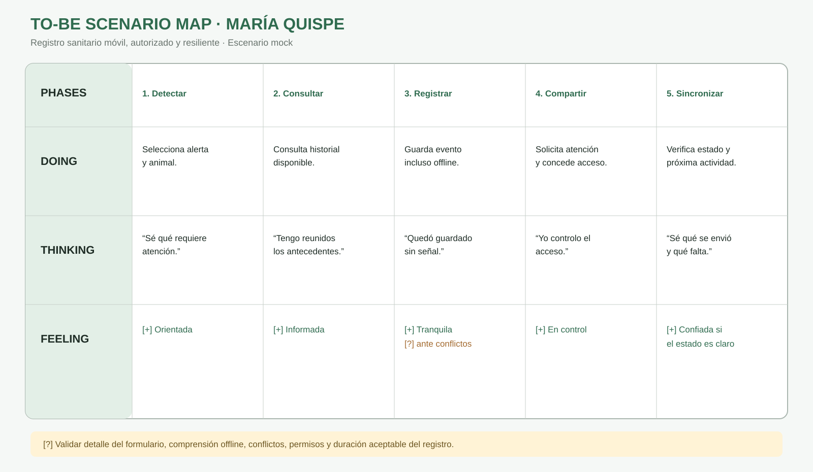
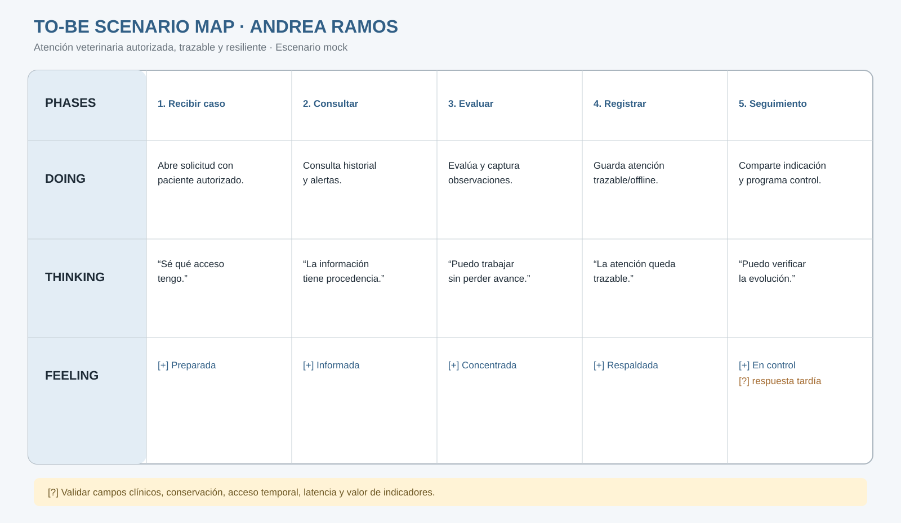

# 3.1. To-Be Scenario Mapping

Los To-Be Scenario Maps representan cómo deberían realizarse las tareas prioritarias con AniTec. Se construyeron a partir de los As-Is Scenario Maps, los patrones de las diez entrevistas mock y las oportunidades identificadas en el análisis competitivo. Conservan los mismos User Personas del capítulo II: **María Quispe**, ganadera, y **Andrea Ramos**, veterinaria de campo.

> Los perfiles y escenarios de investigación son sintéticos y fueron autorizados para fines académicos. Los mapas expresan una propuesta de diseño que deberá validarse con usuarios reales y pruebas de usabilidad.

## Proceso de elaboración

1. **Preparación:** se definió para cada persona el mismo objetivo utilizado en su escenario As-Is.
2. **Lluvia de ideas individual:** se propusieron cambios para resolver los pains y blank areas del capítulo II.
3. **Revisión:** se descartaron ideas sin trazabilidad y se agruparon las restantes por fase.
4. **Definición de fases:** se nombraron las columnas y se organizaron las filas `Doing`, `Thinking` y `Feeling`.
5. **Comparación:** se contrastó cada fase con el As-Is para identificar cambios atribuibles a AniTec.
6. **Etiquetado:** se marcaron experiencias positivas `[+]`, riesgos o experiencias negativas `[-]` y supuestos pendientes de validación `[?]`.

## To-Be Scenario Mapping — María Quispe

**Escenario:** registrar y dar seguimiento a un evento sanitario desde el teléfono, incluso cuando la conectividad es intermitente.

| Fila / fase | 1. Detectar | 2. Consultar | 3. Registrar | 4. Compartir | 5. Sincronizar y seguir |
|---|---|---|---|---|---|
| **Doing** | Recibe una alerta o identifica una incidencia y selecciona el animal. | Consulta el historial sanitario disponible en el dispositivo. | Registra síntomas, fecha y evidencia; si no hay red, el dato queda pendiente. | Solicita atención y concede al veterinario acceso sanitario limitado. | Revisa el estado de sincronización y confirma la siguiente actividad. |
| **Thinking** | “Sé qué requiere atención y qué tan urgente es.” | “Tengo los antecedentes reunidos.” | “El registro quedó guardado aunque no haya señal.” | “Yo decido quién puede consultar y modificar.” | “Puedo verificar qué se envió y qué falta.” |
| **Feeling** | Atenta y orientada `[+]` | Informada `[+]` | Tranquila `[+]`, con cautela ante conflictos `[?]` | En control `[+]` | Confiada si el estado es claro `[+]` |

### Cambios frente al As-Is de María

| Problema As-Is | Cambio To-Be | Resultado esperado |
|---|---|---|
| Busca entre cuadernos, fotografías y mensajes. | Historial por animal disponible desde Android. | Menor tiempo de búsqueda y menos información omitida. |
| Posterga la transcripción cuando trabaja en campo. | Guardado local y sincronización diferida. | Registro cercano al momento en que ocurre el evento. |
| Envía información incompleta al veterinario. | Solicitud asociada al animal y a su historial autorizado. | Mejor continuidad entre productor y profesional. |
| Depende de su memoria para seguimientos. | Alertas con prioridad, fecha y confirmación. | Menor riesgo de actividades vencidas. |
| No sabe quién puede cambiar los datos. | Roles, autorización, revocación y auditoría. | Mayor control y confianza. |

**Supuestos pendientes `[?]`:** nivel de detalle que puede completarse en campo; tolerancia a conflictos de sincronización; duración aceptable del registro; alcance de permisos por tipo de dato; comprensión de los estados offline.

## To-Be Scenario Mapping — Andrea Ramos

**Escenario:** preparar, realizar y dar seguimiento a una atención veterinaria con acceso autorizado y continuidad offline.

| Fila / fase | 1. Recibir caso | 2. Consultar historial | 3. Evaluar | 4. Registrar | 5. Indicar y seguir |
|---|---|---|---|---|---|
| **Doing** | Recibe una solicitud asociada a un propietario y animal autorizados. | Consulta antecedentes, alertas y tratamientos disponibles. | Evalúa al animal y registra observaciones, aun con conectividad limitada. | Guarda diagnóstico, tratamiento, dosis y próxima fecha; el sistema conserva autoría y estado. | Comparte indicaciones, programa seguimiento y revisa pendientes por cliente. |
| **Thinking** | “Sé cuál es el animal y qué acceso tengo.” | “La información tiene procedencia y está vigente.” | “Puedo trabajar sin perder el avance.” | “La atención quedará trazable.” | “Puedo verificar evolución y tareas pendientes.” |
| **Feeling** | Preparada `[+]` | Informada y segura `[+]` | Concentrada `[+]` | Responsable y respaldada `[+]` | En control `[+]`, atenta a respuestas tardías `[?]` |

### Cambios frente al As-Is de Andrea

| Problema As-Is | Cambio To-Be | Resultado esperado |
|---|---|---|
| Reconstruye el historial desde varios medios. | Historial sanitario centralizado y autorizado. | Preparación más rápida y decisiones con mejor contexto. |
| Puede mezclar información de propietarios. | Separación por propietario, hato y animal. | Menos errores de asociación y exposición. |
| Registra después de la visita. | Borrador o registro clínico offline. | Menor duplicidad y pérdida de información. |
| Los permisos son implícitos. | Acceso solicitado, aprobado, limitado y revocable. | Colaboración con mínimo privilegio. |
| El seguimiento depende de calendarios separados. | Alertas y actividades ligadas a la atención. | Continuidad clínica verificable. |

**Supuestos pendientes `[?]`:** campos clínicos mínimos por tipo de atención; reglas de corrección y conservación; latencia aceptable de sincronización; alcance del acceso temporal; indicadores que aportan valor sin sustituir el criterio clínico.

## Síntesis de requisitos derivados

Los dos escenarios justifican las siguientes capacidades, que se desarrollan en las User Stories:

- Registro y consulta móvil de animales e historial sanitario.
- Persistencia local, cola de sincronización, reintento y resolución de conflictos.
- Alertas y seguimientos con prioridad y confirmación.
- Solicitud, aprobación, limitación y revocación de accesos.
- Auditoría y conservación de registros clínicos.
- Separación de datos por propietario, hato y animal.
- Exportación y recuperación de información.

Los diagramas incluidos son representaciones vectoriales editables del contenido. Para la entrega que exija evidencia literal de herramienta, deberán importarse o recrearse en Lucidchart/Miro y sustituirse por la captura y URL pública correspondientes.
