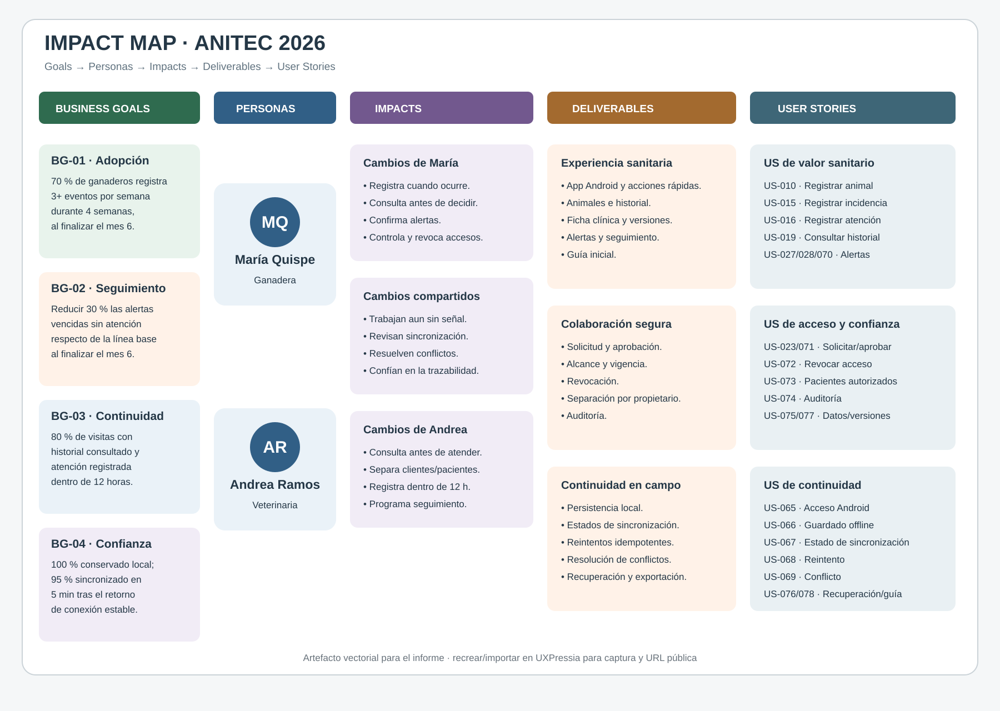

# 3.3. Impact Map

El Impact Map relaciona metas de negocio con las personas que pueden contribuir a ellas, los cambios de comportamiento esperados, los entregables capaces de provocar esos cambios y las User Stories que permiten construirlos. Se utilizan los User Personas vigentes: **María Quispe**, ganadera, y **Andrea Ramos**, veterinaria de campo. Los objetivos son hipótesis para un piloto futuro; las entrevistas mock no constituyen una línea base real.

## Business Goals SMART

| ID | Business Goal | Medición |
|---|---|---|
| **BG-01 — Adopción del registro** | Al finalizar los primeros seis meses del piloto, lograr que al menos 70 % de los ganaderos activados registre tres o más eventos válidos por semana durante cuatro semanas consecutivas. | Eventos de auditoría; cohorte de ganaderos que completó onboarding; revisión mensual. |
| **BG-02 — Seguimiento sanitario** | Al finalizar el sexto mes, reducir en 30 % la proporción de alertas sanitarias que vence sin atención respecto de la línea base medida durante las primeras cuatro semanas del piloto. | Alertas vencidas sin confirmación / alertas con vencimiento; comparación con línea base. |
| **BG-03 — Continuidad clínica** | Para el sexto mes, conseguir que al menos 80 % de las visitas veterinarias registradas tenga una consulta de historial asociada y una atención documentada dentro de las 12 horas posteriores. | Auditoría de consulta, visita y atención vinculadas al mismo propietario y animal. |
| **BG-04 — Confianza en campo** | Durante cada mes del piloto, conservar 100 % de las operaciones aceptadas localmente y sincronizar al menos 95 % dentro de los cinco minutos posteriores al retorno de una conexión estable. | Telemetría de cola móvil, reintentos, conflictos y confirmaciones del servidor. |

Los porcentajes deberán revisarse cuando exista una línea base real. “Usuario activado”, “evento válido”, “visita” y “conexión estable” se definirán operacionalmente antes de iniciar el piloto para evitar mediciones ambiguas.

## Trazabilidad Goal → Actor → Impact → Deliverable → User Story

| Goal | Actor / Persona | Impact esperado | Deliverable | User Stories |
|---|---|---|---|---|
| BG-01 | María Quispe | Registra el evento cuando ocurre y consulta el historial antes de decidir. | Registro móvil, ficha de animal e historial sanitario. | **US-010:** Como ganadero, quiero registrar un animal para mantener su trazabilidad. **US-015:** Como ganadero, quiero registrar una incidencia para facilitar el seguimiento. **US-019:** Como veterinario, quiero consultar el historial para tomar mejores decisiones. **US-065:** Como usuario de campo, quiero acceder a tareas prioritarias desde Android. |
| BG-01 | María Quispe | Completa las primeras tareas sin depender de capacitación extensa. | Guía inicial y acciones rápidas. | **US-003:** Como ganadero, quiero acceder a acciones rápidas para reducir pasos. **US-078:** Como usuario nuevo, quiero una guía breve para aprender los flujos prioritarios. |
| BG-02 | María Quispe | Revisa, confirma o reprograma alertas sanitarias. | Calendario y bandeja de alertas con prioridad. | **US-027:** Como usuario, quiero visualizar mis actividades para organizarme. **US-028:** Como usuario, quiero crear una actividad o recordatorio. **US-070:** Como responsable, quiero confirmar o posponer una alerta para evitar olvidos. |
| BG-02 | Andrea Ramos | Programa el seguimiento y verifica su estado con el productor. | Seguimiento asociado a la atención y pendientes por cliente. | **US-016:** Como veterinario, quiero registrar diagnóstico, tratamiento y seguimiento. **US-020:** Como veterinario, quiero revisar clientes y seguimientos pendientes. **US-070:** Como responsable, quiero confirmar la atención de alertas. |
| BG-03 | Andrea Ramos | Consulta solo los pacientes autorizados antes o durante la visita. | Cartera separada por propietario, historial y autorización por recurso. | **US-023:** Como veterinario, quiero solicitar acceso sanitario. **US-071:** Como propietario, quiero aprobar o rechazar solicitudes. **US-073:** Como veterinario, quiero consultar únicamente clientes y pacientes autorizados. |
| BG-03 | Andrea Ramos | Registra la atención y conserva sus rectificaciones. | Ficha clínica, historial de versiones y auditoría. | **US-016:** Como veterinario, quiero registrar la atención. **US-018:** Como profesional, quiero rectificar o anular sin borrar. **US-074:** Como propietario, quiero consultar la auditoría. **US-077:** Como profesional, quiero revisar versiones. |
| BG-04 | María Quispe | Registra sin señal y verifica qué información se sincronizó. | Persistencia local, cola visible y reintento. | **US-066:** Como usuario de campo, quiero guardar sin conexión. **US-067:** Como usuario, quiero consultar estados de sincronización. **US-068:** Como usuario, quiero reintentos sin duplicados. |
| BG-04 | Andrea Ramos | Continúa una atención sin conexión y resuelve conflictos sin sobrescribir. | Borrador clínico offline, idempotencia y resolución de conflictos. | **US-066:** Como usuario autorizado, quiero guardar offline. **US-069:** Como usuario autorizado, quiero resolver conflictos. **US-076:** Como usuario, quiero recuperar información sincronizada. |
| BG-01, BG-03 | María Quispe | Controla quién participa y revoca relaciones terminadas. | Gestión de permisos y auditoría. | **US-071:** Como propietario, quiero definir alcance y duración. **US-072:** Como propietario, quiero revocar acceso. **US-074:** Como propietario, quiero verificar el uso de sus datos. |

## Lectura del mapa

El mapa coloca primero los resultados de comportamiento y después las funcionalidades. IoT, finanzas, landing page y pagos se conservan en el catálogo general, pero no ocupan el núcleo del Impact Map porque las entrevistas mock priorizan registro, historial, alertas, colaboración y conectividad. Podrán incorporarse cuando exista un Business Goal que justifique su impacto.

La instrumentación de BG-01 a BG-04 requiere auditoría y telemetría respetuosas de la privacidad. Las métricas deben evitar contenido clínico innecesario y utilizar identificadores controlados. El mapa y sus metas deberán revisarse al obtener evidencia de usuarios reales.

## Evidencia de herramienta

- **Herramienta requerida:** UXPressia.
- **Captura incluida:** representación vectorial editable del mapa actualizado.
- **URL pública de UXPressia:** pendiente de incorporar después de recrear o importar el mapa en la cuenta del equipo.

No se incluye una URL ficticia. Para la entrega final, el equipo deberá publicar el artefacto en UXPressia, sustituir o acompañar la representación actual con su captura y registrar el enlace público.
