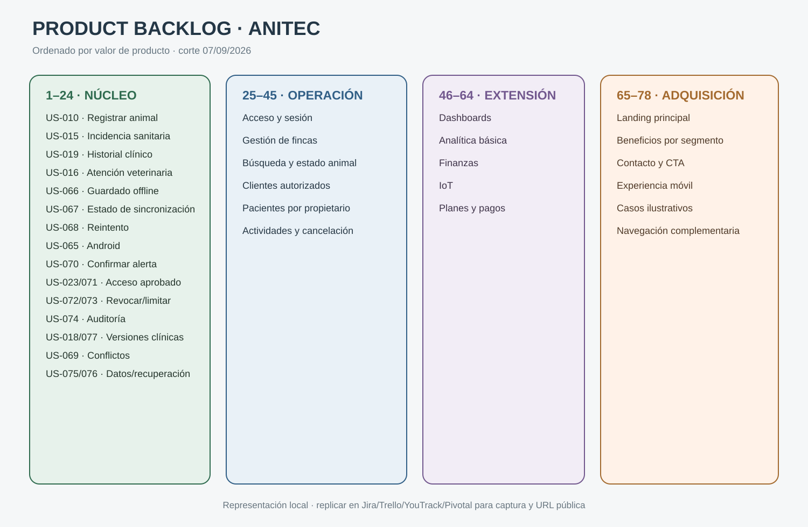

# 3.4. Product Backlog

El Product Backlog ordena las User Stories por valor esperado para los dos segmentos. La prioridad parte de las tareas más frecuentes e importantes del capítulo II y de los Business Goals del Impact Map. Por ello, registro, historial, continuidad offline, alertas y colaboración autorizada aparecen antes que analítica, finanzas, IoT, suscripciones y landing page. La autenticación se mantiene como habilitador cercano al primer incremento de valor, pero no encabeza el backlog únicamente por ser un requisito técnico.

Las estimaciones utilizan exclusivamente la escala solicitada `1, 2, 3, 5 y 8`. Los valores expresan complejidad relativa, incertidumbre y esfuerzo del equipo, no horas. Una historia estimada en 8 debe revisarse y, si no puede completarse dentro de un sprint, dividirse antes de comprometerla.

| # Orden | User Story ID | Título | Descripción | Story Points |
|---:|---|---|---|---:|
| 1 | US-010 | Registrar animal | Como ganadero, quiero registrar un animal para mantener la trazabilidad de mi hato. | 5 |
| 2 | US-008 | Visualizar animales | Como ganadero, quiero ver mis animales para consultar rápidamente su información principal. | 3 |
| 3 | US-015 | Registrar incidencia sanitaria | Como ganadero, quiero registrar una incidencia para dejar constancia y facilitar el seguimiento. | 5 |
| 4 | US-019 | Consultar historial clínico | Como veterinario, quiero consultar el historial autorizado de un animal para decidir con mejores antecedentes. | 5 |
| 5 | US-016 | Registrar atención veterinaria | Como veterinario, quiero registrar diagnóstico, tratamiento y seguimiento para documentar la atención. | 5 |
| 6 | US-066 | Guardar sin conexión | Como usuario de campo, quiero guardar un evento sin conexión para no perder el trabajo realizado. | 8 |
| 7 | US-067 | Consultar estado de sincronización | Como usuario, quiero distinguir estados de sincronización para saber si mis datos llegaron a la nube. | 3 |
| 8 | US-068 | Reintentar sincronización | Como usuario, quiero reintentos sin duplicados para recuperar continuidad al regresar la conexión. | 5 |
| 9 | US-065 | Acceder desde Android | Como usuario de campo, quiero completar tareas prioritarias desde Android para no depender de una computadora. | 5 |
| 10 | US-027 | Visualizar actividades | Como usuario, quiero revisar actividades programadas para organizar controles y trabajo. | 3 |
| 11 | US-028 | Crear actividad o recordatorio | Como usuario, quiero programar una actividad para recordar controles, visitas y tareas. | 5 |
| 12 | US-070 | Confirmar una alerta | Como responsable, quiero confirmar o posponer una alerta para conservar visible su seguimiento. | 3 |
| 13 | US-023 | Solicitar acceso sanitario | Como veterinario, quiero solicitar acceso para atender a un ganadero cuando el propietario lo apruebe. | 5 |
| 14 | US-071 | Aprobar o rechazar acceso | Como propietario, quiero definir alcance y duración de una solicitud para controlar mis datos. | 5 |
| 15 | US-073 | Consultar pacientes autorizados | Como veterinario, quiero ver únicamente clientes y animales autorizados para no mezclar información. | 3 |
| 16 | US-072 | Revocar acceso | Como propietario, quiero revocar un acceso para impedir nuevas consultas o modificaciones. | 3 |
| 17 | US-074 | Consultar auditoría | Como propietario, quiero conocer las operaciones sensibles para verificar el uso de mis datos. | 5 |
| 18 | US-017 | Editar borrador sanitario | Como profesional autorizado, quiero completar una atención antes de finalizarla. | 3 |
| 19 | US-018 | Rectificar o anular registro | Como profesional autorizado, quiero corregir sin borrar la historia clínica. | 5 |
| 20 | US-077 | Consultar versiones sanitarias | Como profesional autorizado, quiero revisar versiones para comprender qué cambió. | 3 |
| 21 | US-069 | Resolver conflicto de sincronización | Como usuario autorizado, quiero resolver diferencias sin sobrescribir información silenciosamente. | 8 |
| 22 | US-076 | Recuperar información sincronizada | Como usuario, quiero recuperar mis datos cloud después de cambiar o reinstalar el dispositivo. | 5 |
| 23 | US-075 | Exportar información propia | Como propietario, quiero exportar mis datos para conservar una copia reutilizable. | 5 |
| 24 | US-078 | Completar guía inicial | Como usuario nuevo, quiero una guía breve para aprender tareas, estados offline y permisos. | 3 |
| 25 | US-053 | Iniciar sesión | Como usuario registrado, quiero iniciar sesión para acceder a las capacidades de mi rol. | 5 |
| 26 | US-054 | Redirigir según rol | Como usuario autenticado, quiero llegar al panel correspondiente a mis responsabilidades. | 3 |
| 27 | US-055 | Restringir acceso según rol | Como usuario autenticado, quiero acceder solamente a las secciones permitidas. | 5 |
| 28 | US-056 | Cerrar sesión | Como usuario autenticado, quiero cerrar sesión para proteger mi información. | 2 |
| 29 | US-004 | Visualizar fincas | Como ganadero, quiero ver mis fincas para identificar cada unidad productiva. | 3 |
| 30 | US-005 | Registrar finca | Como ganadero, quiero registrar una finca para organizar animales y actividades. | 5 |
| 31 | US-006 | Editar finca | Como ganadero, quiero actualizar una finca para mantener información vigente. | 3 |
| 32 | US-007 | Desactivar finca | Como ganadero, quiero desactivar una finca sin perder sus registros históricos. | 3 |
| 33 | US-009 | Buscar animales | Como ganadero, quiero buscar animales por identificadores para encontrarlos rápidamente. | 3 |
| 34 | US-011 | Editar animal | Como ganadero, quiero actualizar los datos permitidos de un animal. | 3 |
| 35 | US-012 | Cambiar estado del animal | Como ganadero, quiero marcar un animal vendido, transferido, fallecido o inactivo sin perder su historial. | 3 |
| 36 | US-013 | Consultar animales según rol | Como usuario, quiero ver únicamente animales permitidos para proteger información de propietarios. | 3 |
| 37 | US-014 | Visualizar registros sanitarios | Como usuario autorizado, quiero revisar eventos sanitarios visibles para mi rol. | 3 |
| 38 | US-020 | Visualizar dashboard veterinario | Como veterinario, quiero revisar clientes, pacientes y seguimientos para organizar mi trabajo. | 5 |
| 39 | US-021 | Seleccionar cliente | Como veterinario, quiero seleccionar un cliente autorizado para revisar sus fincas. | 3 |
| 40 | US-022 | Visualizar clientes asignados | Como veterinario, quiero revisar mis clientes vigentes para comprender su situación. | 3 |
| 41 | US-024 | Finalizar relación profesional | Como veterinario, quiero finalizar una relación sin borrar atenciones previas. | 3 |
| 42 | US-025 | Consultar pacientes por ganadero | Como veterinario, quiero ver pacientes separados por propietario. | 3 |
| 43 | US-026 | Acceder al historial del paciente | Como veterinario, quiero abrir el historial desde la ficha del paciente. | 3 |
| 44 | US-029 | Editar actividad | Como responsable, quiero actualizar fecha, prioridad o estado de una actividad. | 3 |
| 45 | US-030 | Cancelar actividad | Como responsable, quiero cancelar con motivo sin borrar la trazabilidad. | 2 |
| 46 | US-001 | Visualizar resumen ganadero | Como ganadero, quiero revisar animales, fincas, alertas y actividades en un resumen. | 5 |
| 47 | US-002 | Filtrar resumen por finca | Como ganadero, quiero filtrar indicadores por unidad productiva. | 3 |
| 48 | US-003 | Acceder a acciones rápidas | Como ganadero, quiero reducir pasos en las tareas frecuentes. | 3 |
| 49 | US-035 | Visualizar analítica ganadera | Como ganadero, quiero revisar indicadores sanitarios y productivos básicos. | 5 |
| 50 | US-036 | Visualizar analítica veterinaria | Como veterinario, quiero revisar indicadores de clientes autorizados. | 5 |
| 51 | US-037 | Visualizar estado sanitario | Como ganadero, quiero conocer cuántos animales requieren observación o tratamiento. | 5 |
| 52 | US-038 | Agrupar registros por tipo | Como usuario autorizado, quiero agrupar eventos sanitarios para interpretar recurrencias. | 3 |
| 53 | US-039 | Visualizar atenciones por hato | Como veterinario, quiero conocer qué clientes requieren mayor seguimiento. | 3 |
| 54 | US-064 | Consumir dashboards del backend | Como usuario, quiero indicadores calculados con información persistida y autorizada. | 5 |
| 55 | US-031 | Visualizar movimientos financieros | Como ganadero, quiero revisar ingresos, egresos y balance. | 3 |
| 56 | US-032 | Registrar movimiento financiero | Como ganadero, quiero registrar ingresos y egresos para actualizar el balance. | 5 |
| 57 | US-033 | Editar movimiento financiero | Como ganadero, quiero corregir datos permitidos de un movimiento. | 3 |
| 58 | US-034 | Anular movimiento financiero | Como ganadero, quiero anular con motivo sin borrar la operación original. | 3 |
| 59 | US-058 | Visualizar dispositivos IoT | Como usuario autorizado, quiero revisar dispositivos asociados a fincas o animales. | 5 |
| 60 | US-059 | Consultar métricas IoT | Como usuario autorizado, quiero consultar lecturas recientes de un dispositivo. | 5 |
| 61 | US-060 | Visualizar planes | Como usuario, quiero comparar planes para identificar una opción compatible con mi operación. | 3 |
| 62 | US-061 | Consultar suscripción activa | Como usuario, quiero conocer el estado y alcance de mi plan. | 3 |
| 63 | US-062 | Realizar pago de prueba | Como usuario, quiero recorrer un pago controlado para validar el flujo de suscripción. | 8 |
| 64 | US-063 | Consultar historial de pagos | Como usuario, quiero revisar los pagos asociados a mi cuenta. | 3 |
| 65 | US-044 | Visualizar landing principal | Como visitante, quiero comprender rápidamente la propuesta de AniTec. | 5 |
| 66 | US-045 | Conocer beneficios | Como visitante, quiero revisar beneficios para evaluar la propuesta. | 3 |
| 67 | US-046 | Visualizar información para ganaderos | Como ganadero visitante, quiero conocer casos de uso relacionados con mi trabajo. | 3 |
| 68 | US-047 | Visualizar información para veterinarios | Como veterinario visitante, quiero conocer casos de uso relacionados con mi trabajo. | 3 |
| 69 | US-051 | Acceder a contacto o CTA | Como visitante interesado, quiero encontrar el siguiente paso para contactar al equipo. | 2 |
| 70 | US-052 | Navegar landing desde móvil | Como visitante móvil, quiero revisar la landing sin problemas de visualización. | 3 |
| 71 | US-048 | Visualizar página Nosotros | Como visitante, quiero conocer al equipo y el propósito del producto. | 2 |
| 72 | US-049 | Cambiar idioma de landing | Como visitante, quiero elegir el idioma disponible de la landing. | 3 |
| 73 | US-050 | Consultar casos ilustrativos | Como visitante, quiero comprender escenarios de uso sin confundirlos con testimonios reales. | 3 |
| 74 | US-040 | Navegar mediante menú por rol | Como usuario, quiero acceder a funciones mediante una navegación acorde con mi rol. | 3 |
| 75 | US-041 | Visualizar inicio interno | Como usuario, quiero encontrar un resumen y accesos principales al ingresar. | 3 |
| 76 | US-042 | Visualizar información sobre AniTec | Como usuario, quiero comprender el propósito y alcance de la aplicación. | 2 |
| 77 | US-043 | Visualizar página no encontrada | Como usuario, quiero recuperarme de una ruta inexistente. | 1 |
| 78 | US-057 | Cambiar idioma de interfaz | Como usuario, quiero elegir un idioma disponible para utilizar la aplicación. | 3 |

## Criterio de priorización

- **Órdenes 1–24:** núcleo de validación; registro, sanidad, Android, offline, alertas, permisos, auditoría y propiedad de datos.
- **Órdenes 25–45:** capacidades habilitadoras y gestión operativa completa de ganaderos y veterinarios.
- **Órdenes 46–58:** resúmenes, analítica básica y finanzas.
- **Órdenes 59–64:** IoT y monetización, sujetos a drivers, costos y validación comercial.
- **Órdenes 65–78:** adquisición, contenido público y experiencia complementaria.

Los Technical Enablers TS-001–TS-030 se detallan en la sección 3.2 y se descompondrán en el Architectural Design Backlog y los Sprint Backlogs. No se colocan por delante de las User Stories en esta tabla: el orden principal representa valor de producto, mientras ADD determinará qué trabajo técnico habilita cada incremento.

## Evidencia de herramienta

- **Herramientas admitidas por el statement:** Pivotal Tracker, JetBrains YouTrack, Jira Software o Trello.
- **Fecha de corte de esta versión:** 7 de septiembre de 2026.
- **Captura incluida:** representación vectorial del orden y los bloques de prioridad.
- **URL pública del Product Backlog:** pendiente de incorporar cuando el equipo replique este orden en la herramienta seleccionada.

No se inventa una URL ni una captura de una cuenta inexistente. Antes de la entrega, el equipo deberá copiar los 78 elementos a la herramienta, verificar que el orden coincida con esta tabla, publicar el tablero con los permisos acordados y reemplazar o acompañar la representación actual con una captura real.
