# 4.1. Design Concepts, ViewPoints & ER Diagrams

En esta sección el equipo aplica el método ADD v3 del SEI a AniTec. Antes de iterar sobre la arquitectura (sección 4.3) se documentan los conceptos de diseño vigentes: los principios y enfoques que guían las decisiones, las vistas C4/UML del sistema tal como está implementado hoy, y el modelo de datos real. Todo el contenido de esta sección describe el sistema **tal como existe actualmente** (un monolito modular ASP.NET Core + SPA Vue 3 + MySQL) y no un diseño aspiracional; las secciones 4.2 y 4.3 son las que introducen y justifican cambios sobre esta base.

## 4.1.1. Principles Statements

Estos son los principios generales que se observan de forma consistente en el código de AniTec y que el equipo se compromete a mantener conforme el sistema crezca:

1. **Aislamiento por bounded context, incluso compartiendo base de datos.** Cada contexto (Livestock, Sanitary, Financial, Activities, Analytics, Devices, Metrics, Subscriptions, Clients, Profiles, Iam) tiene su propia carpeta con capas `Domain/Application/Infrastructure/Interfaces` y su propio conjunto de tablas. Las referencias hacia otro contexto (por ejemplo, `owner_id` u `veterinarian_id` apuntando conceptualmente a `users`) se guardan como enteros simples, nunca como *foreign key* real de base de datos entre contextos. Esto evita que un cambio en IAM rompa una migración de Livestock.
2. **Resultados explícitos sobre excepciones para fallos de negocio esperados.** Los *command services* devuelven `Result`/`Result<T>` (éxito o fallo con un `LivestockError`/mensaje) en vez de lanzar excepciones cuando, por ejemplo, un animal o un corral no existen. Las excepciones quedan reservadas para errores verdaderamente inesperados.
3. **Frontera explícita entre el dominio y el contrato REST.** Ninguna entidad de dominio se serializa directamente: cada contexto define *Resources* (DTOs) y *Assemblers* dedicados (`...FromEntityAssembler`, `...CommandFromResourceAssembler`) para traducir en ambos sentidos. Un cambio de forma en una entidad no filtra automáticamente al contrato público.
4. **Validar cerca del borde, con mensajes por campo.** Las reglas de negocio invariantes (por ejemplo, que un animal siempre tenga un corral, o que un lote tenga entre 1 y 500 unidades) se validan explícitamente en el controlador antes de construir el comando, acumulando una lista de errores específicos por campo en vez de un mensaje genérico único — esta es una decisión reforzada directamente por retroalimentación real de uso durante el desarrollo de este ciclo.
5. **Convención sobre configuración en la persistencia.** Los nombres de tabla, columna, llave primaria (`p_k_*`), llave foránea (`f_k_*`) e índice (`i_x_*`) se derivan automáticamente del modelo C# mediante una convención *snake_case* aplicada una sola vez (`UseSnakeCaseNamingConvention`), en vez de mapearse a mano por cada entidad.

## 4.1.2. Approaches Statements Architectural Styles & Patterns

**Enfoque (Approach): Domain-Driven Design.** AniTec se organiza como un conjunto de *bounded contexts* explícitos con su propio lenguaje ubicuo (Hato/Corral/Animal en Livestock, Registro Sanitario en Sanitary, etc.), cada uno con su Aggregate Root, sus *Commands*/*Queries*, su *Repository* y su *Assembler*.

**Estilo arquitectónico principal: Monolito Modular (Modular Monolith).** Todo el backend se compila y despliega como un único proyecto (`Anitec.Platform`, un solo `.csproj`, un solo `Program.cs`), pero internamente está particionado por bounded context siguiendo el mismo patrón de capas en cada uno. No existen hoy un API Gateway ni un *message broker*: la comunicación entre contextos ocurre en proceso, y las referencias cruzadas se resuelven por convención de IDs (principio 4.1.1.1), no por eventos. Esta es una decisión consciente para el tamaño actual del equipo y del producto — la sección 4.3 (Iteración 3) evalúa cuándo y cómo evolucionar hacia servicios extraídos.

**Estilo complementario: Cliente-Servidor / REST sobre HTTPS.** El SPA (Vue 3 + Vite) consume la API exclusivamente vía JSON/HTTPS, sin *server-side rendering* ni acoplamiento de sesión en el servidor (autenticación *stateless* vía JWT).

**Patrón de comunicación interna: CQRS ligero.** Cada contexto separa explícitamente sus *Command Services* (escritura: `Handle(CreateXCommand)`, `Handle(UpdateXCommand)`, etc., devolviendo `Result`) de sus *Query Services* (lectura, devolviendo entidades o listas directamente) — sin *event sourcing* ni un modelo de lectura separado físicamente, es una separación de responsabilidades dentro de la misma base de datos.

## 4.1.3. Context Diagram

  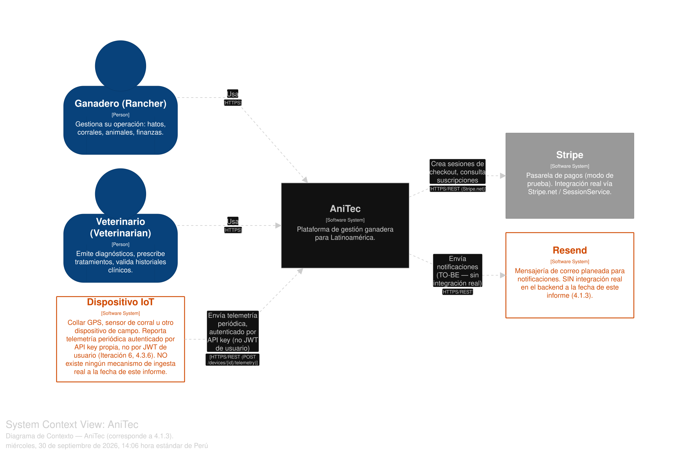

*Diagrama regenerado en Structurizr DSL (`CodeDiagrams/workspace.dsl`), verificado y sin errores de inspección — reemplaza la versión previa en PNG.*

El diagrama de contexto muestra a AniTec como un único sistema de software con dos tipos de usuario humano y tres sistemas externos (uno de ellos, to-be):

- **Ganadero (Rancher)** — usuario principal, gestiona su operación (hatos, corrales, animales, finanzas) a través de la plataforma.
- **Veterinario (Veterinarian)** — emite diagnósticos, prescribe tratamientos y valida historiales clínicos del ganado de sus clientes.
- **Stripe** *(sistema externo, confirmado real)* — pasarela de pagos utilizada para gestionar suscripciones en modo de prueba (`Stripe.net`, `SessionService` real dentro de `SubscriptionsController`).
- **Resend** *(sistema externo, aún no implementado)* — el diagrama documenta un sistema de mensajería de correo planeado para notificaciones; a la fecha de este informe **no existe ninguna integración real con Resend en el backend** (se verificó que no hay referencia alguna al SDK ni a llamadas HTTP hacia Resend en el código). Se conserva en el diagrama como parte del diseño objetivo (diseñado en la Iteración 5, 4.3.5), pero debe leerse como *pendiente de implementación*, no como una integración vigente.
- **Dispositivo IoT** *(sistema externo, to-be)* — collar GPS, sensor de corral u otro dispositivo de campo. Se agrega al diagrama de contexto como parte del diseño de la Iteración 6 (4.3.6); no existe ningún mecanismo de ingesta real a la fecha de este informe.

## 4.1.4. Approach Driven ViewPoints Diagrams

### Diagrama de Contenedores (C4)

  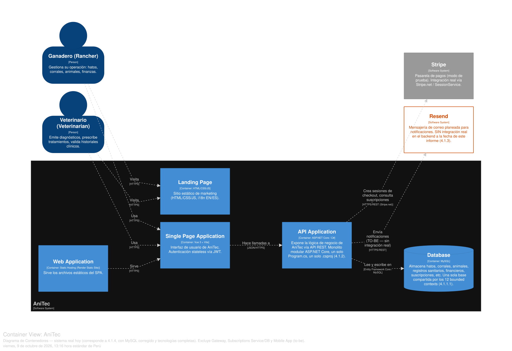

Diagrama regenerado en Structurizr DSL, verificado contra el código real: el motor de base de datos es **MySQL** vía `MySql.EntityFrameworkCore`, y cada relación entre contenedores incluye su tecnología completa — SPA → API Application en **JSON/HTTPS**, API Application → Base de datos en **Entity Framework Core / MySQL**, Usuarios → Landing/Web App en **HTTPS**. Muestra el sistema **real, hoy**: Landing Page, Web Application que sirve el SPA, Single Page Application en Vue 3 + Vite, API Application y la base de datos — excluye el API Gateway, el Subscriptions Service y la Mobile App, que son diseño *to-be* de las Iteraciones 3 y 4 (secciones 4.3.3 y 4.3.4, con sus propios diagramas de contenedores extendidos).

### Diagramas de Componentes (C4) por Bounded Context

Regenerados en Structurizr DSL a partir del inventario real de clases del backend (verificado directamente contra `Program.cs` y cada carpeta `Interfaces/Rest`). Los 12 bounded contexts expuestos en la API Application quedan documentados, cada uno con su borde de entrada (SPA) y salida (Database) reales:

  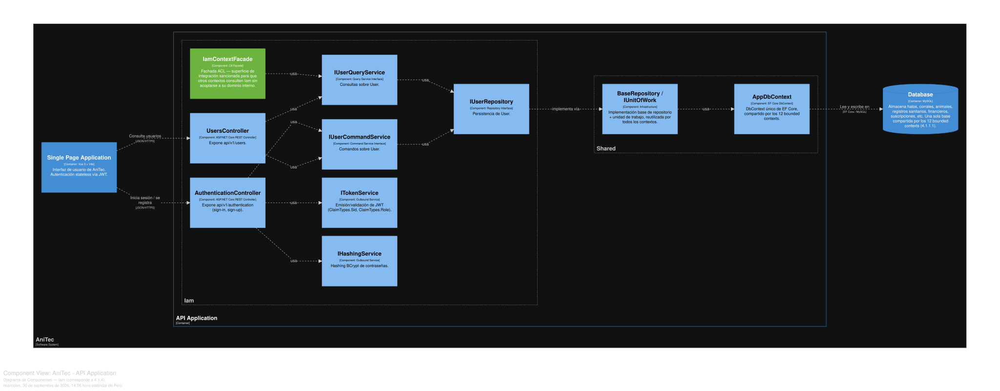

  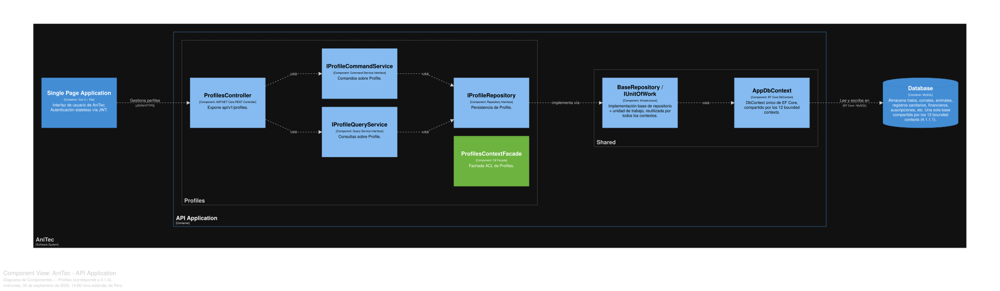

  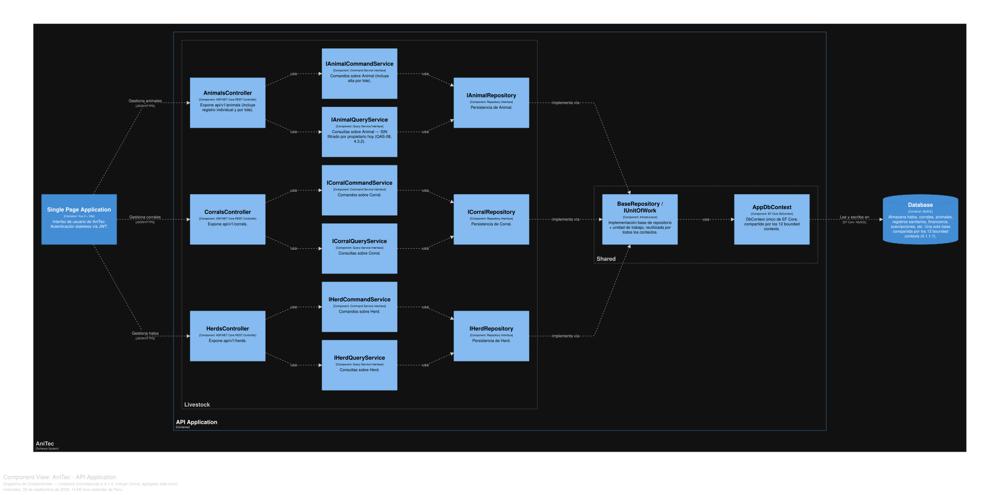

  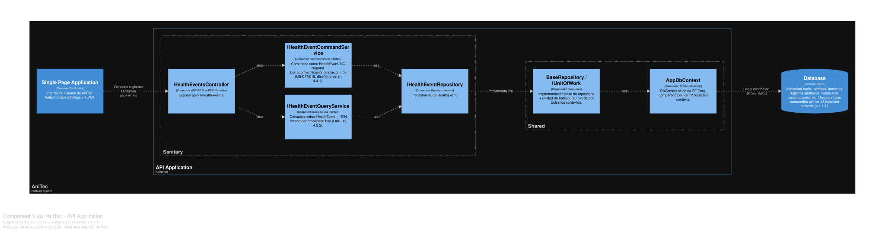

  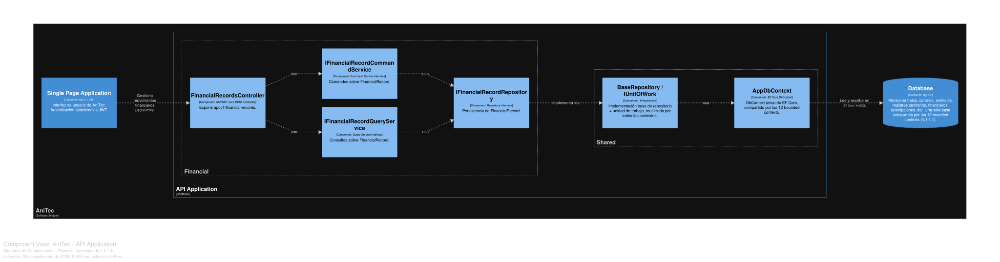

  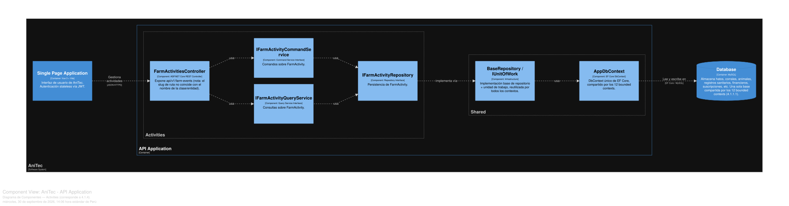

  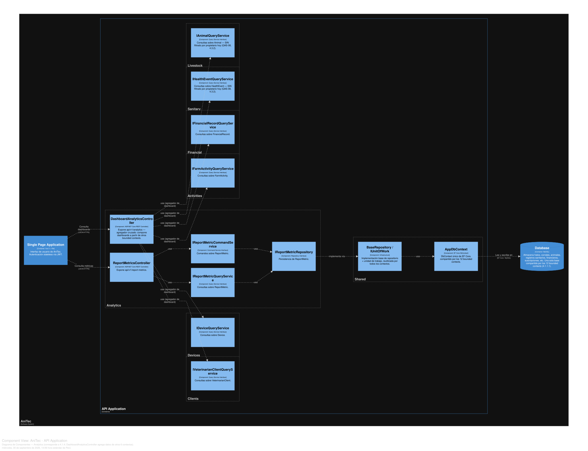

  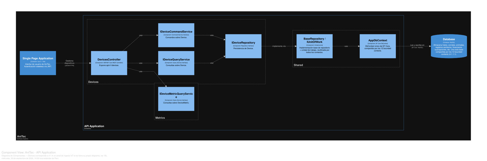

  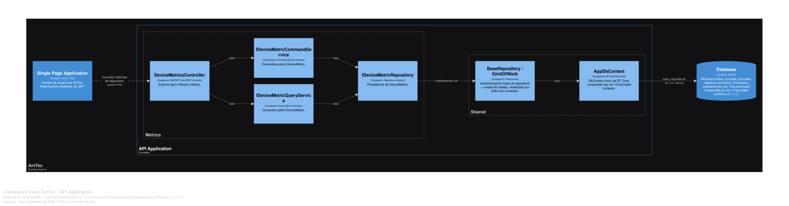

  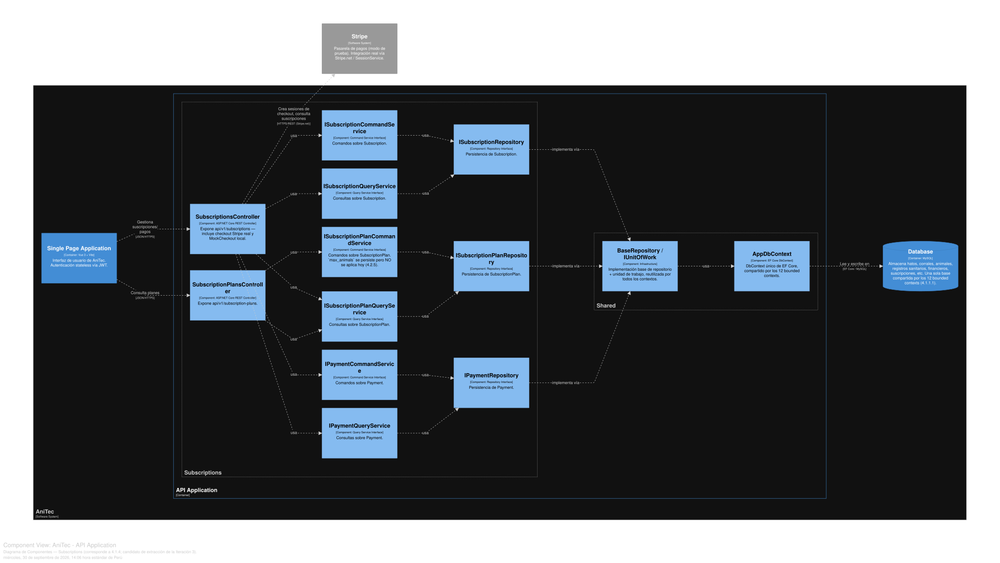

  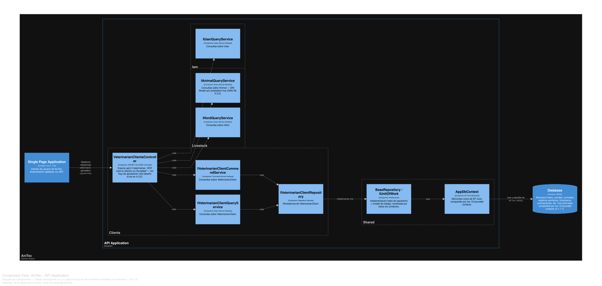

  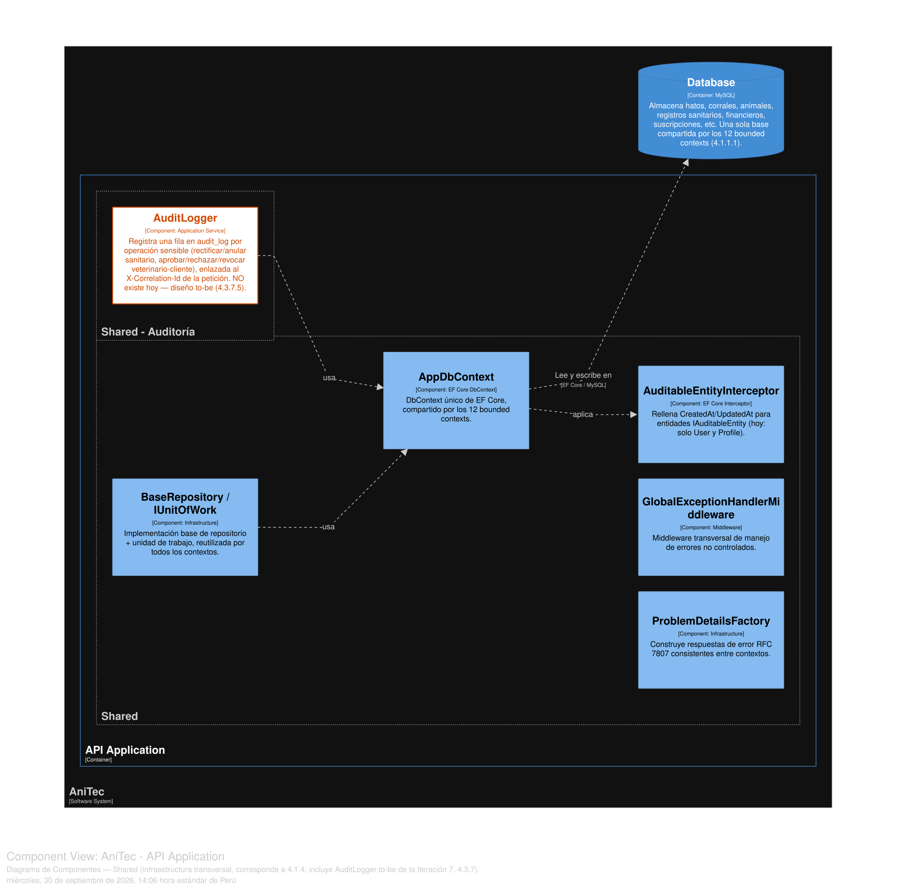

El de **Shared** ya incluye `AuditLogger`, diseñado en la Iteración 7 (4.3.7) — la infraestructura transversal (persistencia, auditoría, manejo de errores) se documenta en un solo lugar en vez de repetirse en cada iteración que la usa.

### Diagrama de clases (UML)

  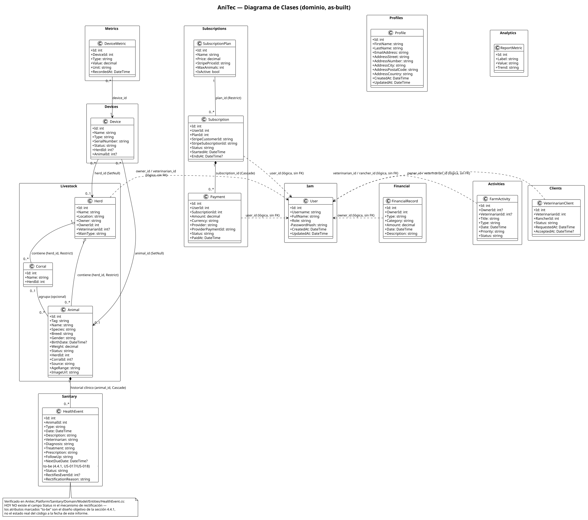

Diagrama regenerado en PlantUML a partir del esquema real (verificado contra `AppDbContextModelSnapshot.cs`): incluye `Corral` y los atributos agregados a `Animal` este ciclo (`corralId`, `imageUrl`, `source`, `ageRange`). Las 15 entidades de dominio quedan agrupadas por bounded context, con sus 9 relaciones FK reales (diferenciadas entre agregación y composición según el comportamiento real de `ON DELETE` en MySQL) y sus 6 referencias lógicas hacia `User` en línea punteada, sin FK real, consistente con el principio de aislamiento por bounded context (4.1.1.1). Los 3 campos de `HealthEvent` marcados como *to-be* (`Status`, `RectifiesEventId`, `RectificationReason`) corresponden al diseño objetivo de la sección 4.4.1 — verificado en el código que no existen hoy.

Este diagrama documenta el **modelo de dominio del backend**. El *statement* no exige que el diagrama de clases sea de una capa en particular — como complemento, se incluye también la vista de clases del lado del cliente:

  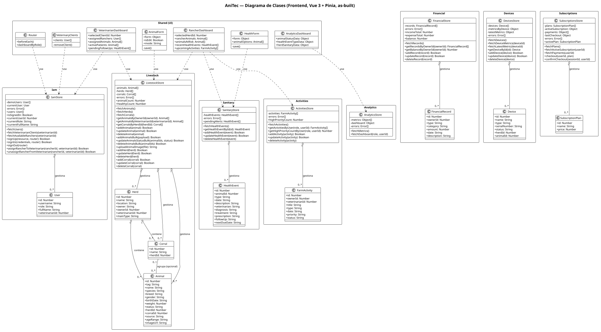

Diagrama regenerado en PlantUML, verificado directamente contra los 8 *stores* de Pinia reales (`anitec-frontend/src`) — no es el modelo de dominio del backend, es la arquitectura de estado del cliente (*stores*, entidades locales, *dashboards*, formularios), e incluye `DevicesStore` y `SubscriptionsStore`.

### Diagrama de actividad — Registro de animales (individual vs. por lote)

  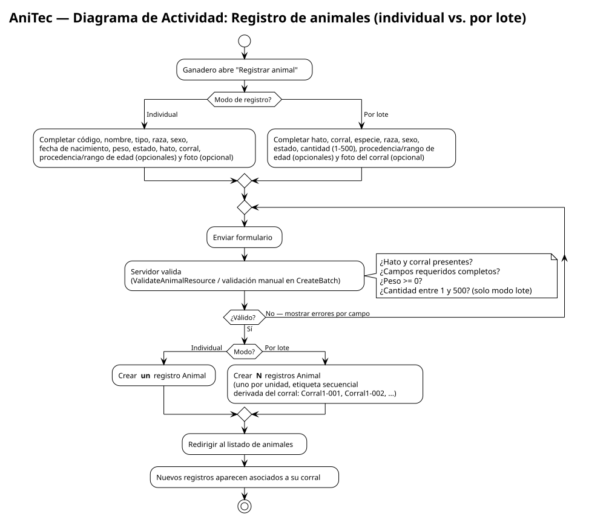

Diagrama regenerado en PlantUML. Representa el flujo real implementado en `animal-form.vue` / `AnimalsController`:

1. **Inicio** — el ganadero abre "Registrar animal".
2. **Decisión — Modo de registro**: ¿Individual o "Varios (corral)"?
   - **Individual**: completa código, nombre, tipo, raza, sexo, fecha de nacimiento, peso, estado, hato, corral, procedencia/rango de edad (opcionales) y foto (opcional).
   - **Por lote**: completa hato, corral, especie, raza, sexo, estado, cantidad (1–500), procedencia/rango de edad (opcionales) y una foto del corral completo (opcional).
3. **Validación** (servidor, `ValidateAnimalResource` / validación manual en `CreateBatch`): ¿hato y corral presentes? ¿campos requeridos completos? ¿peso ≥ 0? ¿cantidad entre 1 y 500?
   - **No válido** → el sistema responde con la lista de mensajes de error por campo → el ganadero corrige y reintenta (vuelve al paso 2).
   - **Válido** → continúa.
4. **Creación**: modo individual crea **un** registro `Animal`; modo lote crea **N** registros `Animal` (uno por unidad), con etiqueta secuencial derivada del nombre del corral (`Corral1-001`, `Corral1-002`, …).
5. **Fin** — el sistema redirige al listado de animales, donde los nuevos registros aparecen asociados a su corral.

## 4.1.5. Relational/Non Relational Database Diagram

AniTec usa una única base de datos relacional **MySQL**, con un `DbContext` compartido por todos los bounded contexts (sin *schemas* separados). Los nombres de tabla/columna/constraint se derivan automáticamente del modelo C# vía convención *snake_case* (`p_k_<tabla>`, `f_k_<tabla>__<referencia>`, `i_x_<tabla>_<columna>`).

  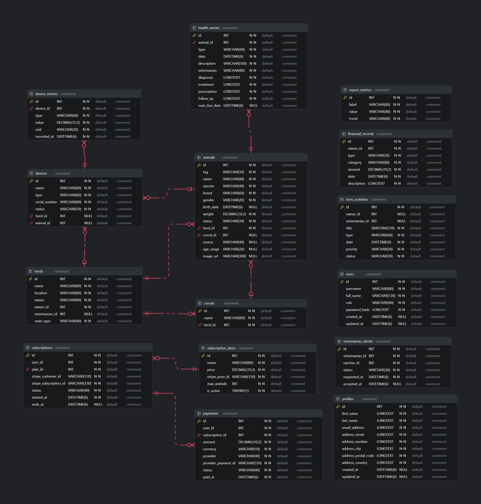

Diagrama ER regenerado a partir del esquema SQL real (`CodeDiagrams/4-1-design-concepts-viewpoints-er-diagrams/anitec-schema.sql`, extraído de `AppDbContextModelSnapshot.cs`). Nota de lectura: las líneas que conectan `users` con otras tablas (`herds`, `financial_records`, `farm_activities`, `veterinarian_clients`, `subscriptions`, `payments`) son inferencia de la herramienta de diagramación por nombre de columna, no *foreign keys* reales — ninguna de esas columnas tiene un `CONSTRAINT` en el SQL, consistente con el principio de aislamiento por bounded context (4.1.1.1).

### Diccionario de tablas (esquema real, MySQL)

**Bounded Context: Livestock**

| Tabla | Columna | Tipo | Nulo | PK/FK |
|---|---|---|---|---|
| `herds` | id | int | No | PK |
| | name | varchar(80) | No | |
| | location | varchar(80) | No | |
| | owner | varchar(80) | No | |
| | owner_id | int | No | (referencia lógica a `users`, sin FK real) |
| | veterinarian_id | int | Sí | (referencia lógica a `users`, sin FK real) |
| | main_type | varchar(40) | No | |
| `corrals` | id | int | No | PK |
| | name | varchar(80) | No | |
| | herd_id | int | No | FK → `herds.id` (Restrict) |
| `animals` | id | int | No | PK |
| | tag | varchar(30) | No | |
| | name | varchar(80) | No | |
| | species | varchar(40) | No | texto simple, **no** es FK |
| | breed | varchar(60) | No | texto simple, **no** es FK |
| | gender | varchar(20) | No | |
| | birth_date | datetime(6) | Sí | |
| | weight | decimal(18,2) | No | |
| | status | varchar(30) | No | |
| | herd_id | int | No | FK → `herds.id` (Restrict) |
| | corral_id | int | Sí | FK → `corrals.id` (SetNull) |
| | source | varchar(40) | Sí | |
| | age_range | varchar(20) | Sí | |
| | image_url | varchar(300) | Sí | |

**Bounded Context: Sanitary**

| Tabla | Columna | Tipo | Nulo | PK/FK |
|---|---|---|---|---|
| `health_events` | id | int | No | PK |
| | animal_id | int | No | FK → `animals.id` (Cascade) |
| | type | varchar(40) | No | |
| | date | datetime(6) | No | |
| | description | varchar(500) | No | |
| | veterinarian | varchar(80) | No | |
| | diagnosis / treatment / prescription / follow_up | longtext | No | |
| | next_due_date | datetime(6) | Sí | |

**Bounded Context: Financial**

| Tabla | Columna | Tipo | Nulo | PK/FK |
|---|---|---|---|---|
| `financial_records` | id | int | No | PK |
| | owner_id | int | No | (referencia lógica a `users`) |
| | type | varchar(20) | No | |
| | category | varchar(80) | No | |
| | amount | decimal(10,2) | No | |
| | date | datetime(6) | No | |
| | description | longtext | No | |

**Bounded Context: Activities**

| Tabla | Columna | Tipo | Nulo | PK/FK |
|---|---|---|---|---|
| `farm_activities` | id | int | No | PK |
| | owner_id / veterinarian_id | int | Sí | (referencia lógica a `users`) |
| | title | varchar(120) | No | |
| | type | varchar(40) | No | |
| | date | datetime(6) | No | |
| | priority | varchar(20) | No | |
| | status | varchar(30) | No | |

**Bounded Context: Analytics**

| Tabla | Columna | Tipo | Nulo | PK/FK |
|---|---|---|---|---|
| `report_metrics` | id | int | No | PK |
| | label | varchar(80) | No | |
| | value | varchar(40) | No | |
| | trend | varchar(80) | No | |

**Bounded Context: Devices**

| Tabla | Columna | Tipo | Nulo | PK/FK |
|---|---|---|---|---|
| `devices` | id | int | No | PK |
| | name | varchar(80) | No | |
| | type | varchar(60) | No | |
| | serial_number | varchar(80) | No | |
| | status | varchar(30) | No | |
| | herd_id | int | Sí | FK → `herds.id` (SetNull) |
| | animal_id | int | Sí | FK → `animals.id` (SetNull) |

**Bounded Context: Metrics**

| Tabla | Columna | Tipo | Nulo | PK/FK |
|---|---|---|---|---|
| `device_metrics` | id | int | No | PK |
| | device_id | int | No | FK → `devices.id` (Cascade) |
| | type | varchar(60) | No | |
| | value | decimal(12,2) | No | |
| | unit | varchar(20) | No | |
| | recorded_at | datetime(6) | No | |

**Bounded Context: Subscriptions**

| Tabla | Columna | Tipo | Nulo | PK/FK |
|---|---|---|---|---|
| `subscription_plans` | id | int | No | PK |
| | name | varchar(80) | No | |
| | price | decimal(10,2) | No | |
| | stripe_price_id | varchar(120) | No | |
| | max_animals | int | No | |
| | is_active | tinyint(1) | No | |
| `subscriptions` | id | int | No | PK |
| | user_id | int | No | (referencia lógica a `users`) |
| | plan_id | int | No | FK → `subscription_plans.id` (Restrict) |
| | stripe_customer_id / stripe_subscription_id | varchar(120) | No | |
| | status | varchar(40) | No | |
| | started_at | datetime(6) | No | |
| | ends_at | datetime(6) | Sí | |
| `payments` | id | int | No | PK |
| | user_id | int | No | (referencia lógica a `users`) |
| | subscription_id | int | No | FK → `subscriptions.id` (Cascade) |
| | amount | decimal(10,2) | No | |
| | currency / provider / provider_payment_id / status | varchar | No | |
| | paid_at | datetime(6) | No | |

**Bounded Context: Clients**

| Tabla | Columna | Tipo | Nulo | PK/FK |
|---|---|---|---|---|
| `veterinarian_clients` | id | int | No | PK |
| | veterinarian_id / rancher_id | int | No | (referencia lógica a `users`) |
| | status | varchar(30) | No | |
| | requested_at | datetime(6) | No | |
| | accepted_at | datetime(6) | Sí | |

Índice único: `(veterinarian_id, rancher_id)` — evita una relación duplicada entre el mismo par ganadero/veterinario.

**Bounded Context: IAM**

| Tabla | Columna | Tipo | Nulo | PK/FK |
|---|---|---|---|---|
| `users` | id | int | No | PK |
| | username | varchar(80) | No | |
| | full_name | varchar(120) | No | |
| | role | varchar(40) | No | |
| | password_hash | longtext | No | (hash BCrypt) |
| | created_at / updated_at | datetime | Sí | auditoría automática |

**Bounded Context: Profiles**

| Tabla | Columna | Tipo | Nulo | PK/FK |
|---|---|---|---|---|
| `profiles` | id | int | No | PK |
| | first_name / last_name | longtext | No | (Value Object `PersonName`) |
| | email_address | longtext | No | (Value Object `EmailAddress`) |
| | address_street / address_number / address_city / address_postal_code / address_country | longtext | No | (Value Object `StreetAddress`) |
| | created_at / updated_at | datetime | Sí | auditoría automática |

### Relaciones (foreign keys reales)

| Origen | Destino | Comportamiento al eliminar |
|---|---|---|
| `corrals.herd_id` | `herds.id` | Restrict |
| `animals.herd_id` | `herds.id` | Restrict |
| `animals.corral_id` | `corrals.id` | SetNull |
| `health_events.animal_id` | `animals.id` | Cascade |
| `devices.herd_id` | `herds.id` | SetNull |
| `devices.animal_id` | `animals.id` | SetNull |
| `device_metrics.device_id` | `devices.id` | Cascade |
| `subscriptions.plan_id` | `subscription_plans.id` | Restrict |
| `payments.subscription_id` | `subscriptions.id` | Cascade |

Todas las demás referencias entre contextos (`owner_id`, `veterinarian_id`, `rancher_id`, `user_id` hacia `users`) son **lógicas**, no llaves foráneas de base de datos — consistente con el principio de aislamiento por bounded context (4.1.1).

## 4.1.6. Design Patterns

| Patrón | Dónde se usa | Propósito |
|---|---|---|
| **Repository** | Un `I<Entidad>Repository`/`<Entidad>Repository : BaseRepository<T>` por agregado (ej. `IAnimalRepository`, `ICorralRepository`) | Aísla el acceso a datos de la lógica de aplicación; permite sustituir la implementación sin tocar los *command/query services*. |
| **Unit of Work** | `IUnitOfWork`/`UnitOfWork`, invocado como `unitOfWork.CompleteAsync()` al final de cada *command handler* | Agrupa múltiples cambios (por ejemplo, crear hasta 500 animales de un lote) en una sola transacción/`SaveChanges`. |
| **CQRS ligero (Command/Query Services)** | `I<Contexto>CommandService` vs. `I<Contexto>QueryService` en cada bounded context | Separa explícitamente las operaciones de escritura (que devuelven `Result`) de las de lectura. |
| **Assembler / Mapper** | `...ResourceFromEntityAssembler`, `Create...CommandFromResourceAssembler`, `Update...CommandFromResourceAssembler` | Traduce entre el modelo de dominio y los contratos REST en ambas direcciones, evitando serializar entidades directamente. |
| **Result** | `Result` / `Result<T>` (`Shared.Application.Model`), con `Success()`/`Failure(error, mensaje)` | Modela explícitamente el éxito o fracaso de un comando sin usar excepciones para casos de negocio esperados. |
| **DTO (Data Transfer Object)** | `...Resource` (ej. `AnimalResource`, `CreateAnimalBatchResource`) | Define el contrato JSON de entrada/salida de cada endpoint, independiente de la forma interna de la entidad. |

## 4.1.7. Tactics

Catálogo de tácticas arquitectónicas por atributo de calidad, ancladas a mecanismos realmente implementados (no aspiracionales):

| Atributo de calidad | Táctica | Mecanismo real |
|---|---|---|
| Seguridad | Autenticar usuarios | JWT emitido por `TokenService` tras validar credenciales en `sign-in` |
| Seguridad | Autorizar usuarios | Atributo `[Authorize("Rancher", "Veterinarian")]` por controlador/acción, verificado por rol |
| Seguridad | Limitar exposición de datos sensibles | Hashing de contraseñas con BCrypt; `[JsonIgnore]` sobre `PasswordHash` en el contrato de `User` |
| Modificabilidad | Mantener la semántica de la interfaz | Clases base genéricas (`BaseRepository<T>`, `BaseEndpoint` en el frontend) reutilizadas por todos los bounded contexts |
| Modificabilidad | Encapsular | Un *Assembler* dedicado por transformación entidad↔recurso; ningún controlador serializa una entidad directamente |
| Modificabilidad | Usar un intermediario | `Result<T>` como contrato de retorno uniforme entre *command services* y controladores |
| Usabilidad / Disponibilidad de la información | Validar entradas | Validación manual por campo (`ValidateAnimalResource`, validación de `CreateAnimalBatchResource`) devolviendo una lista de mensajes específicos en vez de un error genérico — mecanismo añadido explícitamente este ciclo tras detectar que el mensaje genérico no permitía al ganadero corregir su registro |
| Interoperabilidad | Documentar el contrato | Swagger/OpenAPI expuesto en `/swagger` sobre todos los controladores REST |
| Rendimiento | Agrupar operaciones | Registro por lote (`CreateAnimalBatchCommand`) inserta hasta 500 animales en una sola transacción en vez de 500 llamadas HTTP individuales |
