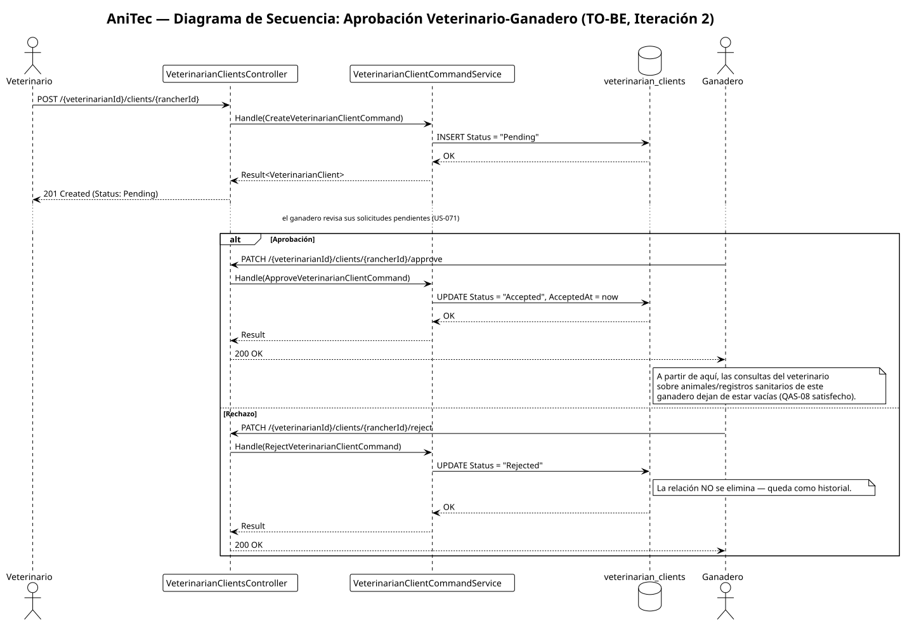

# 4.3.2. Iteration 2: Seguridad e Identidad

Segunda iteración ADD v3. A diferencia de la Iteración 1 (que formalizó documentación sobre una estructura ya correcta), esta iteración parte de una **brecha real encontrada al inspeccionar el código de autorización durante su preparación**: el sistema autentica y autoriza por rol correctamente, pero **no filtra resultados por propiedad del recurso**. Se documenta la evidencia, se diseña la corrección y se deja constancia explícita de que, como el resto del capítulo 4, esto es un **diseño para implementación futura** — no se modificó código de producción al escribir este informe.

## 4.3.2.1. Architectural Design Backlog 2

| # | Ítem | Tipo | Prioridad |
|---|---|---|---|
| 1 | Filtrar por propiedad/relación autorizada en los Query Services de Livestock, Sanitary y Financial. | Corrección de diseño | Alta |
| 2 | Rediseñar la asignación veterinario–ganadero para que quede pendiente de aprobación en vez de auto-aceptada. | Corrección de diseño | Alta |
| 3 | Exponer endpoints de aprobar/rechazar sobre `VeterinarianClientsController`. | Nueva interfaz | Alta |
| 4 | Diseñar (a nivel conceptual) un mecanismo mínimo de auditoría para operaciones sensibles. | Diseño | Media |
| 5 | Restringir la política CORS (`AllowAllPolicy`) a los orígenes reales del SPA y la landing page. | Corrección de configuración | Media |
| 6 | Agregar restricción de unicidad sobre `users.username`. | Corrección de esquema | Baja |

## 4.3.2.2. Establish Iteration Goal by Selecting Drivers

**Evidencia encontrada al preparar esta iteración:** `AnimalQueryService.Handle(GetAllAnimalsQuery)` y `HealthEventQueryService.Handle(GetAllHealthEventsQuery)` devuelven `repository.ListAsync(cancellationToken)` **sin ningún filtro** — es decir, cualquier usuario autenticado con rol Ganadero o Veterinario puede leer animales y registros sanitarios de **cualquier** propietario a través de la API, sin importar si le pertenecen o si existe una relación veterinario–cliente autorizada. Esto contradice directamente el criterio de aceptación ya escrito para US-013 ("*Then* el sistema muestra solo los animales de sus fincas"). El filtrado que sí funciona en la aplicación web (`getAnimalsByOwnerId`, `getAnimalsByVeterinarianId` en el store de Pinia) ocurre únicamente en el cliente — no protege contra una llamada directa a la API.

Esto se formaliza como un nuevo escenario de calidad, evidenciado durante esta iteración:

**QAS-08 — Confidencialidad por propiedad de recurso**
- **Fuente:** un ganadero o veterinario autenticado.
- **Estímulo:** solicita el listado o detalle de animales/registros sanitarios que no le pertenecen ni están bajo una relación de cliente autorizada.
- **Ambiente:** operación normal, incluyendo llamadas directas a la API (no solo a través del frontend oficial).
- **Artefacto:** `AnimalQueryService`, `HealthEventQueryService` y, por el mismo patrón, los query services de Financial y Activities.
- **Respuesta esperada:** el servidor filtra el resultado según propiedad o relación autorizada, independientemente del cliente que origina la petición.
- **Medida:** 0 registros ajenos devueltos por la API a un usuario sin relación autorizada — hoy **no se cumple** (verificado directamente en el código).

Esta iteración también formaliza dos escenarios ya definidos en 4.2.3 que hoy **ya se cumplen** (as-built), consistente con el mismo tratamiento que la Iteración 1 dio a QAS-04/05/07 — y uno de ellos tiene una interacción directa con QAS-08 que conviene dejar explícita:

**QAS-06 — Seguridad ante acceso no autorizado** (4.2.3) — ya satisfecho: cada controlador ya expone `[Authorize(role)]` (sección 4.1.7), y el frontend redirige rutas fuera del rol correspondiente. Esta iteración no rediseña este mecanismo, solo lo confirma como línea base sobre la que se construye el filtrado por recurso (QAS-08).

**QAS-02 — Continuidad clínica entre actores** (4.2.3) — ya satisfecho, pero con una dependencia real hacia el diseño de QAS-08: hoy un ganadero ve el diagnóstico que su veterinario registró porque **no hay filtro alguno** — cualquier query devuelve todo. Una vez que el filtrado por propiedad se implemente (ítem 1 de este backlog), esa visibilidad debe seguir garantizada explícitamente para el propietario del recurso, no solo bloquear a terceros — es decir, el diseño de `AnimalQueryService`/`HealthEventQueryService` en 4.3.2.5 debe seguir devolviendo el registro al `Rancher` dueño del `Herd`, no solo negarlo a quien no tiene relación. Se deja como caso de verificación explícito para no regresionar QAS-02 al cerrar QAS-08.

**Drivers seleccionados y prioridad:** QAS-08 (alta, brecha activa y verificada) > EP-015 / flujo de aprobación veterinario–cliente (alta, US-023/US-071) > TS-028 autorización de mínimo privilegio formal (media) > restricción de CORS (media, constraint 4.2.4) > QAS-02/QAS-06 (ya satisfechos, se formalizan sin rediseño) > restricción de unicidad en `username` (baja, Concern #6).

**Justificación de la priorización:** QAS-08 se prioriza primero porque es una vulnerabilidad activa y ya demostrada, no una mejora especulativa — cualquier prioridad de "mínimo privilegio" (TS-028) es prematura si el filtrado básico por propiedad todavía no existe. El flujo de aprobación veterinario–cliente (ítem 2) se ubica justo después porque es la pieza de datos que QAS-08 necesita para poder distinguir "veterinario autorizado" de "veterinario cualquiera" — sin un estado `Accepted` que realmente signifique aprobación explícita del ganadero, filtrar por la tabla `veterinarian_clients` no aportaría la garantía que QAS-08 exige.

**Meta de la iteración:** cerrar la brecha entre autorización por rol (ya sólida) y autorización por recurso (inexistente), usando la información de identidad que el JWT ya transporta (`ClaimTypes.Sid`, `ClaimTypes.Role` — confirmado en `TokenService`) y la relación veterinario–cliente ya modelada en `veterinarian_clients`, sin introducir tablas ni mecanismos nuevos donde no hacen falta.

## 4.3.2.3. Choose One or More Elements of the System to Refine

- Los Query Services de **Livestock** (`AnimalQueryService`), **Sanitary** (`HealthEventQueryService`) y **Financial** (equivalente para `FinancialRecord`).
- El bounded context **Clients** (`VeterinarianClientCommandService`, `VeterinarianClientsController`) — flujo de aprobación.
- La configuración de CORS en `Program.cs`.

## 4.3.2.4. Choose One or More Design Concepts That Satisfy the Selected Drivers

- **Autorización basada en recursos, derivada de la identidad del token — nunca de un parámetro provisto por el cliente.** El `callerId`/`callerRole` se extrae de `HttpContext.User.Claims` (ya disponibles), no de un `ownerId` en el query string, para que un usuario no pueda solicitar los datos de otro simplemente cambiando un parámetro.
- **Reutilizar el modelo de datos existente, no crear uno nuevo.** `veterinarian_clients` ya tiene `Status`, `RequestedAt` y `AcceptedAt` — el problema no es de esquema, es que el flujo actual nunca deja el estado en algo distinto de `"Accepted"`. La corrección es de comportamiento (comando), no de estructura.
- **Dependencia entre contextos vía llamada a servicio, no vía foreign key** — consistente con el principio 4.1.1.1: para que Livestock/Sanitary sepan qué ranchers están autorizados para un veterinario, consultan `IVeterinarianClientQueryService` (del contexto Clients) en tiempo de ejecución, sin agregar una FK cruzada en la base de datos.

## 4.3.2.5. Instantiate Architectural Elements, Allocate Responsibilities, and Define Interfaces

**Filtrado por propiedad (ítem 1 del backlog):**

| Elemento | Cambio de diseño propuesto |
|---|---|
| `GetAllAnimalsQuery` | Gana `CallerId: int` y `CallerRole: string`, poblados por el controlador desde `HttpContext.User.Claims`, nunca desde el body/query string del cliente. |
| `AnimalQueryService` | Pasa a depender también de `IHerdRepository` (ya existe en Livestock) y de `IVeterinarianClientQueryService` (nueva dependencia hacia Clients). Si `CallerRole == "Rancher"`, filtra animales cuyo `Herd.OwnerId == CallerId`. Si `CallerRole == "Veterinarian"`, obtiene los `RancherId` con relación `Status == "Accepted"` para ese veterinario y filtra animales cuyo hato pertenezca a esos ranchers. |
| `HealthEventQueryService` | Mismo patrón, resolviendo el propietario a través de `HealthEvent.AnimalId → Animal.HerdId → Herd.OwnerId`. |
| Financial (equivalente) | Filtra directamente por `FinancialRecord.OwnerId == CallerId` (no aplica veterinario, es exclusivo del ganadero). |

**Flujo de aprobación veterinario–cliente (ítems 2 y 3 del backlog):**

| Elemento | Cambio de diseño propuesto |
|---|---|
| `CreateVeterinarianClientCommand` / entidad `VeterinarianClient` | El estado inicial al crear pasa de `"Accepted"` (auto-aceptado) a `"Pending"` cuando la solicitud la origina el veterinario. |
| `VeterinarianClientsController` | Gana `PATCH {veterinarianId}/clients/{rancherId}/approve` y `PATCH {veterinarianId}/clients/{rancherId}/reject`, ambos `[Authorize("Rancher")]` — solo el propietario de los datos puede aprobar o rechazar, nunca el veterinario solicitante. |
| `VeterinarianClientCommandService` | Gana `Handle(ApproveVeterinarianClientCommand)` / `Handle(RejectVeterinarianClientCommand)`, que fijan `Status` y `AcceptedAt` explícitamente. |

**Auditoría mínima (ítem 4, nivel conceptual):** se propone reutilizar `IAuditableEntity` (ya usado por `User` y `Profile` para `created_at`/`updated_at`) como base, extendiéndolo a `VeterinarianClient` y a las operaciones de rectificación/anulación sanitaria (US-018) para registrar quién y cuándo aprobó, rectificó o anuló. El diseño detallado de un registro de auditoría consultable (US-074) se traslada como entrada a la Iteración 7 (Observabilidad y Confiabilidad Operativa), donde encaja mejor junto con el resto de la trazabilidad operativa.

**CORS (ítem 5):** reemplazar `AllowAllPolicy` por una política con orígenes explícitos (dominio del SPA en GitHub Pages y de la landing page), sin cambios de código adicionales — es un ajuste de configuración en `Program.cs`.

**Unicidad de `username` (ítem 6):** agregar un índice único (`i_x_users_username`) sobre `users.username` — corrección de esquema mínima (Concern #6, 4.2.5), sin componentes nuevos; el único efecto de diseño adicional es que `IUserCommandService.Handle(CreateUserCommand)` debe capturar la violación de restricción y devolver un `Result` de fallo con un mensaje por campo (consistente con el principio 4.1.1.4), en vez de dejar que la excepción de base de datos llegue sin traducir al cliente.

## 4.3.2.6. Sketch Views (C4 & UML) and Record Design Decisions

Esta iteración no modifica ningún contenedor ni agrega un bounded context nuevo, por lo que no se redibuja el diagrama de contenedores completo — siguiendo la misma convención de la Iteración 1, solo se registra el fragmento que cambia: una **nueva dependencia en tiempo de ejecución** de Livestock y Sanitary hacia el componente Clients (a través de `IVeterinarianClientQueryService`), que se suma al diagrama de componentes de la API Application (sección 4.1.4) como una flecha adicional Livestock → Clients y Sanitary → Clients, etiquetada "consulta relaciones autorizadas".

**Flujo de aprobación (diagrama de secuencia, TO-BE):**

  

Diagrama regenerado en PlantUML. Resumen del flujo:

1. Veterinario solicita acceso a un ganadero → `POST {veterinarianId}/clients/{rancherId}` → se crea `VeterinarianClient` con `Status = "Pending"`.
2. Ganadero revisa sus solicitudes pendientes (US-071) → decide.
3. Aprobación → `PATCH .../approve` → `Status = "Accepted"`, `AcceptedAt = now`.
4. Rechazo → `PATCH .../reject` → `Status = "Rejected"` (la relación no se elimina; queda como historial).
5. A partir de la aprobación, las consultas del veterinario sobre animales/registros sanitarios de ese ganadero dejan de estar vacías (QAS-08 satisfecho).

**Decisiones de diseño registradas:**

1. La identidad usada para filtrar siempre proviene del token (`ClaimTypes.Sid`/`ClaimTypes.Role`), nunca de un parámetro de la petición — cierra la vulnerabilidad de raíz, no solo su síntoma.
2. Se reutiliza el esquema existente de `veterinarian_clients` (ya tenía `Status`/`AcceptedAt`) en vez de crear una tabla de "solicitudes de acceso" nueva.
3. El diseño de auditoría completa (US-074) se pospone deliberadamente a la Iteración 7, para no mezclar dos drivers distintos (autorización vs. observabilidad) en la misma iteración.

## 4.3.2.7. Analysis of Current Design and Review Iteration Goal (Kanban Board)

| Backlog Item | Estado |
|---|---|
| 1. Filtrado por propiedad en Query Services | Diseño completo — Implementación pendiente |
| 2. Flujo de aprobación pendiente/aceptado | Diseño completo — Implementación pendiente |
| 3. Endpoints aprobar/rechazar | Diseño completo — Implementación pendiente |
| 4. Auditoría mínima | Solo nivel conceptual — diseño detallado trasladado a Iteración 7 |
| 5. Restricción de CORS | Diseño completo — Implementación pendiente |
| 6. Unicidad de `username` | Diseño completo — Implementación pendiente |

**Revisión de la meta:** la meta se cumplió a nivel de diseño — QAS-08 tiene una solución concreta y trazable a clases y endpoints reales del código actual, sin requerir un cambio de esquema mayor, y se verificó explícitamente que esa solución no regresiona QAS-02 (el propietario del recurso conserva visibilidad). QAS-06 se confirma como línea base ya satisfecha. Se deja explícito que, a la fecha de este informe, **el código de producción todavía no implementa esta corrección** — es un hallazgo y un diseño de esta iteración, no un cambio ya desplegado.

**Riesgo que se traslada:** el diseño de auditoría completo (ítem 4) queda abierto y se retoma en la Iteración 7, donde se aborda junto con observabilidad y trazabilidad operativa de forma más coherente.
