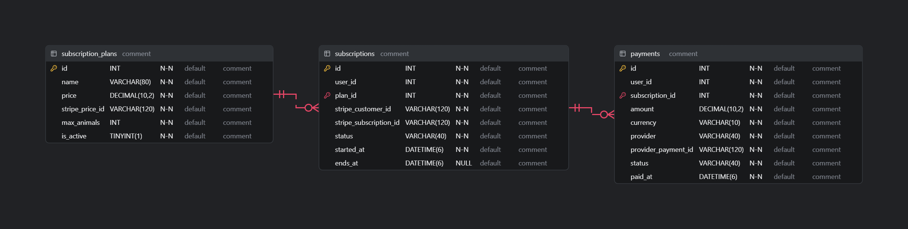
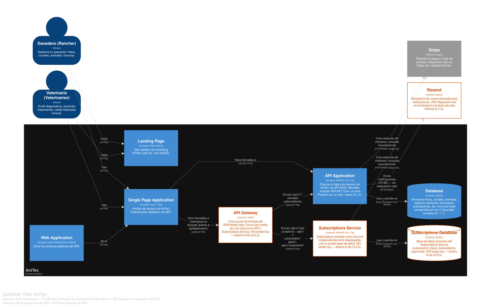

# 4.3.3. Iteration 3: Extracción de Servicios Críticos y API Gateway

Tercera iteración ADD v3. Retoma el riesgo trasladado explícitamente desde la Iteración 1 (4.3.1.7): el acoplamiento físico por base de datos compartida. En vez de proponer "migrar todo a microservicios" — inconsistente con las restricciones ya documentadas (equipo de 3, un ciclo académico, un solo nivel de Render, sin *message broker*, sección 4.2.4) — esta iteración selecciona **un** candidato de extracción concreto, lo justifica con evidencia real del código, y deja registrado por qué el resto de los bounded contexts permanece en el monolito por ahora.

## 4.3.3.1. Architectural Design Backlog 3

| # | Ítem | Tipo | Prioridad |
|---|---|---|---|
| 1 | Seleccionar y justificar el primer candidato de extracción. | Decisión arquitectónica | Alta |
| 2 | Diseñar el API Gateway (tecnología, reglas de enrutamiento, versionado de contratos). | Diseño | Alta |
| 3 | Diseñar el desacoplamiento de datos del servicio extraído (base de datos propia). | Diseño | Alta |
| 4 | Identificar el enabler de comunicación asíncrona (TS-027) que una segunda ola de extracción necesitaría. | Diseño (nivel de identificación, no detalle) | Media |
| 5 | Documentar explícitamente qué contextos **no** se extraen en esta iteración y por qué. | Documentación de decisión | Alta |

## 4.3.3.2. Establish Iteration Goal by Selecting Drivers

**Evidencia encontrada al preparar esta iteración:** se verificó en el código que **ningún** otro bounded context referencia `SubscriptionPlan`, `Subscription` ni `Payment` (`grep` sobre Livestock y Analytics no encontró ninguna coincidencia) — Subscriptions es hoy el contexto con **menor acoplamiento cruzado real** de los 12. También se confirmó que `subscription_plans.max_animals` existe en el esquema pero **no se aplica en ningún punto** del registro de animales — es una regla de negocio pendiente, no una dependencia activa que complique la extracción.

Se formaliza un nuevo escenario de calidad para esta iteración:

**QAS-09 — Aislamiento de fallos del subsistema de facturación**
- **Fuente:** el proveedor externo Stripe, o un error interno del contexto Subscriptions.
- **Estímulo:** Stripe responde con error o timeout, o el propio servicio de Subscriptions falla.
- **Ambiente:** operación normal.
- **Artefacto:** el límite de despliegue entre Subscriptions y el resto del sistema.
- **Respuesta esperada:** el registro de animales, la gestión sanitaria y la gestión financiera siguen operando con normalidad.
- **Medida:** 0 % de degradación en endpoints no relacionados con Subscriptions cuando Subscriptions o Stripe fallan — hoy **no se cumple**: todo corre en el mismo proceso ASP.NET Core, por lo que un fallo no controlado en Subscriptions comparte el mismo *runtime* que Livestock/Sanitary/Financial.

**Drivers seleccionados y prioridad:** QAS-09 (aislamiento de fallos) y modificabilidad/despliegue independiente (TS-008) se priorizan **juntos y por encima** de TS-025 (Gateway) y TS-027 (eventos), porque el Gateway y los eventos son *medios*, no el fin — sin un candidato de extracción real y justificado, construir un Gateway sería prematuro.

**Trade-off reconocido explícitamente:** extraer Subscriptions agrega un salto de red (SPA → Gateway → Subscriptions Service, en vez de una llamada en proceso) — un costo real de rendimiento. Se acepta porque las operaciones de suscripción (ver plan, pagar, consultar historial) no están en la ruta crítica del uso diario de un ganadero o veterinario (registrar animales, atender un caso sanitario); el costo de latencia adicional es bajo y el beneficio de aislar fallos de facturación es alto. Esta es exactamente la clase de conflicto entre atributos de calidad que exige una decisión priorizada y justificada, no una regla general de "extraer siempre mejora la arquitectura".

**Meta de la iteración:** extraer Subscriptions como primer servicio independientemente desplegable, con su propia base de datos, detrás de un API Gateway — sin tocar la estructura interna de los otros 11 bounded contexts.

## 4.3.3.3. Choose One or More Elements of the System to Refine

- El bounded context **Subscriptions** completo (`SubscriptionPlan`, `Subscription`, `Payment`) — objetivo de extracción.
- Un contenedor **API Gateway**, nuevo.
- La base de datos de Subscriptions (`subscription_plans`, `subscriptions`, `payments`) — se separa de la base de datos compartida.
- El resto de los 11 bounded contexts permanece **sin cambios** — se refina la decisión de *no* tocarlos, con su justificación.

## 4.3.3.4. Choose One or More Design Concepts That Satisfy the Selected Drivers

- **Patrón Strangler Fig:** el Gateway se introduce como único punto de entrada del SPA; Subscriptions se sirve desde un proceso nuevo, todo lo demás se sirve desde el monolito existente (renombrado conceptualmente "Core API" en este diseño) — el SPA no necesita saber que la API está dividida.
- **Database-per-service, aplicado solo al servicio extraído:** Subscriptions migra `subscription_plans`, `subscriptions` y `payments` a su propia base de datos MySQL, separada de la de los otros 11 contextos. No se propone *database-per-service* para el resto — sería costoso e injustificado sin un driver que lo pida.
- **Contratos versionados:** se mantiene `/api/v1/...` para lo ya existente; cualquier cambio incompatible futuro en el contrato de Subscriptions se publica como `/api/v2/subscriptions/...` sin forzar una nueva versión en el resto del sistema.
- **Validación de identidad sin acoplamiento en tiempo real:** Subscriptions valida el JWT emitido por Iam usando la misma clave de firma (configuración compartida), sin necesitar una llamada en vivo al monolito para confirmar la sesión — consistente con el principio de referencias entre contextos por identidad, no por dependencia directa (4.1.1.1).

## 4.3.3.5. Instantiate Architectural Elements, Allocate Responsibilities, and Define Interfaces

| Elemento | Responsabilidad |
|---|---|
| **API Gateway** (nuevo, propuesto en YARP — *Yet Another Reverse Proxy*, biblioteca oficial de .NET, coherente con el stack ya usado) | Único punto de entrada del SPA. Enruta `/api/v1/subscription-plans/*`, `/api/v1/subscriptions/*` y `/api/v1/payments/*` hacia el nuevo Subscriptions Service; enruta el resto de `/api/v1/*` hacia el Core API (monolito actual). Reenvía el header `Authorization` sin modificarlo — no valida el JWT él mismo, cada servicio lo valida de forma independiente. |
| **Subscriptions Service** (nuevo deployable) | Mismo `SubscriptionsController`, `ISubscriptionPlanCommandService`/`QueryService`, `ISubscriptionCommandService`/`QueryService`, `IPaymentCommandService`/`QueryService` ya existentes, movidos a su propio proyecto ASP.NET Core con su propio `Program.cs` y su propio `AppDbContext` apuntando a una base de datos separada. Conserva intacta la integración con Stripe (`Stripe.net`, `SessionService`). |
| **Core API** (el monolito actual, sin Subscriptions) | Conserva los 11 bounded contexts restantes exactamente como están documentados en 4.1 y refinados en la Iteración 1 — sin cambios de código más allá de retirar el registro DI de Subscriptions. |
| **Base de datos de Subscriptions** (nueva instancia/esquema MySQL) | Contiene únicamente `subscription_plans`, `subscriptions`, `payments` — migradas desde la base compartida actual (sección 4.1.5). Ninguna otra tabla las referencia mediante *foreign key* real (confirmado en 4.1.5), por lo que la migración no requiere coordinar borrado/actualización con otros contextos. |

  

*Diagrama ER del esquema aislado (to-be), regenerado a partir de `CodeDiagrams/4-3-3-.../anitec-subscriptions-service-schema.sql` — mismas 3 tablas que hoy viven en la base compartida, sin cambio de modelo de datos, solo de despliegue.*

## 4.3.3.6. Sketch Views (C4 & UML) and Record Design Decisions

  

Diagrama regenerado en Structurizr DSL. El Diagrama de Contenedores de la sección 4.1.4 gana **tres contenedores nuevos** (en naranja, to-be) y **una relación modificada**:

- **Nuevo:** API Gateway — recibe todo el tráfico del SPA.
- **Nuevo:** Subscriptions Service — recibe el tráfico de suscripciones/pagos enrutado por el Gateway; se conecta a Stripe exactamente como antes.
- **Nuevo:** Subscriptions Database (MySQL) — exclusiva del Subscriptions Service.
- **Modificado:** la relación `Single Page Application → API Application` (JSON/HTTPS) de 4.1.4 pasa a ser `Single Page Application → API Gateway → {Core API, Subscriptions Service}`.

Todo lo demás del diagrama de contenedores y los diagramas de componentes restantes (Iteración 1) queda **sin cambios**.

**Decisiones de diseño registradas:**

1. Se elige **Subscriptions** como primer candidato de extracción — no Devices/Metrics ni Analytics — por tener cero referencias entrantes reales desde otros bounded contexts (verificado en el código) y por tener una razón de negocio clara: aislar los fallos de facturación/Stripe del resto de la operación ganadera.
2. Se **pospone** la extracción de Devices y Metrics hasta que exista una integración real con dispositivos (preocupación 4.2.5 #2) — extraerlos hoy, siendo CRUD puro sobre datos sembrados manualmente, no aportaría el beneficio de aislamiento que sí aporta Subscriptions.
3. Se **descarta explícitamente**, para esta iteración, extraer Livestock, Sanitary, Financial, Activities, Analytics o Clients: están fuertemente relacionados alrededor de `Herd`/`Animal`, y separarlos exigiría el mecanismo de eventos asíncronos de TS-027 (para evitar transacciones distribuidas) — mecanismo que hoy no existe y que excede el alcance y el tiempo disponibles para esta iteración.
4. El Gateway se construye con **YARP** en vez de un producto externo (Ocelot, Kong, etc.) para no introducir una tecnología ajena al stack .NET ya dominado por el equipo — consistente con la restricción de equipo/tiempo (4.2.4).
5. TS-027 (eventos asíncronos) queda **identificado, no diseñado en detalle** — es el prerequisito que una eventual segunda ola de extracción (por ejemplo, Sanitary) necesitaría para no depender de transacciones distribuidas entre bases de datos separadas.

## 4.3.3.7. Analysis of Current Design and Review Iteration Goal (Kanban Board)

| Backlog Item | Estado |
|---|---|
| 1. Justificar candidato de extracción | ✅ Done (diseño) |
| 2. Diseñar el API Gateway | ✅ Done (diseño) |
| 3. Diseñar desacoplamiento de datos | ✅ Done (diseño) |
| 4. Identificar enabler de eventos (TS-027) | ✅ Identificado — 🔲 diseño detallado fuera de alcance de esta iteración |
| 5. Documentar qué no se extrae y por qué | ✅ Done |

**Revisión de la meta:** cumplida — se obtiene un plan de extracción incremental, concreto, de bajo riesgo y respaldado por evidencia real del código (cero acoplamiento entrante hacia Subscriptions), en vez de una migración total no realista para las restricciones del proyecto (4.2.4). El trade-off de latencia adicional se reconoce y se acepta explícitamente por no afectar la ruta crítica diaria del ganadero.

**Riesgo que se traslada:** si el equipo decide en el futuro extraer un segundo servicio más acoplado (candidato natural: Sanitary, por su relación con Livestock), TS-027 deja de ser opcional — se convierte en un prerequisito duro. Esta iteración no lo resuelve, solo lo deja señalado.
