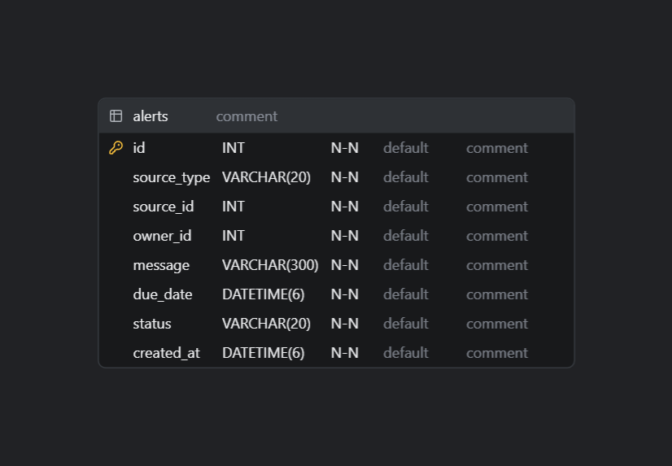
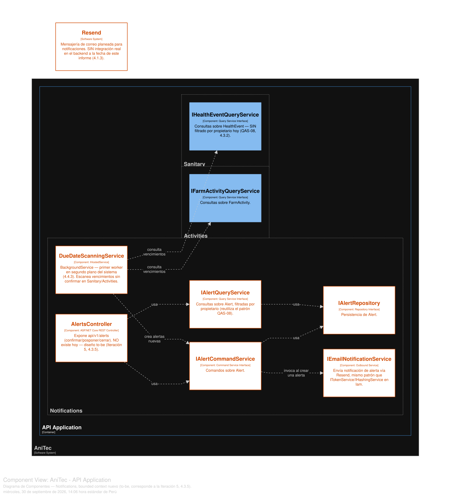

# 4.3.5. Iteration 5: Notificaciones y Alertas Operativas

Quinta iteración ADD v3. Nace de re-derivar el número y el contenido de las iteraciones directamente desde los drivers ya catalogados en la sección 4.2, en vez de heredar la cantidad de un índice previo — al hacerlo, se confirmó que **QAS-03** (seguimiento sanitario oportuno) y la **preocupación arquitectónica #7** (brecha de integración con Resend, 4.2.5) son la misma necesidad no resuelta: un mecanismo de notificaciones/alertas que hoy no existe en ningún punto del backend. Como el resto del capítulo, esta iteración es explícitamente **to-be**: no existe código de esta capacidad a la fecha de este informe.

## 4.3.5.1. Architectural Design Backlog 5

| # | Ítem | Tipo | Prioridad |
|---|---|---|---|
| 1 | Diseñar el modelo de datos de una alerta operativa (`Alert`), independiente de `HealthEvent`/`FarmActivity` pero derivada de ellos. | Diseño (to-be) | Alta |
| 2 | Diseñar el mecanismo que detecta vencimientos sin confirmación (scheduler en segundo plano). | Diseño (to-be) | Alta |
| 3 | Diseñar los endpoints para que el propietario confirme, posponga o cierre una alerta. | Diseño (to-be) | Alta |
| 4 | Diseñar la integración real con Resend para notificación proactiva por correo. | Diseño (to-be) | Media |
| 5 | Documentar explícitamente que esta es la primera capacidad del sistema con un proceso en segundo plano. | Documentación de decisión | Media |

## 4.3.5.2. Establish Iteration Goal by Selecting Drivers

**Driver principal:** QAS-03 (sección 4.2.3), derivado de BG-02 "Seguimiento sanitario":

> *"una alerta sanitaria alcanza su fecha de vencimiento sin confirmación... la alerta permanece visible y priorizada hasta ser confirmada, pospuesta o cerrada explícitamente... reducción del 30 % en la proporción de alertas que vence sin atención."*

Hoy este escenario **no se cumple de ninguna forma programática**: `HealthEvent.NextDueDate` y `FarmActivity.Date`/`Status` existen como columnas, pero ningún componente del backend las evalúa activamente contra la fecha actual — la única forma en que un vencimiento se nota hoy es si el usuario abre la pantalla correspondiente y lo advierte visualmente. No hay ni un temporizador ni una notificación push/email.

**Driver secundario:** Architectural Concern #7 (4.2.5) — el sistema externo "Resend" aparece en el Context Diagram (sección 4.1.3) desde el diseño original, pero **nunca tuvo integración real**: se verificó al preparar la sección 4.1 que no hay referencia alguna al SDK ni a llamadas HTTP hacia Resend en el código. Esta iteración es la primera en tomarlo como driver en vez de solo señalarlo.

**Justificación de la priorización:** el modelo de datos de la alerta (ítem 1) y el scheduler que la genera (ítem 2) se priorizan antes que la integración con Resend (ítem 4), porque el envío de un correo no tiene sentido sin que exista primero un registro de "esto venció y nadie lo confirmó" — el canal de notificación (in-app vs. email) es secundario respecto a la detección del vencimiento en sí, que es lo que QAS-03 realmente mide.

**Meta de la iteración:** diseñar un mecanismo de alertas operativas que cierre QAS-03 usando datos que ya existen (`NextDueDate`, `FarmActivity.Date`), sin depender de infraestructura que el proyecto no tiene (restricción 4.2.4: sin *message broker*), y dejar el correo real vía Resend como un canal adicional sobre esa misma alerta, no como el mecanismo primario.

## 4.3.5.3. Choose One or More Elements of the System to Refine

- **Nuevo bounded context:** `Notifications` — no existe hoy; se crea porque el concepto "alerta operativa" no pertenece naturalmente a Sanitary ni a Activities (lee de ambos, no es dueño de ninguno).
- **Nuevo componente:** un `BackgroundService` (mecanismo nativo de .NET, sin dependencias externas) que se ejecuta dentro del mismo proceso ASP.NET Core — primer proceso en segundo plano del sistema (ver nota sobre 4.4.3 más abajo).
- **`Sanitary` y `Activities`:** se consultan en modo lectura desde el scheduler, sin modificar sus entidades.
- **Resend:** pasa de aparecer solo en el Context Diagram a tener un punto de integración real diseñado.

## 4.3.5.4. Choose One or More Design Concepts That Satisfy the Selected Drivers

- **Alerta como entidad derivada, no como duplicado del dato de origen.** `Alert` no copia el diagnóstico ni el detalle de la actividad — solo referencia `SourceType`/`SourceId` y guarda lo mínimo necesario para gestionarse a sí misma (`DueDate`, `Status`, `Message`). Si el registro de origen cambia, la alerta sigue apuntando al mismo ID; no hay sincronización de datos que mantener.
- **Detección por *polling* interno, no por *triggers* de base de datos ni un *message broker* nuevo.** Un `BackgroundService` ya soportado nativamente por ASP.NET Core (`IHostedService`) se despierta periódicamente (por ejemplo cada 15 minutos) y consulta `IHealthEventQueryService`/`IFarmActivityQueryService` ya existentes — reutiliza los *query services* de Sanitary y Activities en vez de que `Notifications` tenga su propio acceso directo a esas tablas, consistente con el principio de aislamiento por bounded context (4.1.1.1).
- **Reutilizar el patrón de *outbound service* ya establecido.** Iam ya resuelve un problema estructuralmente idéntico (una dependencia hacia un servicio externo) con `ITokenService`/`IHashingService` como interfaces de aplicación implementadas en Infraestructura. `IEmailNotificationService` sigue el mismo patrón: la capa de aplicación de `Notifications` depende de la interfaz, no del SDK de Resend directamente.
- **El correo es un canal adicional sobre la alerta, nunca la única fuente de verdad.** Si el envío a Resend falla (el proveedor está caído, hay un error de red), la alerta igual existe y es consultable en la API — evita que una falla de un sistema externo de baja criticidad (correo) bloquee el cumplimiento de QAS-03.

## 4.3.5.5. Instantiate Architectural Elements, Allocate Responsibilities, and Define Interfaces

**Modelo de datos y detección (ítems 1 y 2 del backlog):**

| Elemento | Responsabilidad |
|---|---|
| Entidad `Alert` (nueva, en `Notifications`) | `Id`, `SourceType` ("HealthEvent" \| "FarmActivity"), `SourceId`, `OwnerId`, `Message`, `DueDate`, `Status` ("Pending" \| "Confirmed" \| "Snoozed" \| "Closed"), `CreatedAt`. |
| `IAlertRepository` / `IAlertCommandService` / `IAlertQueryService` | Mismo patrón Repository/Command/Query ya usado en los otros 12 bounded contexts (sección 4.1.6) — sin excepción por ser un contexto nuevo y pequeño. |
| `DueDateScanningService` (nuevo `BackgroundService`, en `Notifications.Infrastructure`) | Cada ciclo: consulta `IHealthEventQueryService` por `NextDueDate <= hoy` sin alerta `Pending`/`Confirmed` asociada; consulta `IFarmActivityQueryService` por `Date <= hoy` con `Status` distinto de completado; por cada resultado nuevo, crea un `Alert` vía `IAlertCommandService`. |

**Endpoints (ítem 3 del backlog):**

| Endpoint | Responsabilidad |
|---|---|
| `AlertsController` — `GET api/v1/alerts` (`[Authorize]`) | Devuelve las alertas del usuario autenticado — reutiliza el mismo filtrado por `CallerId` diseñado en la Iteración 2 (QAS-08), aplicado aquí desde el inicio en vez de como corrección posterior. |
| `PATCH api/v1/alerts/{id}/confirm` | `Status = "Confirmed"`. |
| `PATCH api/v1/alerts/{id}/snooze` | `Status = "Snoozed"`, recalcula `DueDate` (por ejemplo, +3 días) — la alerta reaparece si vuelve a vencer. |
| `PATCH api/v1/alerts/{id}/close` | `Status = "Closed"` — cierre explícito sin confirmar la atención original (por ejemplo, si el animal ya no está en el hato). |

**Integración con Resend (ítem 4 del backlog):**

| Elemento | Responsabilidad |
|---|---|
| `IEmailNotificationService` (nueva interfaz, `Notifications.Application.Internal.OutboundServices`, mismo patrón que `ITokenService`/`IHashingService` en Iam) | `SendAlertNotificationAsync(Alert alert, string recipientEmail)`. |
| Implementación real (`Notifications.Infrastructure`) | Envuelve el SDK de Resend; se invoca desde `IAlertCommandService` inmediatamente después de crear un `Alert` nuevo, en un bloque *try/catch* que registra el fallo pero **no** revierte la creación de la alerta (el canal de correo es adicional, no la fuente de verdad — ver 4.3.5.4). |

  

*Diagrama ER del esquema propuesto (to-be), regenerado a partir de `CodeDiagrams/4-3-5-.../alerts-table.sql`.*

## 4.3.5.6. Sketch Views (C4 & UML) and Record Design Decisions

  

Diagrama regenerado en Structurizr DSL — el bounded context `Notifications` es completamente nuevo (to-be), con sus dependencias reales hacia `IHealthEventQueryService` (Sanitary) y `IFarmActivityQueryService` (Activities), y su salida hacia Resend.

**Fragmento nuevo del Diagrama de Contenedores** (se agrega sobre la versión ya extendida en las Iteraciones 3 y 4):

- **Nuevo componente dentro de la API Application:** `Notifications` (Alert, `DueDateScanningService`, `IEmailNotificationService`) — depende en tiempo de ejecución de `IHealthEventQueryService` (Sanitary) y `IFarmActivityQueryService` (Activities), sin agregar un contenedor nuevo: vive dentro del mismo proceso ASP.NET Core.
- **Relación externa nueva:** API Application → Resend, "Envía notificación de alerta (HTTPS/REST)" — reemplaza la relación ya presente en el Context Diagram (4.1.3) marcada como *to-be*, que a partir de esta iteración tiene un diseño concreto detrás.

**Flujo de detección y notificación (secuencia, notación textual):**

1. `DueDateScanningService` despierta (cada 15 minutos) → consulta `IHealthEventQueryService`/`IFarmActivityQueryService` por vencimientos sin alerta activa.
2. Por cada vencimiento nuevo → `IAlertCommandService.Handle(CreateAlertCommand)` → se crea `Alert` con `Status = "Pending"`.
3. Inmediatamente después → `IEmailNotificationService.SendAlertNotificationAsync(...)` → si falla, se registra el error (ver Iteración 7, correlación de logs) pero la alerta ya creada permanece.
4. El propietario ve la alerta en `GET /alerts` → confirma, pospone o cierra.
5. Si se pospone, `DueDateScanningService` la vuelve a evaluar en su próximo ciclo contra el nuevo `DueDate`.

**Decisiones de diseño registradas:**

1. **Esta es la primera capacidad del sistema con un proceso en segundo plano** (`BackgroundService`) — hasta esta iteración, AniTec era un monolito de solicitud/respuesta puramente síncrono (confirmado en la sección 4.4.3, Process View). Esa sección debe actualizarse para reflejar este cambio (ver nota de seguimiento más abajo), en vez de dejar una afirmación desactualizada.
2. Se prioriza reutilizar los *query services* existentes de Sanitary/Activities en vez de que `Notifications` lea las tablas directamente — evita duplicar la lógica de "qué cuenta como vencido" en dos lugares.
3. El fallo del canal de correo (Resend) se trata como degradación aceptable, no como error bloqueante — consistente con el principio de que un sistema externo de baja criticidad no debe condicionar el cumplimiento del driver principal (QAS-03, que se mide sobre la alerta en sí, no sobre el correo).

**Nota de seguimiento (fuera del alcance de esta iteración, pero causada por ella):** la sección 4.4.3 (Process View) actualmente afirma que AniTec "no tiene *workers* en segundo plano" como parte de su descripción *as-built* — con esta iteración, esa afirmación deja de ser completa una vez implementada. Se actualiza en el mismo cambio que introduce este archivo (ver `4-4-architectural-view-model.md`).

## 4.3.5.7. Analysis of Current Design and Review Iteration Goal (Kanban Board)

| Backlog Item | Estado |
|---|---|
| 1. Modelo de datos de `Alert` | ✅ Diseño completo (to-be) |
| 2. Scheduler de detección de vencimientos | ✅ Diseño completo (to-be) |
| 3. Endpoints confirmar/posponer/cerrar | ✅ Diseño completo (to-be) |
| 4. Integración real con Resend | ✅ Diseño completo (to-be) |
| 5. Documentar el primer *background worker* del sistema | ✅ Done |

**Revisión de la meta:** cumplida a nivel de diseño — QAS-03 y la preocupación #7 comparten ahora una solución concreta y trazable a un bounded context, una entidad y un flujo de detección específicos, en vez de permanecer como una preocupación documentada sin dueño. Se reitera: **no existe código de `Notifications`, del scheduler ni de la integración con Resend a la fecha de este informe** — es un diseño para implementación futura, igual que el resto del capítulo.

**Riesgo que se traslada:** el diseño de pruebas para el scheduler (¿qué pasa si el proceso se reinicia entre ciclos? ¿se duplican alertas?) y la observabilidad de sus fallos silenciosos corresponden naturalmente a la Iteración 7 (Observabilidad y Confiabilidad Operativa), donde se retoman junto con el resto de la trazabilidad operativa del sistema.
