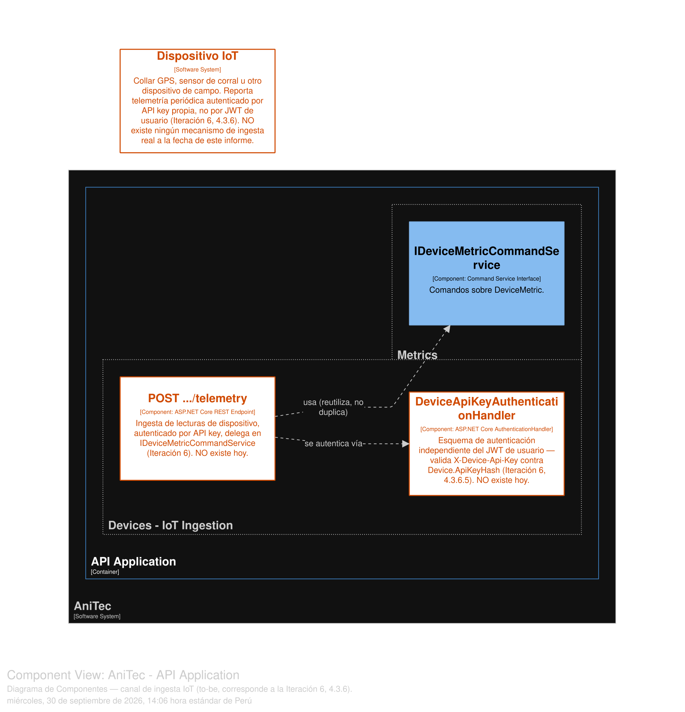

# 4.3.6. Iteration 6: Integración Real con Dispositivos IoT

Sexta iteración ADD v3. Como la Iteración 5, nace de re-derivar el número de iteraciones directamente desde los drivers de la sección 4.2 en vez de un índice heredado: la **preocupación arquitectónica #2** (4.2.5) señala que Devices y Metrics son CRUD puro sobre datos sembrados manualmente, sin ningún cliente de protocolo de dispositivo real — una brecha arquitectónicamente comparable a la que la Iteración 4 ya diseñó para la app móvil (EP-014, cero código existente), pero que nunca había recibido el mismo tratamiento *to-be*. Esta iteración lo corrige. Como el resto del capítulo, es explícitamente **to-be**: no existe ningún mecanismo de ingesta de dispositivo a la fecha de este informe.

## 4.3.6.1. Architectural Design Backlog 6

| # | Ítem | Tipo | Prioridad |
|---|---|---|---|
| 1 | Diseñar la autenticación de dispositivo (distinta de la autenticación de usuario). | Diseño (to-be) | Alta |
| 2 | Diseñar el endpoint de ingesta de telemetría, reutilizando el `Command Service` ya existente. | Diseño (to-be) | Alta |
| 3 | Elegir y justificar el protocolo de transporte (polling HTTP vs. MQTT/CoAP/WebSocket). | Decisión arquitectónica | Alta |
| 4 | Diseñar una mitigación de disponibilidad ante dispositivos mal configurados (rate limiting). | Diseño (to-be) | Media |
| 5 | Documentar que esta iteración cierra la preocupación #2 (4.2.5). | Documentación de decisión | Media |

## 4.3.6.2. Establish Iteration Goal by Selecting Drivers

**Evidencia encontrada al preparar esta iteración:** los bounded contexts Devices y Metrics exponen `DevicesController` (`api/v1/devices`) y `DeviceMetricsController` (`api/v1/device-metrics`), ambos protegidos por el mismo `[Authorize]` de usuario que cualquier otro controlador — es decir, hoy la única forma de que exista un `DeviceMetric` es que un **usuario humano autenticado con JWT** lo cree manualmente vía la API, exactamente igual que crear un registro financiero o un evento sanitario. No hay ningún endpoint pensado para que un dispositivo físico se autentique y reporte una lectura por sí mismo.

Se formaliza un nuevo escenario de calidad, evidenciado durante esta iteración:

**QAS-11 — Ingesta confiable de telemetría de dispositivos**
- **Fuente:** un dispositivo de campo (por ejemplo, un collar GPS o un sensor de corral).
- **Estímulo:** envía una lectura periódica (ubicación, temperatura, u otro valor de `DeviceMetric`).
- **Ambiente:** operación normal, con la conectividad intermitente típica de una zona rural.
- **Artefacto:** el punto de ingesta de telemetría y la entidad `DeviceMetric`.
- **Respuesta esperada:** el sistema autentica al **dispositivo** (no a un usuario humano), valida el payload y persiste la lectura sin requerir una sesión interactiva.
- **Medida:** hoy **no se cumple de ninguna forma** — no existe autenticación de dispositivo ni un endpoint de ingesta; toda escritura en `device_metrics` depende de que un humano la haga manualmente con su propio JWT.

**Drivers seleccionados y prioridad:** QAS-11 (alta, brecha total confirmada en el código) > Concern #2 (4.2.5, ya documentada pero nunca diseñada) > restricción 4.2.4 (sin *message broker*, condiciona directamente el ítem 3 del backlog).

**Justificación de la priorización:** la autenticación de dispositivo (ítem 1) se prioriza antes que el endpoint de ingesta (ítem 2), porque un endpoint de telemetría sin un mecanismo de identidad propio del dispositivo simplemente reproduciría el mismo problema que ya tiene el resto de la API (usar JWT de usuario donde no corresponde) — el orden de diseño sigue la misma lógica que la Iteración 2 aplicó a la autorización por recurso: primero la identidad correcta, después el comportamiento que depende de ella.

**Meta de la iteración:** diseñar un canal de ingesta de telemetría autenticado por dispositivo (no por usuario), reutilizando `IDeviceMetricCommandService` ya existente, sin requerir infraestructura que el proyecto no tiene (restricción 4.2.4) ni exceder el nivel gratuito de Render (restricción 4.2.4, cómputo/memoria limitados).

## 4.3.6.3. Choose One or More Elements of the System to Refine

- El bounded context **Devices** (entidad `Device`) — gana un mecanismo de credencial propio.
- El bounded context **Metrics** (`IDeviceMetricCommandService`, `DeviceMetricsController`) — se reutiliza sin cambios de lógica de negocio.
- **Nuevo elemento en el Context Diagram (to-be):** "Dispositivo IoT" — un tipo de origen de tráfico distinto de los dos actores humanos (Ganadero, Veterinario) ya documentados en 4.1.3.
- **Nuevo componente:** un middleware/atributo de autenticación de dispositivo, independiente del middleware JWT ya existente.

## 4.3.6.4. Choose One or More Design Concepts That Satisfy the Selected Drivers

- **Autenticación por API key de dispositivo, no por JWT de usuario.** Un sensor de campo no puede completar un flujo de *login* interactivo ni renovar un token de sesión como lo hace un ganadero desde el SPA — necesita una credencial de larga duración, emitida y revocada de forma administrativa (por el ganadero o el instalador del dispositivo), no un mecanismo pensado para personas.
- **Polling HTTP periódico, no un protocolo de dispositivo persistente (MQTT/CoAP) ni WebSockets.** Introducir un *broker* MQTT sería agregar exactamente el tipo de infraestructura que la restricción 4.2.4 ya excluye del proyecto; mantener una conexión persistente por dispositivo tampoco es viable en el nivel gratuito de Render (cómputo/memoria limitados, *cold starts*). Un `POST` periódico y sin estado reutiliza la misma pila HTTP/REST que ya sirve al resto de la API.
- **Reutilizar el `Command Service` existente, no duplicar lógica de negocio.** El canal de ingesta de dispositivo termina llamando al mismo `IDeviceMetricCommandService.Handle(CreateDeviceMetricCommand)` que ya usa `DeviceMetricsController` — la única diferencia real es *quién* se autentica, no *qué* se persiste.
- **Rate limiting como táctica de disponibilidad, no de seguridad.** El objetivo no es bloquear un ataque, sino evitar que un dispositivo mal configurado (por ejemplo, atascado en un bucle de reintento) agote el cómputo limitado del nivel gratuito de Render y degrade el servicio para el resto de los usuarios.

## 4.3.6.5. Instantiate Architectural Elements, Allocate Responsibilities, and Define Interfaces

**Autenticación de dispositivo (ítem 1 del backlog):**

| Elemento | Responsabilidad |
|---|---|
| `Device.ApiKeyHash` (nueva columna, `Devices`) | Hash (mismo mecanismo BCrypt ya usado para contraseñas de usuario, sección 4.1.7) de una API key emitida al registrar o reconfigurar el dispositivo — nunca se guarda en texto plano, igual que `password_hash` en `users`. |
| `DeviceApiKeyAuthenticationHandler` (nuevo, ASP.NET Core `AuthenticationHandler`) | Middleware independiente del JWT — valida el header `X-Device-Api-Key` contra `Device.ApiKeyHash` y, si coincide, autentica la petición con un esquema propio (`"DeviceApiKey"`), distinto del esquema JWT de usuario. |

**Endpoint de ingesta (ítem 2 del backlog):**

| Elemento | Responsabilidad |
|---|---|
| `POST api/v1/devices/{deviceId}/telemetry` (nuevo, en `DevicesController` o un controlador dedicado, `[Authorize(AuthenticationSchemes = "DeviceApiKey")]`) | Recibe una lectura (`type`, `value`, `unit`, `recordedAt`), verifica que `deviceId` coincide con el dispositivo autenticado por la API key (un dispositivo no puede reportar telemetría a nombre de otro), y delega a `IDeviceMetricCommandService.Handle(CreateDeviceMetricCommand)` — la misma interfaz que ya usa el flujo manual vía usuario. |

**Rate limiting (ítem 4 del backlog):**

| Elemento | Responsabilidad |
|---|---|
| Política de *rate limiting* (propuesta: `Microsoft.AspNetCore.RateLimiting`, ya nativo en ASP.NET Core, sin dependencias externas) aplicada sobre `POST .../telemetry` | Limita la frecuencia de peticiones aceptadas por `deviceId` (por ejemplo, una lectura cada 60 segundos) — peticiones adicionales se rechazan con `429 Too Many Requests` en vez de procesarse. |

## 4.3.6.6. Sketch Views (C4 & UML) and Record Design Decisions

**Fragmento nuevo del Context Diagram** (se agrega sobre la versión ya documentada en 4.1.3 — el "Dispositivo IoT" ya aparece en esa vista, sección 4.1.3):

- **Nuevo:** "Dispositivo IoT" — origen de tráfico no humano, se conecta al API Application vía HTTP/REST autenticado por API key, sin pasar por el SPA ni por el flujo de sesión de usuario.

  

Diagrama regenerado en Structurizr DSL, en una vista propia (separada de `12-Components-Devices`, que conserva solo lo as-built).

**Fragmento nuevo del Diagrama de Componentes de Devices/Metrics** (se agrega sobre 4.1.4):

- **Nuevo componente:** `DeviceApiKeyAuthenticationHandler`, en paralelo al middleware JWT ya existente — ambos conviven, cada petición se autentica con el esquema que corresponde según el header presente.
- **Sin cambios** en `IDeviceMetricRepository`/`IDeviceMetricCommandService`/`IDeviceMetricQueryService` — se reutilizan tal como están.

**Flujo de ingesta (secuencia, notación textual):**

1. El dispositivo despierta (temporizador interno) → arma una lectura → `POST /devices/{deviceId}/telemetry` con header `X-Device-Api-Key`.
2. `DeviceApiKeyAuthenticationHandler` valida el hash → si no coincide, `401 Unauthorized`; si coincide, autentica la petición con la identidad del dispositivo.
3. El controlador verifica que el `deviceId` de la ruta coincide con el dispositivo autenticado → si no, `403 Forbidden`.
4. Verificación de *rate limit* → si excede la frecuencia permitida, `429 Too Many Requests`.
5. `IDeviceMetricCommandService.Handle(CreateDeviceMetricCommand)` → persiste la lectura exactamente igual que el flujo manual ya existente.
6. El dispositivo recibe `201 Created` y vuelve a dormir hasta el siguiente ciclo.

**Decisiones de diseño registradas:**

1. Se elige un esquema de autenticación **separado** del JWT de usuario, en vez de emitir un JWT de "usuario dispositivo" — un dispositivo no tiene rol (Ganadero/Veterinario) ni necesita expirar su sesión cada pocas horas; forzarlo al mismo modelo mezclaría dos conceptos de identidad distintos.
2. Se descarta explícitamente introducir MQTT/CoAP o cualquier *broker* — no por ser técnicamente inferior, sino porque violaría directamente la restricción 4.2.4 y excede lo que el nivel gratuito de Render puede sostener de forma confiable.
3. El endpoint de ingesta reutiliza el `Command Service` ya existente — no se duplica la regla de negocio de qué constituye una lectura válida en dos lugares distintos del código.
4. El *rate limiting* se diseña como mitigación de disponibilidad (proteger el cómputo compartido), no como control de seguridad — la autenticación por API key ya resuelve la parte de seguridad.

## 4.3.6.7. Analysis of Current Design and Review Iteration Goal (Kanban Board)

| Backlog Item | Estado |
|---|---|
| 1. Autenticación de dispositivo | ✅ Diseño completo (to-be) |
| 2. Endpoint de ingesta de telemetría | ✅ Diseño completo (to-be) |
| 3. Justificación de polling HTTP vs. protocolo persistente | ✅ Done |
| 4. Rate limiting | ✅ Diseño completo (to-be) |
| 5. Documentar cierre de la preocupación #2 | ✅ Done |

**Revisión de la meta:** cumplida a nivel de diseño — QAS-11 tiene ahora una solución concreta, trazable a una columna de esquema, un middleware y un endpoint específicos, reutilizando la lógica de negocio de Metrics ya existente en vez de duplicarla. Se reitera: **no existe código de autenticación de dispositivo ni del endpoint de telemetría a la fecha de este informe** — es un diseño para implementación futura, igual que el resto del capítulo.

**Riesgo que se traslada:** el diseño de pruebas para este canal (¿qué pasa si el mismo dispositivo envía dos lecturas con el mismo `recordedAt`? ¿cómo se audita una API key comprometida?) corresponde a la Iteración 7 (Observabilidad y Confiabilidad Operativa), donde se retoma junto con el resto del catálogo de pruebas del capítulo.
