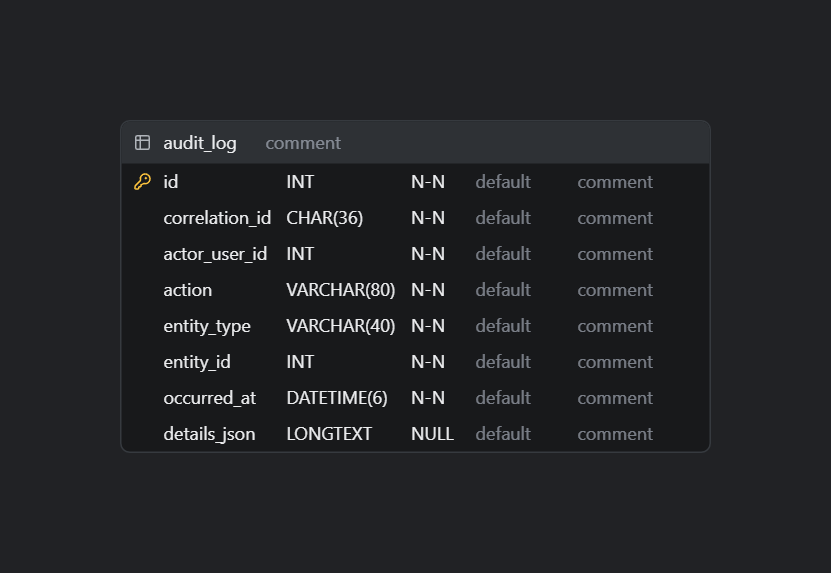

# 4.3.7. Iteration 7: Observabilidad y Confiabilidad Operativa

Séptima y última iteración ADD v3 de este informe — el *capstone* que cierra las obligaciones dejadas explícitamente pendientes por las iteraciones anteriores: el diseño de auditoría completo (trasladado desde 4.3.2.7), la observabilidad distribuida que las Iteraciones 3 y 4 hicieron necesaria al introducir un Gateway, un segundo servicio desplegable y un cliente móvil (TS-029), el catálogo de pruebas para todo lo anterior (TS-030, trasladado desde 4.3.4.7) — y, dado que el número de iteraciones se re-derivó de los drivers reales en vez de un índice heredado, también recoge las pruebas pendientes de las dos iteraciones agregadas en ese ejercicio: el scheduler de alertas (Iteración 5) y el canal de ingesta de dispositivos (Iteración 6).

## 4.3.7.1. Architectural Design Backlog 7

| # | Ítem | Tipo | Prioridad |
|---|---|---|---|
| 1 | Diseñar un registro de auditoría consultable para operaciones sensibles (US-074). | Diseño | Alta |
| 2 | Diseñar observabilidad distribuida: correlación de logs entre Gateway, Core API, Subscriptions Service y sincronización móvil. | Diseño | Alta |
| 3 | Diseñar tácticas de disponibilidad para la nueva superficie distribuida (Gateway → Subscriptions Service → Stripe). | Diseño | Alta |
| 4 | Diseñar el catálogo de pruebas automatizadas de contratos, autorización, idempotencia, conflictos, alertas y telemetría de dispositivos. | Diseño | Alta |
| 5 | Revisar y cerrar el estado de todos los riesgos trasladados desde las iteraciones 1 a 6. | Cierre de capítulo | Alta |

## 4.3.7.2. Establish Iteration Goal by Selecting Drivers

**Por qué esta iteración es necesaria ahora y no antes:** hasta la Iteración 2, AniTec era un único proceso — un log de consola era, en la práctica, suficiente para depurar un problema. Desde la Iteración 3 (Gateway + Subscriptions Service como despliegue separado) y la Iteración 4 (un cliente móvil que reintenta y puede fallar en cualquier punto de una cadena de varios saltos), una falla ya no ocurre en un solo lugar — diagnosticarla requiere poder **reconstruir la cadena completa** de una petición.

**QAS-10 — Diagnóstico de una falla distribuida** *(nuevo, motivado por las Iteraciones 3 y 4)*
- **Fuente:** un integrante del equipo operando el sistema (no un usuario final).
- **Estímulo:** una operación falla en algún punto de la cadena Gateway → Core API o Subscriptions Service → base de datos, o una sincronización móvil falla de forma repetida.
- **Ambiente:** incidente en curso, operación normal del resto del sistema.
- **Artefacto:** los logs y trazas de cada componente.
- **Respuesta:** el operador reconstruye la cadena completa de la petición usando un identificador de correlación común a todos los componentes involucrados.
- **Medida:** todo log relevante a una petición es localizable por un único identificador de correlación — hoy **no se cumple**: no existe ningún mecanismo de correlación entre componentes.

**Drivers seleccionados y prioridad:** QAS-10 (observabilidad) y TS-030 (pruebas) se abordan **junto con** el cierre de US-074 (auditoría) porque las tres comparten la misma pieza de infraestructura — un identificador de correlación por operación — y separarlas en iteraciones distintas duplicaría trabajo. Se prioriza sobre cualquier otra mejora porque, sin esto, ninguna de las tres capacidades nuevas introducidas en las Iteraciones 3 y 4 (Gateway, Subscriptions Service, sincronización móvil) es realmente operable en producción, solo demostrable en desarrollo.

**Meta de la iteración:** diseñar un identificador de correlación compartido, un registro de auditoría que lo reutilice, tácticas de disponibilidad para la nueva superficie distribuida, y el catálogo de pruebas que valida todo lo diseñado en las Iteraciones 2 a 6 — cerrando el capítulo con una revisión honesta de qué quedó resuelto y qué no.

## 4.3.7.3. Choose One or More Elements of the System to Refine

- **Nuevo componente transversal:** un identificador de correlación (`X-Correlation-Id`) propagado por el API Gateway (Iteración 3), el Core API y el Subscriptions Service.
- **Nuevo componente en `Shared`:** un registro de auditoría (`audit_log`), reutilizando el identificador de correlación.
- La llamada del API Gateway hacia el Subscriptions Service, y de este hacia Stripe (Iteración 3) — ganan una táctica de disponibilidad.
- El endpoint `POST /sync/batch` (Iteración 4) — gana un catálogo de pruebas específico.
- El `DueDateScanningService` (Iteración 5) y el endpoint `POST /devices/{id}/telemetry` (Iteración 6) — ganan su propio catálogo de pruebas.

## 4.3.7.4. Choose One or More Design Concepts That Satisfy the Selected Drivers

- **Correlation ID propagado por cabecera HTTP:** el Gateway genera un `X-Correlation-Id` si la petición no trae uno, y lo reenvía a cada servicio downstream; cada componente lo incluye en cada línea de log estructurado que emite.
- **Registro de auditoría *append-only*, no una simple marca de tiempo:** a diferencia de `IAuditableEntity` (que solo guarda cuándo se modificó algo por última vez), `audit_log` guarda **una fila por operación sensible**, enlazada al `CorrelationId` de la petición que la originó — permite reconstruir tanto "qué pasó" (auditoría, US-074) como "por qué falló" (observabilidad, QAS-10) con el mismo dato.
- **Táctica de disponibilidad — Circuit Breaker:** protege al Core API de una falla prolongada del Subscriptions Service, y al Subscriptions Service de una falla de Stripe, evitando que ambos queden esperando indefinidamente una respuesta que no llegará — refuerza directamente QAS-09 (Iteración 3).
- **Táctica de disponibilidad — Heartbeat/Health Check:** el Gateway (YARP ya lo soporta de forma nativa) verifica periódicamente si el Subscriptions Service está disponible antes de enrutarle tráfico.
- **Táctica de testabilidad — Record/Playback:** los lotes de sincronización (Iteración 4) se pueden capturar y reproducir en pruebas automatizadas, sin depender de un dispositivo móvil real.

Estas tácticas se agregan como una fila nueva a la tabla de 4.1.7, sin reemplazar ninguna de las ya documentadas.

## 4.3.7.5. Instantiate Architectural Elements, Allocate Responsibilities, and Define Interfaces

**Auditoría (ítem 1):**

| Elemento | Responsabilidad |
|---|---|
| Tabla `audit_log` (nueva, en `Shared`) | `id`, `correlation_id`, `actor_user_id`, `action` (ej. "RectifyHealthEvent", "ApproveVeterinarianClient"), `entity_type`, `entity_id`, `occurred_at`, `details_json`. |
| `AuditLogger` (nuevo servicio en `Shared.Application`) | Invocado explícitamente desde los *command handlers* que ya se identificaron como sensibles: rectificar/anular un registro sanitario (US-018), aprobar/rechazar/revocar una relación veterinario–ganadero (Iteración 2), eliminar un animal o un movimiento financiero. |
| `GET /api/v1/audit-log` (`[Authorize("Rancher")]`) | Responde US-074, reutilizando el mismo filtrado por propiedad diseñado en la Iteración 2 (QAS-08) — un ganadero solo consulta auditoría de **sus propios** recursos. |

  

*Diagrama ER del esquema propuesto (to-be), regenerado a partir de `CodeDiagrams/4-3-7-.../audit-log-table.sql`.*

**Observabilidad (ítem 2):**

| Elemento | Responsabilidad |
|---|---|
| Middleware de correlación (Gateway, Core API, Subscriptions Service) | Lee `X-Correlation-Id` entrante o genera uno nuevo; lo adjunta al contexto de logging de la petición. |
| Logging estructurado (propuesto: Serilog, ya integrable con ASP.NET Core sin dependencias externas de infraestructura) | Cada línea de log incluye `correlation_id`, componente de origen, y el resultado de la operación. |

**Disponibilidad (ítem 3):**

| Elemento | Responsabilidad |
|---|---|
| Política de Circuit Breaker (propuesta: Polly, biblioteca .NET ya compatible con el stack) | Envuelve la llamada del Gateway al Subscriptions Service y la del Subscriptions Service a Stripe; abre el circuito tras N fallos consecutivos, devolviendo una respuesta degradada controlada en vez de colgar la petición. |
| Health check del Subscriptions Service (soportado nativamente por YARP) | El Gateway deja de enrutar tráfico a una instancia que no responde su *health check*. |

**Pruebas (ítem 4) — catálogo, no implementación:**

| Tipo de prueba | Qué valida | Driver que cierra |
|---|---|---|
| Contrato | Las rutas del Gateway enrutan al servicio correcto; el contrato `/api/v1/...` no cambia de forma incompatible. | TS-025 (Iteración 3) |
| Autorización por recurso | Un usuario sin relación autorizada no puede leer datos ajenos, incluso llamando la API directamente. | QAS-08 (Iteración 2) |
| Idempotencia de sincronización | Reenviar el mismo `OperationId` dos veces produce un solo efecto. | TS-026 (Iteración 4) |
| Conflicto de sincronización | Un `UpdatedAt` desalineado produce 409, nunca una sobrescritura silenciosa. | US-069 (Iteración 4) |
| Aislamiento de fallos | Una falla simulada del Subscriptions Service no afecta endpoints de Livestock/Sanitary/Financial. | QAS-09 (Iteración 3) |
| Detección de vencimientos | Un `HealthEvent`/`FarmActivity` vencido sin confirmación genera exactamente una `Alert`, sin duplicados entre ciclos del scheduler. | QAS-03 (Iteración 5) |
| Ingesta de telemetría | Una petición de dispositivo sin API key válida se rechaza con 401; una válida pero fuera del límite de frecuencia se rechaza con 429. | QAS-11 (Iteración 6) |

## 4.3.7.6. Sketch Views (C4 & UML) and Record Design Decisions

Fragmento agregado sobre el Diagrama de Contenedores ya extendido en las Iteraciones 3 y 4: una relación transversal (no un contenedor nuevo) — **todas** las flechas SPA/Mobile App → Gateway → {Core API, Subscriptions Service} ganan la anotación *"propaga X-Correlation-Id"*. El componente nuevo `AuditLogger` se agrega al diagrama de componentes de `Shared` (Iteración 1, sección 4.1.4), con flechas entrantes desde Sanitary (rectificaciones) y Clients (aprobaciones/revocaciones).

**Decisiones de diseño registradas:**

1. El registro de auditoría y la correlación de logs comparten el mismo identificador — se diseñan juntos deliberadamente, en vez de como dos mecanismos separados.
2. Circuit Breaker y Health Check se aplican **solo** en los puntos de la arquitectura que ya son distribuidos de verdad (Gateway↔Subscriptions Service, Subscriptions Service↔Stripe) — no se envuelve cada llamada interna del monolito en un *circuit breaker*, sería una complejidad injustificada donde no hay una frontera de red real.
3. El catálogo de pruebas se diseña para validar **decisiones ya tomadas** en iteraciones anteriores (contratos, autorización, idempotencia, conflictos, aislamiento de fallos, detección de vencimientos, ingesta de telemetría) — no introduce drivers nuevos, cierra los existentes.

## 4.3.7.7. Analysis of Current Design and Review Iteration Goal (Kanban Board)

| Backlog Item | Estado |
|---|---|
| 1. Registro de auditoría (US-074) | ✅ Diseño completo — 🔲 Implementación pendiente |
| 2. Observabilidad distribuida (TS-029) | ✅ Diseño completo — 🔲 Implementación pendiente |
| 3. Tácticas de disponibilidad (Circuit Breaker, Health Check) | ✅ Diseño completo — 🔲 Implementación pendiente |
| 4. Catálogo de pruebas (TS-030) | ✅ Diseño completo — 🔲 Implementación pendiente |
| 5. Cierre de riesgos trasladados | ✅ Ver tabla siguiente |

### Cierre del capítulo — estado final de los riesgos trasladados entre iteraciones

| Riesgo/pendiente | Origen | Estado al cierre de la Iteración 7 |
|---|---|---|
| Acoplamiento por base de datos compartida (4.2.5 #3) | Iteración 1 | Parcialmente resuelto — Subscriptions ya tiene base de datos propia (Iteración 3); los 11 contextos restantes siguen compartiendo una sola base de datos, aceptado explícitamente hasta que exista un driver que justifique una segunda extracción. |
| Autorización por recurso inexistente (QAS-08) | Iteración 2 | Diseño completo (Iteración 2); implementación pendiente. |
| Auditoría completa (US-074) | Iteración 2 → trasladado | Diseño completo (esta iteración). |
| Eventos asíncronos servicio–servicio (TS-027, para una segunda extracción) | Iteración 3 | **No resuelto** — sigue fuera de alcance; sería el primer ítem de una eventual iteración futura de este proceso ADD, fuera del alcance de este informe. |
| Pérdida de datos no sincronizados ante fallo de dispositivo | Iteración 4 | Documentado como limitación aceptada, no como pendiente de diseño — es inherente a cualquier arquitectura *offline-first* sin respaldo redundante. |
| Observabilidad y pruebas (TS-029/030) | Iteración 4 → trasladado | Diseño completo (esta iteración). |
| Pruebas del scheduler de alertas | Iteración 5 → trasladado | Diseño completo (esta iteración). |
| Fallo silencioso del canal de correo (Resend) ante un vencimiento | Iteración 5 | Documentado como degradación aceptable — la alerta existe independientemente del correo (4.3.5.4); no requiere diseño adicional. |
| Pruebas del canal de ingesta de dispositivos | Iteración 6 → trasladado | Diseño completo (esta iteración). |
| Administración/revocación de API keys de dispositivo | Iteración 6 | **No resuelto** — el diseño asume una emisión/revocación manual (4.3.6.4); un panel de administración de credenciales de dispositivo queda fuera de alcance de este informe. |

**Revisión de la meta:** cumplida. Las siete iteraciones de este informe producen una arquitectura objetivo coherente y trazable: una estructura base validada (Iteración 1), autorización por recurso y flujo de aprobación diseñados sobre una brecha real encontrada en el código (Iteración 2), un primer servicio extraído con justificación basada en evidencia (Iteración 3), un protocolo de sincronización móvil completo aunque aún no implementado (Iteración 4), un mecanismo de alertas y notificaciones que cierra una brecha entre lo prometido en el Context Diagram y lo realmente integrado (Iteración 5), un canal de ingesta real para los dispositivos IoT que hasta ahora solo tenían CRUD simulado (Iteración 6), y la observabilidad/confiabilidad que hace operable todo lo anterior (esta iteración). Lo que queda explícitamente fuera de alcance — una segunda ola de extracción de servicios con eventos asíncronos, y la administración de credenciales de dispositivo — se deja señalado como trabajo futuro, no oculto.
