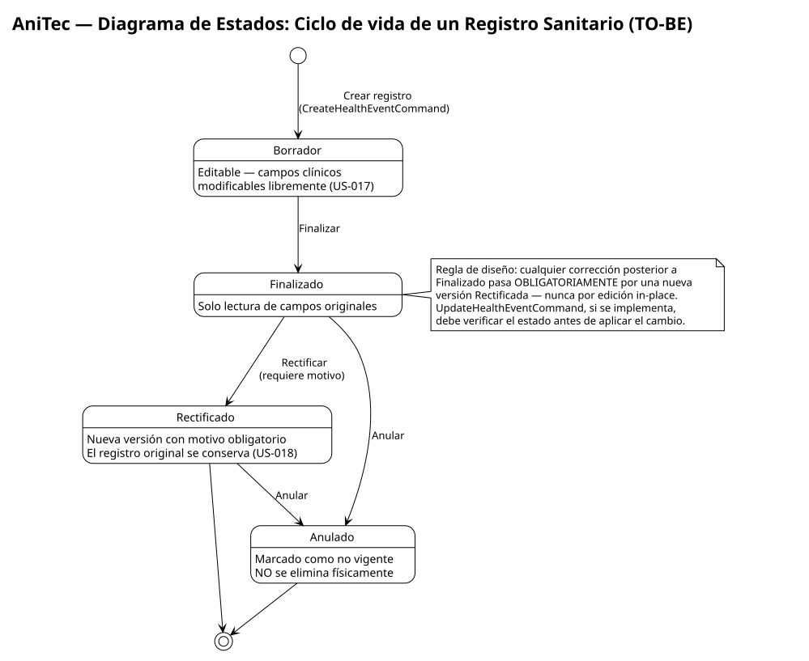
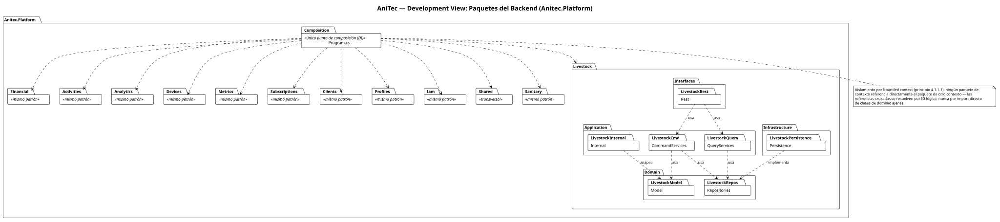
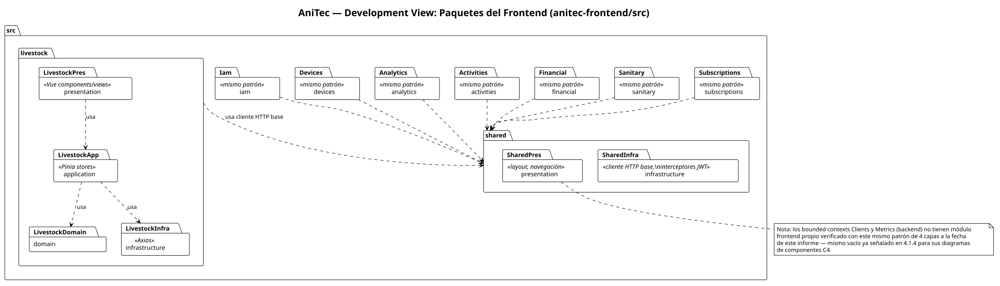

# 4.4. Architectural View Model (4+1)

Esta sección complementa las secciones 4.1–4.3 con el modelo de vistas 4+1 de Kruchten, organizando el mismo sistema ya documentado desde cuatro perspectivas adicionales (lógica, de desarrollo, de proceso y física), más una referencia cruzada al modelo de datos. No se repiten diagramas ya presentados — cada vista que reutiliza contenido de 4.1 o 4.3 lo referencia explícitamente en vez de duplicarlo.

## 4.4.1. Logic View

**Diagrama de clases:** se reutiliza el Class Diagram ya presentado en la sección 4.1.4 — regenerado en PlantUML, ya incluye `Corral` y los campos `ImageUrl`/`Source`/`AgeRange` de `Animal`. No se repite la imagen aquí para no duplicar la misma fuente de verdad.

**Diagrama de estados — ciclo de vida de un Registro Sanitario (propuesto, *to-be*):**

<div align="center">
  
</div>

Al preparar esta vista se verificó directamente en el código (`Anitec.Platform/Sanitary/Domain/Model/Entities/HealthEvent.cs`) si existe algún mecanismo de estado para el registro sanitario, dado que el Product Backlog ya compromete US-017 ("Editar un borrador sanitario") y US-018 ("Rectificar o anular un registro sanitario"). El resultado es concluyente: **`HealthEvent` no tiene ningún campo `Status`, ni versión, ni marca de borrador/finalizado** — es un registro plano que se crea una sola vez con `CreateHealthEventCommand` y no expone ninguna transición de estado. La búsqueda de las palabras `Draft`, `Rectif`, `Annul`, `Finaliz` o `Status` en todo el bounded context Sanitary no arrojó ninguna coincidencia.

Por lo tanto, el siguiente diagrama de estados es un **diseño objetivo (to-be)**, no una descripción del comportamiento actual — se incluye aquí, en la Logic View, porque es precisamente el tipo de vista que debe dejar trazada la lógica de negocio que todavía no tiene una representación en el código, para que una futura implementación no tenga que re-derivar las reglas desde cero. Es consistente con el diseño de auditoría ya esbozado en la Iteración 2 (sección 4.3.2.5), que propone extender `IAuditableEntity` a esta misma entidad.

| Estado | Descripción | Transición de entrada |
|---|---|---|
| **Borrador** | Estado inicial al crear el registro; el veterinario o ganadero puede seguir editando campos clínicos (US-017). | Creación del registro. |
| **Finalizado** | El registro queda cerrado para edición directa; representa el diagnóstico/tratamiento confirmado. | Acción explícita "Finalizar" desde Borrador. |
| **Rectificado** | Se crea una nueva versión del registro a partir de uno Finalizado, con un motivo obligatorio de rectificación (US-018); el registro original permanece como historial, no se sobrescribe. | Acción "Rectificar" desde Finalizado. |
| **Anulado** | El registro se marca como no vigente sin eliminarlo físicamente — preserva el historial clínico completo (principio de no pérdida de datos ya aplicado en otras áreas, por ejemplo el rechazo de una relación veterinario–ganadero en la Iteración 2, que tampoco borra la fila). | Acción "Anular" desde Finalizado o Rectificado. |

Reglas de transición explícitas del diseño: solo un registro en **Borrador** admite edición de campos clínicos; **Finalizado**, **Rectificado** y **Anulado** son de solo lectura respecto a sus campos originales — cualquier corrección posterior a Finalizado pasa obligatoriamente por una nueva versión Rectificada, nunca por una edición in-place. Esta regla es la que hoy no existe: `UpdateHealthEventCommand`, si se implementara siguiendo el patrón ya usado por otras entidades del sistema, tendría que verificar el estado antes de aplicar el cambio — verificación que hoy no puede existir porque no hay estado que verificar.

## 4.4.2. Development View

Vista desde la perspectiva de quien programa el sistema, organizada por paquetes/carpetas — no repite los diagramas de componentes C4 de la sección 4.1.4 (esos documentan responsabilidades en tiempo de ejecución); esta vista documenta cómo el código está organizado físicamente en el repositorio.

**Backend (`Anitec.Platform`) — mismo patrón de capas repetido en cada uno de los 12 bounded contexts** (verificado con la estructura real de carpetas, tomando `Livestock` como ejemplo representativo):

```
Anitec.Platform/
├── <BoundedContext>/                  (Livestock, Sanitary, Financial, Activities,
│                                        Analytics, Devices, Metrics, Subscriptions,
│                                        Clients, Profiles, Iam, Shared)
│   ├── Domain/
│   │   ├── Model/                     Entidades, Commands, Queries
│   │   └── Repositories/              Interfaces (IAnimalRepository, ...)
│   ├── Application/
│   │   ├── CommandServices/           Escritura (Handle: Result / Result<T>)
│   │   ├── QueryServices/             Lectura
│   │   └── Internal/                  Assemblers/Mappers privados del contexto
│   ├── Infrastructure/
│   │   └── Persistence/               Implementación EF Core de los repositorios
│   └── Interfaces/
│       └── Rest/                      Controllers, Resources (DTOs), Assemblers públicos
└── Program.cs                         Único punto de composición (DI) de los 12 contextos
```

<div align="center">
  
</div>

**Frontend (`anitec-frontend/src`) — mismo principio de aislamiento por contexto, adaptado a Vue 3** (verificado con la estructura real):

```
src/
├── <bounded-context>/                 (livestock, sanitary, financial, activities,
│                                        analytics, devices, iam, subscriptions, ...)
│   ├── domain/                        Modelos de cliente (cuando aplica)
│   ├── application/                   Stores (Pinia) y casos de uso del cliente
│   ├── infrastructure/                Clientes HTTP hacia la API (Axios)
│   └── presentation/                  Componentes y vistas Vue
└── shared/
    ├── infrastructure/                Cliente HTTP base, interceptores JWT
    └── presentation/                  Componentes reutilizables (layout, navegación)
```

<div align="center">
  
</div>

**Decisión de diseño observada (no prescrita, ya vigente):** el frontend replica deliberadamente la misma partición por bounded context que el backend, en vez de organizarse por tipo técnico (`components/`, `stores/`, `services/` a nivel global) — reduce la distancia conceptual entre ambos repositorios y facilita ubicar el código correspondiente a una historia de usuario en ambos lados con el mismo nombre de carpeta.

## 4.4.3. Process View

**Estado actual (as-built):** AniTec corre hoy como un **único proceso** ASP.NET Core (Kestrel) sirviendo peticiones HTTP síncronas request/response sobre el *thread pool* estándar de .NET — cada petición HTTP se atiende en su propio hilo administrado por el runtime, sin *workers* en segundo plano, sin colas ni *message broker* (confirmado en 4.1.1.2), y sin tareas programadas (`IHostedService`/`BackgroundService`) registradas en `Program.cs`. Las conexiones a MySQL se gestionan mediante el *connection pooling* propio de EF Core/Pomelo, transparente a nivel de aplicación. En síntesis: **no existen hoy problemas reales de concurrencia, distribución ni sincronización entre procesos** que documentar — sería incorrecto describir mecanismos que el sistema no tiene.

**Estado objetivo (to-be, cross-referenciado con las Iteraciones 3, 4 y 5):** la Process View sí gana complejidad real una vez que el diseño de las Iteraciones 3, 4 y 5 se implemente:

- **Iteración 3 (4.3.3):** al extraer Subscriptions como servicio independiente detrás de un API Gateway (YARP), el sistema pasa de **un** proceso a **dos** procesos concurrentes (Core API y Subscriptions Service), cada uno con su propio *runtime* y *connection pool* hacia su propia base de datos — la falla de uno ya no bloquea el hilo del otro (QAS-09).
- **Iteración 4 (4.3.4):** el `SyncWorker` del cliente móvil (Android/WorkManager, diseño *to-be*) introduce un proceso en segundo plano **en el dispositivo**, distinto del proceso del servidor — su concurrencia relevante es local al teléfono (encolar/reintentar sin bloquear la interfaz), no del backend.
- **Iteración 5 (4.3.5):** `DueDateScanningService`, un `BackgroundService` (`IHostedService`) que corre **dentro del mismo proceso** ASP.NET Core — es el primer *worker* en segundo plano del lado del servidor. A diferencia de los dos puntos anteriores, no introduce un proceso nuevo ni concurrencia distribuida: comparte el *thread pool* del proceso único ya descrito arriba, despertando periódicamente en un hilo administrado por el runtime, igual que cualquier petición HTTP.
- El Circuit Breaker propuesto en la Iteración 7 (4.3.7, Polly/YARP) mantiene estado de fallo **por instancia de Gateway**, relevante solo una vez que exista más de un proceso downstream al cual enrutar.

Ninguno de estos puntos está implementado a la fecha de este informe; se documentan aquí como la evolución esperada de la Process View, consistente con lo ya diseñado en 4.3.3–4.3.5 y 4.3.7.

## 4.4.4. Physical View

<div align="center">
  
</div>

Diagrama regenerado en Structurizr DSL, verificado contra la configuración real del repositorio (equivalente en notación textual, para lectura rápida):

```
┌─────────────────────────────┐        HTTPS/JSON        ┌──────────────────────────────┐
│  Cliente (navegador)         │ ────────────────────────▶│  GitHub Pages                │
│                               │                           │  Single Page Application     │
│                               │                           │  (Vue 3 + Vite, estático)    │
└─────────────────────────────┘                           └──────────────┬───────────────┘
                                                                            │ HTTPS/JSON
                                                                            ▼
                                                             ┌──────────────────────────────┐
                                                             │  Render (contenedor Docker)   │
                                                             │  Anitec.Platform API          │
                                                             │  ASP.NET Core / Kestrel        │
                                                             │  puerto interno 8080           │
                                                             │  anitec-backend.onrender.com  │
                                                             └──────────────┬───────────────┘
                                                                            │ EF Core / MySQL
                                                                            ▼
                                                             ┌──────────────────────────────┐
                                                             │  Base de datos MySQL          │
                                                             │  (cadena de conexión inyectada │
                                                             │  por variable de entorno       │
                                                             │  "DefaultConnection")          │
                                                             └──────────────────────────────┘
```

**Elementos verificados directamente:**
- El SPA se publica en GitHub Pages mediante el script `deploy: gh-pages -d dist` del `package.json` de `anitec-frontend`, y su build de producción (`.env.production`) apunta explícitamente a `https://anitec-backend.onrender.com/api/v1` — confirma que la API corre en Render, no en el mismo host que el SPA.
- La API se empaqueta como imagen Docker (`Dockerfile`: build multi-stage sobre `mcr.microsoft.com/dotnet/sdk:10.0` → runtime `mcr.microsoft.com/dotnet/aspnet:10.0`) que expone el puerto `8080` — consistente con el modelo de despliegue por contenedor de Render.
- La cadena de conexión a MySQL se obtiene de `builder.Configuration.GetConnectionString("DefaultConnection")` (`Program.cs`), es decir, se inyecta por configuración/variable de entorno en el entorno de despliegue — **no está hardcodeada ni versionada en el repositorio**, por lo que el proveedor físico exacto de la base de datos (instancia gestionada de Render u otro proveedor externo) no se puede verificar desde el código fuente; se documenta la conexión lógica (API → MySQL vía EF Core), no la ubicación física exacta del servidor de base de datos.
- La Landing Page (contenedor ya documentado en el Context/Container Diagram, sección 4.1.3–4.1.4) se despliega como sitio estático independiente, separado del SPA de la aplicación — mismo patrón de hosting estático que el SPA, sin backend propio.

**Estado objetivo (to-be, cross-referenciado con la Iteración 3):** el diagrama y el diagrama de texto anteriores describen el despliegue *as-built* (un único proceso Render + una única base de datos MySQL). Una vez implementado el diseño de la Iteración 3 (4.3.3), la Physical View gana una unidad de despliegue nueva:

```
┌─────────────────────────────┐        HTTPS/JSON        ┌──────────────────────────────┐
│  Cliente (navegador)         │ ────────────────────────▶│  GitHub Pages                │
│                               │                           │  Single Page Application     │
└─────────────────────────────┘                           └──────────────┬───────────────┘
                                                                            │ HTTPS/JSON
                                                                            ▼
                                                             ┌──────────────────────────────┐
                                                             │  Render (contenedor Docker)   │
                                                             │  API Gateway (YARP)           │
                                                             └───────┬──────────────┬────────┘
                                                     JSON/HTTPS interno│              │ JSON/HTTPS interno
                                                                            ▼              ▼
                                              ┌──────────────────────────┐   ┌──────────────────────────┐
                                              │  Render (contenedor)      │   │  Render (contenedor)      │
                                              │  Core API (11 contextos)  │   │  Subscriptions Service    │
                                              └────────────┬─────────────┘   └────────────┬─────────────┘
                                                            │ EF Core/MySQL                │ EF Core/MySQL
                                                            ▼                               ▼
                                              ┌──────────────────────────┐   ┌──────────────────────────┐
                                              │  Base de datos MySQL      │   │  Base de datos MySQL      │
                                              │  (compartida, 11 contextos)│   │  (exclusiva, Subscriptions)│
                                              └──────────────────────────┘   └──────────────────────────┘
```

El cambio físico relevante frente al estado actual: de **un** proceso desplegado y **una** base de datos, se pasa a **tres** procesos desplegados de forma independiente (Gateway, Core API, Subscriptions Service) y **dos** bases de datos MySQL separadas — consistente con lo ya establecido en la Process View (4.4.3) para esta misma iteración. Ninguno de estos elementos está implementado a la fecha de este informe.

## 4.4.5. Database Diagram

Ya cubierto en la sección 4.1.5 (Relational Database Diagram) con el diccionario completo de las 14 tablas reales extraídas de `AppDbContextModelSnapshot.cs`, agrupadas por los 12 bounded contexts, más la tabla de relaciones por llave foránea. Esta vista no lo repite — remite directamente a esa sección para evitar mantener dos fuentes de verdad sobre el mismo modelo de datos.
