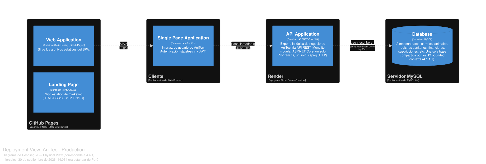

# 5.2. Software Configuration Management

En esta sección se establecen las decisiones y convenciones que mantienen la consistencia del proyecto durante todo su ciclo de vida: con qué herramientas se trabaja, cómo se versiona el código, qué estilo se sigue al escribirlo y cómo se despliega cada producto. Los datos de despliegue corresponden al estado real del sistema al 09/10/2026.

## 5.2.1. Software Development Environment Configuration

AniTec se compone de cuatro repositorios independientes (informe, landing page, frontend web y backend). Esta sección indica las herramientas que el equipo utiliza en cada tipo de actividad del ciclo de vida, junto con su ruta de referencia, respetando las herramientas permitidas por el statement del curso.

**Project Management**

| Herramienta | Propósito en el proyecto | Enlace |
|---|---|---|
| Trello | Product Backlog y tableros de Sprint Backlog. | https://trello.com |

**Requirements Management**

| Herramienta | Propósito en el proyecto | Enlace |
|---|---|---|
| Gherkin | Criterios de aceptación Given–When–Then de las User Stories y archivos `.feature` de las pruebas de aceptación. | https://cucumber.io/docs/gherkin/ |
| Miro | Dinámicas de Event Storming y mapas de escenarios. | https://miro.com/ |

**Product Design**

| Herramienta | Propósito en el proyecto | Enlace |
|---|---|---|
| Figma | Wireframes, mock-ups y prototipos de la landing page y de la aplicación web. | https://www.figma.com |
| Lucidchart | Diagramas UML y de flujo. | https://www.lucidchart.com/ |
| Structurizr | Modelo C4 de la arquitectura (archivo `workspace.dsl` del informe). | https://structurizr.com |
| PlantUML | Diagramas UML versionados como texto (clases, secuencia, actividad, estados, paquetes). | https://plantuml.com |

**Software Development**

| Herramienta | Versión | Propósito en el proyecto | Enlace |
|---|---|---|---|
| Git y GitHub | — | Control de versiones y colaboración, siguiendo GitFlow (sección 5.2.2). | https://github.com |
| Visual Studio Code | — | Redacción del informe en Markdown y edición del frontend y la landing. | https://code.visualstudio.com/ |
| JetBrains Rider | — | Desarrollo del backend ASP.NET Core. | https://www.jetbrains.com/rider/ |
| .NET SDK | 10.0 (`global.json`) | Compilación y ejecución del backend (`net10.0`). | https://dotnet.microsoft.com/ |
| Node.js | 22 | Compilación del frontend con Vite (versión también fijada en Render con `NODE_VERSION=22`). | https://nodejs.org/ |
| Vue 3, Vite, Pinia, PrimeVue | Vue 3.5.x, Vite 8.x | Frontend web (SPA). | https://vuejs.org/ |
| MySQL y MySQL Workbench | MySQL 8.0 local / 8.4.11 en Aiven | Base de datos relacional y su consulta visual durante el desarrollo y el despliegue. | https://www.mysql.com/products/workbench/ |
| xUnit, NSubstitute y Reqnroll | Ver 5.1.1 | Pruebas unitarias y de aceptación (BDD) del backend. | https://xunit.net/ / https://reqnroll.net/ |
| Swagger (OpenAPI) | Swashbuckle 10.2.0 | Documentación e interacción con los Web Services. | https://swagger.io/ |

**Software Deployment**

| Plataforma | Propósito en el proyecto | Enlace |
|---|---|---|
| GitHub Pages | Despliegue de la landing page (sitio estático). | https://pages.github.com |
| Render | Despliegue del backend (Web Service con Docker) y del frontend (Static Site). | https://render.com/ |
| Aiven | Base de datos MySQL administrada (plan gratuito). | https://aiven.io/ |

**Software Documentation**

| Herramienta | Propósito en el proyecto | Enlace |
|---|---|---|
| Markdown en repositorio | Informe del proyecto, versionado junto con sus diagramas. | https://github.com/1ASI0657-2620-9199-Fundamentos-Software/anitec-report |
| Swagger UI | Documentación pública de los endpoints. | https://anitec-backend-tbm0.onrender.com/swagger/index.html |

### Puesta en marcha del entorno local

Para trabajar en el proyecto, cada integrante necesita .NET SDK 10, Node.js 22, un servidor MySQL local y Git. Los comandos principales son:

| Producto | Pasos | Resultado |
|---|---|---|
| **Backend** | Clonar `anitec-backend`; crear en MySQL la base de datos `anitec-platform` (o ajustar `ConnectionStrings:DefaultConnection` en `appsettings.Development.json`); ejecutar `dotnet run --project Anitec.Platform`. Al iniciar en modo Development se aplican las migraciones y se cargan los datos semilla. | API en `http://localhost:5191/api/v1`, Swagger en `/swagger`. |
| **Frontend** | Clonar `anitec-frontend`; `npm install`; verificar que `.env.development` apunte al backend local; `npm run dev`. | SPA en `http://localhost:5173`. |
| **Landing page** | Clonar `anitec-landing-page`; abrir `index.html` (es HTML, CSS y JavaScript estáticos, sin compilación). | Sitio local. |
| **Pruebas** | Desde `anitec-backend`: `dotnet test Anitec.Platform.Tests/Anitec.Platform.Tests.csproj`. | Resultado de la suite descrita en 5.1.1. |

## 5.2.2. Source Code Management

Se utiliza **GitHub** como plataforma de control de versiones y **Git** con el flujo de trabajo **GitFlow** (Driessen, 2010). Cada producto tiene su propio repositorio dentro de la organización del curso, que contiene el proyecto y, en el caso del backend, también los archivos de prueba (`.feature`) en `Anitec.Platform.Tests/Features/`.

| Producto | Repositorio |
|---|---|
| Informe del proyecto | https://github.com/1ASI0657-2620-9199-Fundamentos-Software/anitec-report.git |
| Landing page | https://github.com/1ASI0657-2620-9199-Fundamentos-Software/anitec-landing-page.git |
| Frontend web (Vue 3) | https://github.com/1ASI0657-2620-9199-Fundamentos-Software/anitec-frontend.git |
| Backend / Web Services (.NET) | https://github.com/1ASI0657-2620-9199-Fundamentos-Software/anitec-backend.git |

### Estrategia de ramas (GitFlow)

| Rama | Convención de nombre | Propósito |
|---|---|---|
| Principal | `main` | Contiene únicamente versiones estables, listas para desplegar. Render y GitHub Pages despliegan desde esta rama. |
| Integración | `develop` | Integra las funcionalidades terminadas antes de cada versión. |
| Feature | `feature/<descripcion-en-kebab-case>` (por ejemplo `feature/bulk-animal-registration`) | Una rama por funcionalidad o User Story; nace de `develop` y vuelve a `develop` mediante *pull request*. |
| Release | `release/vMAJOR.MINOR.PATCH` (por ejemplo `release/v1.0.0`) | Preparación de una versión: ajustes finales y numeración. Se fusiona en `main` y en `develop`. |
| Hotfix | `hotfix/<descripcion-en-kebab-case>` | Corrección urgente de un error en producción; nace de `main` y se fusiona en `main` y `develop`. |

### Versionado semántico

Las versiones se nombran con **Semantic Versioning 2.0.0** (`MAJOR.MINOR.PATCH`):

| Parte | Cuándo se incrementa |
|---|---|
| `MAJOR` | Cambios incompatibles en el contrato de la API o en el modelo de datos. |
| `MINOR` | Nuevas funcionalidades compatibles con lo anterior (por ejemplo, un nuevo endpoint). |
| `PATCH` | Correcciones de errores que no cambian el comportamiento esperado. |

Las versiones publicadas se etiquetan en Git con el formato `vMAJOR.MINOR.PATCH` (por ejemplo `v1.0.0`).

### Mensajes de commit (Conventional Commits)

Los mensajes siguen **Conventional Commits 1.0.0**, con el formato `<tipo>[ámbito opcional]: <descripción en inglés>`, y un cuerpo opcional que explica el *por qué*.

| Tipo | Uso | Ejemplo real del repositorio |
|---|---|---|
| `feat` | Nueva funcionalidad. | — |
| `fix` | Corrección de un error. | `fix: point CTA links to the new frontend deployment` (landing page) |
| `docs` | Documentación. | `docs: update student outcome` (informe) |
| `test` | Creación o cambio de pruebas. | — |
| `refactor` | Reestructuración sin cambio de comportamiento. | — |
| `style` | Formato, sin cambio de lógica. | — |
| `chore` | Mantenimiento, configuración o despliegue. | `chore: trigger GitHub Pages deployment` (landing page) |

## 5.2.3. Source Code Style Guide & Coding Conventions

**Reglas generales (todos los productos):** todo el código —nombres de clases, métodos, variables, archivos, ramas y mensajes de commit— se escribe en **inglés**; los nombres son descriptivos y no se abrevian sin necesidad; cada unidad tiene una única responsabilidad.

| Lenguaje / artefacto | Referencia adoptada | Convenciones aplicadas (verificadas en el código) |
|---|---|---|
| **C# (backend)** | *C# Coding Conventions* de Microsoft | `PascalCase` para tipos, métodos y propiedades; `camelCase` para parámetros y variables locales; *namespaces* con alcance de archivo (`namespace X;`); constructores primarios para inyectar dependencias (`AnimalCommandService(IAnimalRepository repository, ...)`); métodos asíncronos con `CancellationToken`; comandos, consultas y *resources* como `record`; una clase por archivo. |
| **Estructura del backend** | DDD con capas | Cada bounded context contiene `Domain`, `Application`, `Infrastructure` e `Interfaces`; nombres de tabla y columna en `snake_case` generados por convención. |
| **API REST** | Principios REST y OpenAPI | Rutas en plural y `kebab-case` bajo `/api/v1/` (`/api/v1/animals`, `/api/v1/health-events`); verbos HTTP según la acción (`GET`, `POST`, `PUT`, `PATCH`, `DELETE`); errores como `ProblemDetails`; cada endpoint documentado con Swagger. |
| **JavaScript / Vue (frontend)** | *Google JavaScript Style Guide* y *Vue Style Guide* | `camelCase` para variables y funciones; `PascalCase` para clases; archivos y componentes en `kebab-case` (`animal-form.vue`, `sign-in-form.vue`); organización por bounded context con las carpetas `domain`, `application`, `infrastructure` y `presentation`; *stores* de Pinia por contexto; textos de la interfaz en archivos de i18n (es/en). |
| **HTML y CSS (landing)** | *Google HTML/CSS Style Guide* | Etiquetas semánticas (`header`, `section`, `footer`); clases en `kebab-case`; sangría de 2 espacios; textos traducibles mediante atributos `data-i18n`. |
| **Gherkin (pruebas BDD)** | *Gherkin Conventions for Readable Specifications* | Pasos declarativos (describen el comportamiento, no la interfaz); *Feature* con la fórmula `As a / I want / So that` y el id del User Story; títulos de escenario que expresan una regla de negocio; `Background` para el contexto común; `Scenario Outline` con `Examples` para variaciones de datos; todo en inglés. |
| **SQL / migraciones** | Convenciones de EF Core | Migraciones con nombre descriptivo en `PascalCase` (`AddCorralsAndAnimalCorral`); una migración por cambio de modelo. |

**Nota sobre el statement:** el curso cita la *Google TypeScript Style Guide*. AniTec está desarrollado en JavaScript (el frontend usa `jsconfig.json`, no TypeScript), por lo que se adopta la guía de JavaScript equivalente de Google.

## 5.2.4. Software Deployment Configuration

El despliegue se organiza por producto y es independiente para cada uno. Todos se publican desde la rama `main` de su repositorio. A continuación se describe cómo, partiendo del código fuente, se llega al producto publicado.

  
  
<i><b>Fuente</b>: Elaboración propia, con Structurizr (vista <code>19-Deployment-Production</code> del <code>workspace.dsl</code>).</i>

| Producto | Plataforma | URL pública |
|---|---|---|
| Landing page | GitHub Pages | https://1asi0657-2620-9199-fundamentos-software.github.io/anitec-landing-page/ |
| Frontend web (SPA) | Render, *Static Site* | https://anitec-frontend-cve3.onrender.com |
| Backend (Web Services) | Render, *Web Service* (Docker) | https://anitec-backend-tbm0.onrender.com |
| Documentación de la API | Swagger UI del backend | https://anitec-backend-tbm0.onrender.com/swagger/index.html |
| Base de datos | Aiven for MySQL (plan gratuito) | Servicio privado: se accede con credenciales (no tiene URL pública). |

### Base de datos (Aiven for MySQL)

1. Crear una cuenta en https://aiven.io/ y un proyecto (`anitec`).
2. Crear un servicio **MySQL** con el plan gratuito (en el formulario viene preseleccionado PostgreSQL; hay que cambiarlo a MySQL). El servicio se aprovisionó en DigitalOcean, región `sfo`, con MySQL 8.4.11.
3. En el resumen del servicio, copiar el host, el puerto, el usuario, la contraseña y el nombre de la base de datos (`defaultdb`). El servicio exige SSL (`SslMode=Required`).
4. Con esos datos se arma la cadena de conexión que usará el backend (se guarda solo como variable de entorno en Render, nunca en el repositorio).
5. Las tablas **no se crean a mano**: el backend ejecuta `Database.Migrate()` al arrancar y aplica las seis migraciones del repositorio. Las tablas resultantes se verificaron con MySQL Workbench (15 tablas del esquema más `__EFMigrationsHistory`).

**Limitaciones del plan gratuito:** el servicio es de un solo nodo, sin alta disponibilidad, con 1 GB de almacenamiento, y puede apagarse tras un periodo de inactividad.

### Backend (Render, Web Service)

1. En Render: **New > Web Service**, conectar el repositorio `1ASI0657-2620-9199-Fundamentos-Software/anitec-backend` (Render debe tener acceso a la organización de GitHub).
2. Configurar: lenguaje **Docker** (usa el `Dockerfile` de la raíz, que compila con el SDK de .NET 10 y ejecuta sobre `aspnet:10.0`), rama `main`, región **Oregon (US West)** (la más cercana a la base de datos en `sfo`) y tipo de instancia **Free**.
3. Definir las variables de entorno:

| Variable | Descripción |
|---|---|
| `ConnectionStrings__DefaultConnection` | Cadena de conexión a Aiven (con `SslMode=Required`). |
| `TokenSettings__Secret` | Clave con la que se firman los tokens JWT. Se genera aleatoria; el valor de `appsettings.json` es solo para desarrollo. |
| `PORT` | `8080`, el puerto en el que escucha el contenedor. |

4. Desplegar. Al terminar, los registros muestran la aplicación aplicando las migraciones y el mensaje `Now listening on: http://0.0.0.0:8080`, y Render marca el servicio como *Live*.
5. Verificar abriendo `/swagger/index.html`.

**Limitaciones del plan gratuito de Render:** el servicio se suspende tras 15 minutos sin tráfico y la siguiente petición tarda alrededor de un minuto; además, el sistema de archivos es efímero (ver hallazgo R6 en 5.1.4: las imágenes subidas por los usuarios se pierden al reiniciar).

### Frontend (Render, Static Site)

1. En Render: **New > Static Site**, conectar el repositorio `anitec-frontend` (rama `main`).
2. Configurar: *Build Command* `npm install && npm run build` y *Publish Directory* `dist`.
3. Definir las variables de entorno. Vite las incorpora al compilar, y tienen prioridad sobre el archivo `.env.production` del repositorio:

| Variable | Valor |
|---|---|
| `VITE_ANITEC_API_URL` | `https://anitec-backend-tbm0.onrender.com/api/v1` |
| `VITE_ANITEC_SERVER_URL` | `https://anitec-backend-tbm0.onrender.com` |
| `NODE_VERSION` | `22` (Vite 8 exige Node 20.19 o superior) |

4. En **Redirects/Rewrites**, agregar la regla `/*` → `/index.html` con acción *Rewrite*; el router de Vue usa modo *history* y sin ella cualquier ruta distinta de `/` devuelve 404 al refrescar.
5. Desplegar y verificar iniciando sesión desde la URL pública.

### Landing page (GitHub Pages)

1. En el repositorio `anitec-landing-page`: **Settings > Pages**.
2. En *Build and deployment*, elegir **Deploy from a branch**, rama `main`, carpeta `/ (root)`.
3. GitHub Pages **no construye el sitio hasta el siguiente push** a `main` después de activarlo; por eso se hizo un commit vacío (`chore: trigger GitHub Pages deployment`), que lanzó el flujo *pages build and deployment*.
4. Verificar en la pestaña **Actions** que el flujo termine en verde; el sitio queda disponible en la URL indicada. En la evidencia, el primer flujo duró 56 segundos.
5. Los botones de llamada a la acción de la landing apuntan al frontend desplegado en Render.

### Integración y despliegue continuo

Tanto Render como GitHub Pages **redespliegan automáticamente** cuando se hace push a `main`. Todavía no existe un flujo de integración continua propio (por ejemplo, GitHub Actions que ejecute `dotnet test` antes de aceptar un cambio); incorporarlo es un trabajo pendiente para los siguientes sprints, y es la forma natural de que la suite de 5.1.1 proteja la rama `main`.
