# 5.3.1. Sprint 1

El Sprint 1 tuvo como objetivo **poner AniTec en línea**: publicar sus tres productos (la landing page, el frontend web y el backend con su base de datos) en proveedores cloud, y demostrar de punta a punta que un usuario puede iniciar sesión y consultar datos protegidos en el sistema desplegado. El periodo cubierto por la evidencia va del 06/09/2026, fecha del primer commit de los repositorios del curso, al 09/10/2026, fecha del despliegue completo.

El Sprint no partió de cero: el código de la landing, el frontend y el backend proviene de la base ya existente, que se importó a los repositorios de este curso, se extendió con el concepto de corral y el registro por lote (commits del 30/09/2026) y se desplegó en infraestructura nueva. Por eso el trabajo de este Sprint es principalmente de verificación, ajuste, pruebas y despliegue.

## 5.3.1.1. Sprint Backlog 1

El Sprint 1 reúne las User Stories de la landing page (US-044 a US-052), cuyo objetivo es que un visitante comprenda la propuesta de AniTec antes de usar la aplicación, y la User Story de inicio de sesión (US-053), que es la que permite demostrar el sistema desplegado. A ellas se suman tareas de despliegue y documentación que no dependen de una historia en particular, sino de las restricciones del curso (publicar los productos en cloud, documentar la configuración y probar el backend). El total comprometido es de **32 Story Points** (valores del Product Backlog, sección 3.4).

<div align="center">
  <!-- PLACEHOLDER: captura del tablero de Trello del Sprint 1 -->
  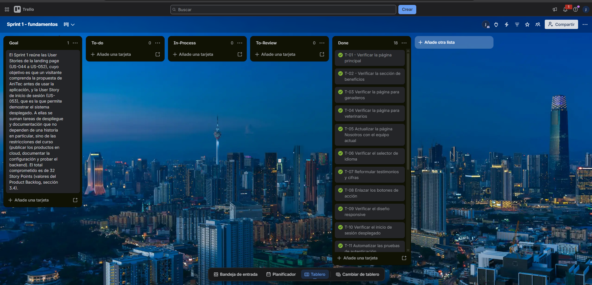
  <p><i><b>Fuente</b>: Tablero del Sprint 1 en Trello.</i></p>
</div>

**URL pública del tablero:** https://trello.com/invite/b/6ac93c4ecaa0b01d412cbc92/ATTIa9bee769aa9d2a18458e3933f1ccf56f3135D90F/sprint-1-fundamentos

### User Stories del Sprint

| # Orden | User Story Id | Título | Descripción | Story Points (1 / 2 / 3 / 5 / 8) |
|---|---|---|---|---|
| 1 | US-053 | Iniciar sesión | Como usuario registrado, quiero iniciar sesión para acceder a las capacidades de mi rol. | 5 |
| 2 | US-044 | Visualizar landing principal | Como visitante, quiero comprender rápidamente la propuesta de AniTec. | 5 |
| 3 | US-045 | Conocer beneficios | Como visitante, quiero revisar beneficios para evaluar la propuesta. | 3 |
| 4 | US-046 | Visualizar información para ganaderos | Como ganadero visitante, quiero conocer casos de uso relacionados con mi trabajo. | 3 |
| 5 | US-047 | Visualizar información para veterinarios | Como veterinario visitante, quiero conocer casos de uso relacionados con mi trabajo. | 3 |
| 6 | US-051 | Acceder a contacto o CTA | Como visitante interesado, quiero encontrar el siguiente paso para contactar al equipo. | 2 |
| 7 | US-052 | Navegar landing desde móvil | Como visitante móvil, quiero revisar la landing sin problemas de visualización. | 3 |
| 8 | US-048 | Visualizar página Nosotros | Como visitante, quiero conocer al equipo y el propósito del producto. | 2 |
| 9 | US-049 | Cambiar idioma de landing | Como visitante, quiero elegir el idioma disponible de la landing. | 3 |
| 10 | US-050 | Consultar casos ilustrativos | Como visitante, quiero comprender escenarios de uso sin confundirlos con testimonios reales. | 3 |

El orden sigue el del Product Backlog (sección 3.4), que lo determina el valor para el negocio. Total comprometido: **32 Story Points**.

### Tabla de control de estado

Las horas son estimaciones del equipo para cada tarea. Los estados siguen la escala To-do / In-Process / To-Review / Done.

| Sprint # | Sprint 1 | | | | | | |
|---|---|---|---|---|---|---|---|
| **User Story** | | **Work-Item / Task** | | | | | |
| **Id** | **Title** | **Id** | **Title** | **Description** | **Estimation (Hours)** | **Assigned To** | **Status** |
| US-044 | Visualizar landing principal | T-01 | Verificar la página principal | Revisar las secciones de `index.html` (hero, segmentos, métricas, funcionalidades, cómo funciona y precios) y su contenido. | 3 | Castro Picón, Manuel Fernando Joao | Done |
| US-045 | Conocer beneficios | T-02 | Verificar la sección de beneficios | Revisar la sección de funcionalidades y beneficios para ganaderos y veterinarios. | 2 | Castro Picón, Manuel Fernando Joao | Done |
| US-046 | Visualizar información para ganaderos | T-03 | Verificar la página para ganaderos | Revisar `assets/pages/ranchers.html`: módulos de gestión y llamadas a la acción. | 2 | Melgarejo Quiroz, Josep Eliu | Done |
| US-047 | Visualizar información para veterinarios | T-04 | Verificar la página para veterinarios | Revisar `assets/pages/veterinarians.html`: funcionalidades y casos de uso. | 2 | Baldeon Vivar, Santiago Armando | Done |
| US-048 | Visualizar página Nosotros | T-05 | Actualizar la página Nosotros con el equipo actual | La página aún presenta a integrantes del equipo del trabajo anterior; reemplazar nombres, fotos y enlaces por Castro, Melgarejo y Baldeon. | 3 | Castro Picón, Manuel Fernando Joao | Done |
| US-049 | Cambiar idioma de landing | T-06 | Verificar el selector de idioma | Comprobar el selector EN/ES y que los textos se traduzcan en todas las páginas. | 2 | Melgarejo Quiroz, Josep Eliu | Done |
| US-050 | Consultar casos ilustrativos | T-07 | Reformular testimonios y cifras | La landing presenta "Real Testimonials" y la cifra "+500 ranchers" que no tienen respaldo (la evidencia del proyecto es sintética, capítulo II). Presentarlos como casos ilustrativos y retirar las cifras no verificables. | 4 | Castro Picón, Manuel Fernando Joao | Done |
| US-051 | Acceder a contacto o CTA | T-08 | Enlazar los botones de acción | Apuntar los botones "Get Started" de la landing al frontend desplegado. | 2 | Melgarejo Quiroz, Josep Eliu | Done |
| US-052 | Navegar landing desde móvil | T-09 | Verificar el diseño responsive | Probar la landing en pantallas de móvil y tableta. | 2 | Baldeon Vivar, Santiago Armando | Done |
| US-053 | Iniciar sesión | T-10 | Verificar el inicio de sesión desplegado | En el Swagger del backend desplegado: `sign-in`, token, y acceso a `GET /animals` sin token (401) y con token (200). | 3 | Baldeon Vivar, Santiago Armando | Done |
| US-053 | Iniciar sesión | T-11 | Automatizar las pruebas de autenticación | Escribir `Authentication.feature` y sus pasos, y pruebas unitarias de `UserCommandService`. | 4 | Melgarejo Quiroz, Josep Eliu | Done |
| — | (Restricción: despliegue en cloud) | T-12 | Crear la base de datos en Aiven | Crear el servicio MySQL (plan gratuito) y obtener las credenciales. | 2 | Melgarejo Quiroz, Josep Eliu | Done |
| — | (Restricción: despliegue en cloud) | T-13 | Desplegar el backend en Render | Web Service con Docker, variables de entorno y migraciones automáticas. | 4 | Melgarejo Quiroz, Josep Eliu | Done |
| — | (Restricción: despliegue en cloud) | T-14 | Desplegar el frontend en Render | Static Site con variables de entorno de la API y regla de *rewrite*. | 3 | Castro Picón, Manuel Fernando Joao | Done |
| — | (Restricción: despliegue en cloud) | T-15 | Activar GitHub Pages para la landing | Configurar la publicación desde `main` y verificar el flujo de despliegue. | 1 | Castro Picón, Manuel Fernando Joao | Done |
| — | (Restricción: despliegue en cloud) | T-16 | Cargar datos de demostración | Ejecutar el seeder contra la base desplegada para crear los usuarios de prueba. | 1 | Melgarejo Quiroz, Josep Eliu | Done |
| — | (Restricción: calidad) | T-17 | Crear la suite de pruebas del backend | Proyecto `Anitec.Platform.Tests` con pruebas unitarias y escenarios BDD (sección 5.1.1). | 6 | Baldeon Vivar, Santiago Armando | Done |
| — | (Restricción: documentación) | T-18 | Documentar configuración y despliegue | Redactar las secciones 5.1 y 5.2 y actualizar las URL del informe. | 4 | Baldeon Vivar, Santiago Armando | Done |

**Resumen de horas por integrante** (suma de las tareas asignadas): Castro Picón, 16 h; Melgarejo Quiroz, 17 h; Baldeon Vivar, 17 h. Total estimado: 50 h.

**Resumen de estados:** las 18 tareas del Sprint están en Done.

## 5.3.1.2. Development Evidence for Sprint Review

Los avances de implementación de este Sprint son tres: (1) la landing page quedó publicada y enlazada con el frontend desplegado; (2) el frontend se compila y publica con variables de entorno que apuntan al backend desplegado; y (3) el backend se despliega desde su imagen Docker y crea su propio esquema de base de datos al arrancar. Los commits que siguen son los **reales** del historial de cada repositorio, tomados con `git log`. Todos corresponden a la rama `main`, la única que existe hasta ahora (ver 5.2.2). Los mensajes de estos commits no incluyen cuerpo, por lo que esa columna se marca con un guion.

**Commits del repositorio anitec-landing-page:**

| Repository | Branch | Commit Id | Commit Message | Commit Message Body | Committed on (Date) |
|---|---|---|---|---|---|
| 1ASI0657-2620-9199-Fundamentos-Software/anitec-landing-page | main | c936c23 | chore: add initial project files | — | 06/09/2026 |
| 1ASI0657-2620-9199-Fundamentos-Software/anitec-landing-page | main | 8276daa | chore: trigger GitHub Pages deployment | — | 09/10/2026 |
| 1ASI0657-2620-9199-Fundamentos-Software/anitec-landing-page | main | b56802f | fix: point CTA links to the new frontend deployment | — | 09/10/2026 |

**Commits del repositorio anitec-frontend:**

| Repository | Branch | Commit Id | Commit Message | Commit Message Body | Committed on (Date) |
|---|---|---|---|---|---|
| 1ASI0657-2620-9199-Fundamentos-Software/anitec-frontend | main | d35cfaf | Initial commit | — | 06/09/2026 |
| 1ASI0657-2620-9199-Fundamentos-Software/anitec-frontend | main | 2bf4b0d | chore: add initial project files and structure | — | 06/09/2026 |
| 1ASI0657-2620-9199-Fundamentos-Software/anitec-frontend | main | 0c0ec74 | chore: add corral entity and related components | — | 30/09/2026 |
| 1ASI0657-2620-9199-Fundamentos-Software/anitec-frontend | main | fe4cc9c | chore: point production env to the new backend deployment | — | 09/10/2026 |

**Commits del repositorio anitec-backend:**

| Repository | Branch | Commit Id | Commit Message | Commit Message Body | Committed on (Date) |
|---|---|---|---|---|---|
| 1ASI0657-2620-9199-Fundamentos-Software/anitec-backend | main | d7c5242 | Initial commit | — | 06/09/2026 |
| 1ASI0657-2620-9199-Fundamentos-Software/anitec-backend | main | 2258c2b | chore: add initial project files and structure | — | 06/09/2026 |
| 1ASI0657-2620-9199-Fundamentos-Software/anitec-backend | main | 0c7acdc | chore: Add corrals and animal-corral relationship, add animal source and age range, add animal image URL | — | 30/09/2026 |

El commit `0c7acdc` del backend es el que Render desplegó (se ve como *Source* en el despliegue, sección 5.3.1.6), y el `0c0ec74` del frontend es el que Render mostraba como versión publicada del *Static Site* al momento de la captura (el commit `fe4cc9c` provoca un redespliegue posterior con los mismos valores).

**Commits del repositorio anitec-report:** los de esta entrega (capítulo 5) se registrarán aquí una vez realizado su commit. <!-- PLACEHOLDER: agregar hash, mensaje y fecha de los commits del capítulo 5 -->

**Repositorios relacionados al Sprint 1:**

- Landing page: https://github.com/1ASI0657-2620-9199-Fundamentos-Software/anitec-landing-page.git
- Frontend: https://github.com/1ASI0657-2620-9199-Fundamentos-Software/anitec-frontend.git
- Backend: https://github.com/1ASI0657-2620-9199-Fundamentos-Software/anitec-backend.git
- Informe: https://github.com/1ASI0657-2620-9199-Fundamentos-Software/anitec-report.git


## 5.3.1.3. Testing Suite Evidence for Sprint Review

Las pruebas de este Sprint se centran en **US-053 (Iniciar sesión)**, la única historia del Sprint que se apoya en un Web Service. Se diseñaron escenarios de aceptación en Gherkin (`Authentication.feature`), ejecutados con Reqnroll, que invocan el `UserCommandService` real, más pruebas unitarias del mismo servicio y de las piezas del núcleo que usa (`Result`, repositorio, *Unit of Work*). La suite completa y sus herramientas están descritas en 5.1.1.

**Ruta del proyecto de pruebas:** `anitec-backend/Anitec.Platform.Tests/` (repositorio https://github.com/1ASI0657-2620-9199-Fundamentos-Software/anitec-backend.git), con los archivos `.feature` en `Features/`.

### Archivo `.feature` relacionado con US-053

```gherkin
Feature: User authentication
  As a registered user of AniTec
  I want to sign in with my credentials
  So that I can access the capabilities of my role (US-053)

  Background:
    Given the following registered users
      | username    | password  | role         |
      | ganadero    | anitec123 | Rancher      |
      | veterinaria | anitec123 | Veterinarian |

  Scenario: Successful sign in returns a token
    When I sign in with username "ganadero" and password "anitec123"
    Then the sign in succeeds
    And a token is issued for the user "ganadero"

  Scenario: A wrong password is rejected
    When I sign in with username "ganadero" and password "incorrecta"
    Then the sign in fails with the error "InvalidCredentials"
    And no token is issued

  Scenario: An unknown user is rejected with the same error
    When I sign in with username "fantasma" and password "anitec123"
    Then the sign in fails with the error "InvalidCredentials"
    And no token is issued

  Scenario: A new user can register and then sign in
    Given I sign up as "maria" with password "anitec123", full name "Maria Quispe" and role "Rancher"
    When I sign in with username "maria" and password "anitec123"
    Then the sign in succeeds
    And a token is issued for the user "maria"

  Scenario: A username that is already taken cannot be registered again
    When I sign up as "ganadero" with password "otra" and full name "Otro" and role "Rancher"
    Then the sign up fails with the error "UsernameAlreadyTaken"

  Scenario Outline: Only the supported roles can be registered
    When I sign up as "nuevo" with password "anitec123" and full name "Nuevo" and role "<role>"
    Then the sign up <outcome>

    Examples:
      | role         | outcome                                |
      | Rancher      | succeeds                               |
      | Veterinarian | succeeds                               |
      | Admin        | fails with the error "InvalidRole"     |
```

### Relación de pruebas con la User Story

| Prueba | Tipo | Criterio de US-053 que respalda |
|---|---|---|
| Successful sign in returns a token | BDD | Un usuario registrado accede con sus credenciales y recibe un token. |
| A wrong password is rejected | BDD | Una contraseña incorrecta no permite el acceso ni emite token. |
| An unknown user is rejected with the same error | BDD | Un usuario inexistente recibe el mismo error que una contraseña errónea (no revela qué usuarios existen). |
| A new user can register and then sign in | BDD | El registro y el inicio de sesión funcionan de forma encadenada. |
| A username that is already taken cannot be registered again | BDD | No se duplican usuarios. |
| Only the supported roles can be registered (3 filas) | BDD | Solo existen los roles Rancher y Veterinarian, que son los que determinan las capacidades del usuario. |
| `UserCommandServiceTests` (9 pruebas) | Unitaria | Contraseña guardada con *hash* (nunca en texto plano), normalización del rol, errores de dominio. |

### Resultado de la ejecución

Los 8 escenarios de autenticación y las 9 pruebas unitarias de Iam se ejecutaron junto con el resto de la suite (48 pruebas en total), con el siguiente resultado el 09/10/2026:

```
Correctas! - Con error: 0, Superado: 48, Omitido: 0, Total: 48, Duración: 3 s
```

<div align="center">
  <!-- PLACEHOLDER: captura de la ejecución de las pruebas (puede ser la misma de 5.1.1) -->
  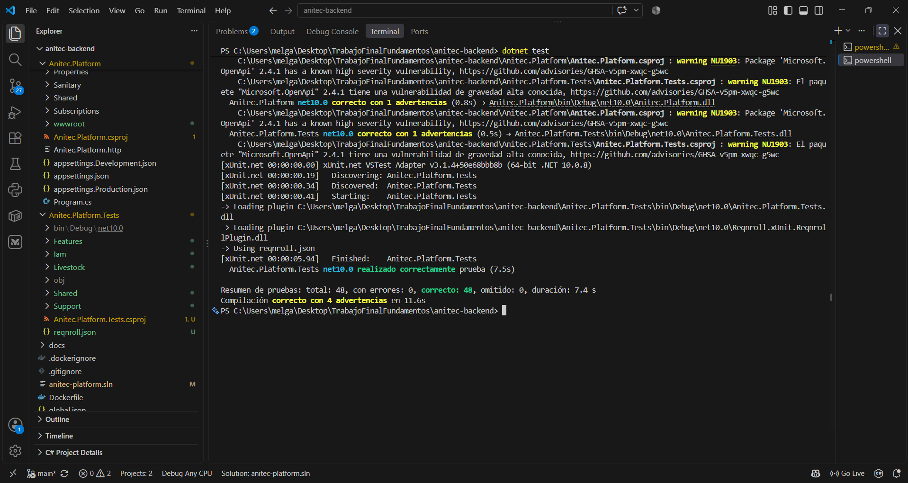
  <p><i><b>Fuente</b>: Elaboración propia.</i></p>
</div>

### Reporte HTML de los escenarios Gherkin

Además de la salida de consola, cada ejecución de la suite genera un **reporte HTML** con los escenarios de los archivos `.feature`, sus pasos y su resultado. Lo produce el formateador HTML de Reqnroll (versión 3.3.4), activado en el archivo `reqnroll.json` del proyecto de pruebas, y se escribe en `Anitec.Platform.Tests/bin/Debug/net10.0/reports/reqnroll_report.html`. En la ejecución del 09/10/2026 el reporte indicó **100 % (16 / 16) escenarios superados**, repartidos en los dos archivos `Authentication.feature` y `BulkAnimalRegistration.feature`.

<div align="center">
  <!-- PLACEHOLDER: captura del reporte HTML con el resumen (100 % passed) y los dos archivos .feature -->
  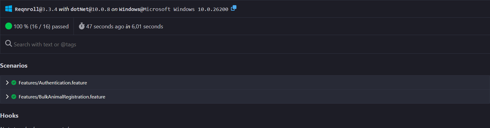
  <p><i><b>Fuente</b>: Reporte HTML de Reqnroll, ejecución local.</i></p>
</div>

<div align="center">
  <!-- PLACEHOLDER: captura del reporte HTML con Authentication.feature expandido, mostrando los pasos de cada escenario -->
  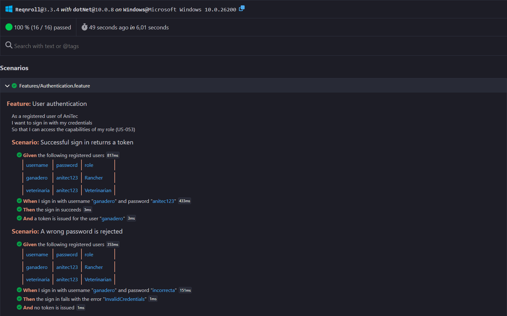
  <p><i><b>Fuente</b>: Reporte HTML de Reqnroll, escenarios de US-053.</i></p>
</div>

**Commits de testing de este Sprint:**

| Repository | Branch | Commit Id | Commit Message | Commit Message Body | Committed on (Date) |
|---|---|---|---|---|---|
| 1ASI0657-2620-9199-Fundamentos-Software/anitec-backend | main | b009c70 | chore: add report for test | — | 09/10/2026 |


**Verificación manual sobre el sistema desplegado:** además de la suite automatizada, el comportamiento de autenticación se comprobó sobre el backend publicado en Render (capturas en 5.3.1.4): sin token, `GET /api/v1/animals` responde 401; con el token obtenido de `sign-in`, responde 200 con la lista de animales.

## 5.3.1.4. Execution Evidence for Sprint Review

En este Sprint se logró que los tres productos sean accesibles desde internet y que trabajen entre sí. Las capturas muestran el recorrido de un usuario: entra desde la landing, inicia sesión en la aplicación web (que consulta la base de datos desplegada) y la API protege sus datos con un token.

**Enlace al video de demostración del Sprint 1:** <!-- PLACEHOLDER: reemplazar por la URL del video (YouTube) que ilustre la navegación y el inicio de sesión --> `https://youtu.be/xxxxxxxxxxx`

### Landing page desplegada

<div align="center">
  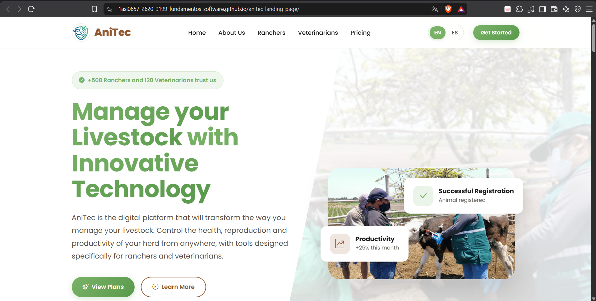
  <p><i><b>Fuente</b>: https://1asi0657-2620-9199-fundamentos-software.github.io/anitec-landing-page/</i></p>
</div>

### Aplicación web desplegada

<div align="center">
  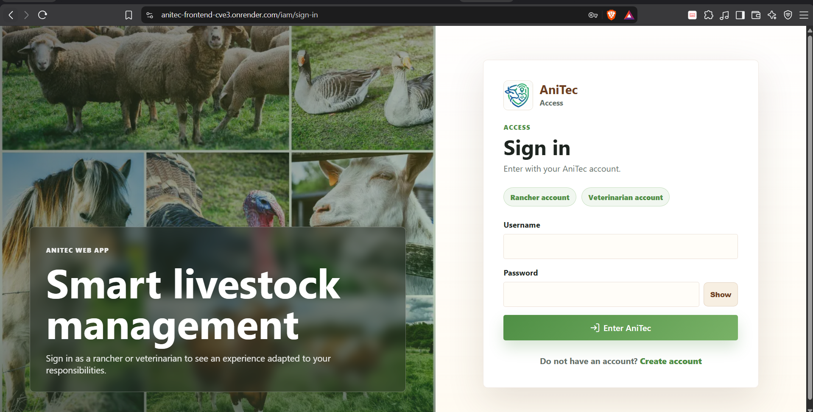
  <p><i><b>Fuente</b>: https://anitec-frontend-cve3.onrender.com</i></p>
</div>

<div align="center">
  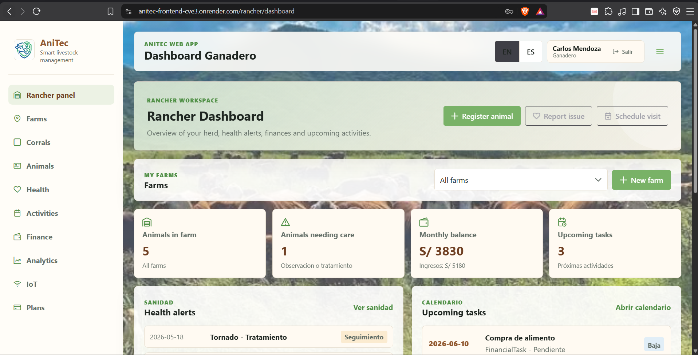
  <p><i><b>Fuente</b>: Panel del ganadero, con datos que provienen de la base de datos de Aiven.</i></p>
</div>

### Web Services: inicio de sesión y acceso protegido

**1. Inicio de sesión** (`POST /api/v1/authentication/sign-in`, usuario `ganadero`): la API responde 200 con los datos del usuario y su token.

<div align="center">
  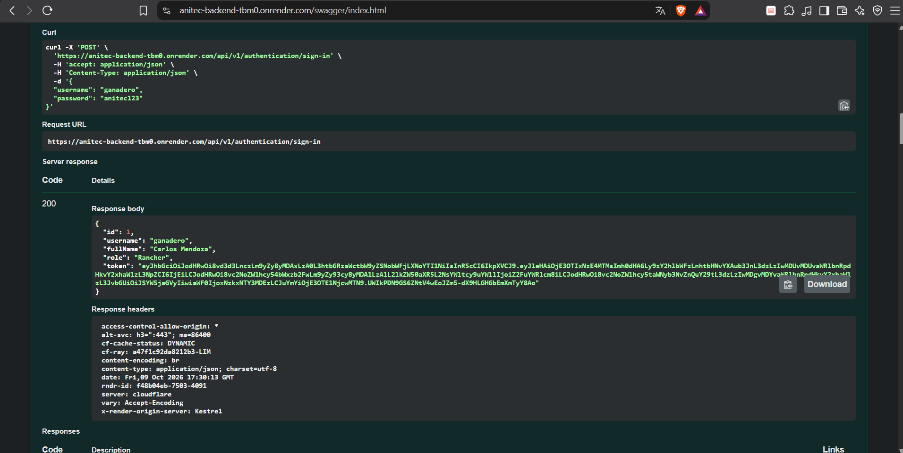
  <p><i><b>Fuente</b>: Swagger UI del backend desplegado.</i></p>
</div>

**2. Acceso sin token** (`GET /api/v1/animals`): la API rechaza la petición con 401 y el mensaje `Missing or invalid token`.

<div align="center">
  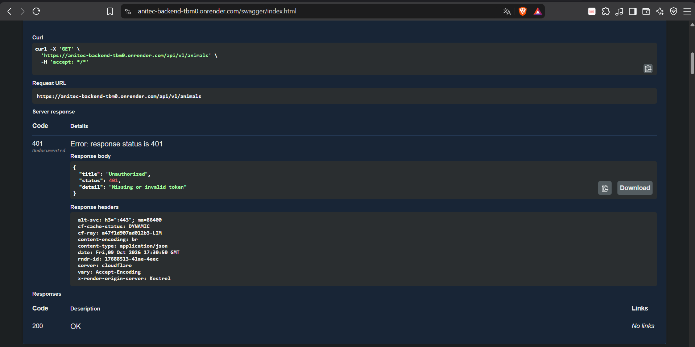
  <p><i><b>Fuente</b>: Swagger UI del backend desplegado.</i></p>
</div>

**3. Acceso con token** (`GET /api/v1/animals` con `Authorization: Bearer ...`): la API responde 200 con la lista de animales almacenada en la base de datos desplegada.

<div align="center">
  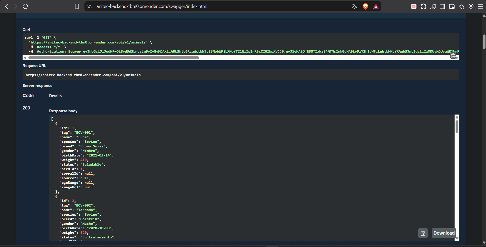
  <p><i><b>Fuente</b>: Swagger UI del backend desplegado.</i></p>
</div>

### Interacción vía Postman

<div align="center">
  <!-- PLACEHOLDER: captura de Postman con POST sign-in -->
  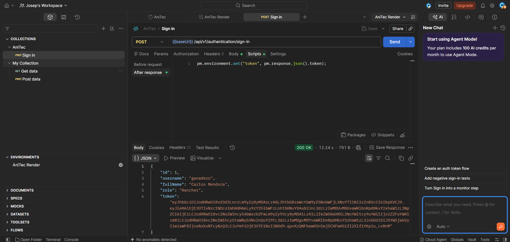
  <p><i><b>Fuente</b>: Postman contra el backend desplegado.</i></p>
</div>

<div align="center">
  <!-- PLACEHOLDER: captura de Postman con GET animals usando el token -->
  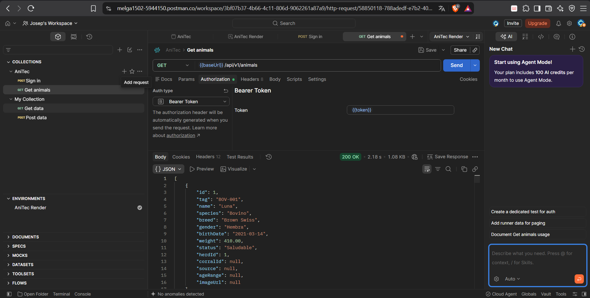
  <p><i><b>Fuente</b>: Postman contra el backend desplegado.</i></p>
</div>

## 5.3.1.5. Microservices Documentation Evidence for Sprint Review

La documentación de los Web Services está generada con **OpenAPI** mediante Swashbuckle y se publica junto con la API. En este Sprint se documentan los endpoints que respaldan US-053 y la verificación del sistema desplegado: el inicio de sesión, el registro y la lectura protegida de animales. Los demás endpoints (hatos, corrales, registros sanitarios, finanzas, etc.) ya aparecen en el mismo Swagger y se documentarán en los Sprints en que se trabajen.

**Documentación desplegada:** https://anitec-backend-tbm0.onrender.com/swagger/index.html
**URL local (desarrollo):** http://localhost:5191/swagger
**Repositorio de los Web Services:** https://github.com/1ASI0657-2620-9199-Fundamentos-Software/anitec-backend.git

<div align="center">
  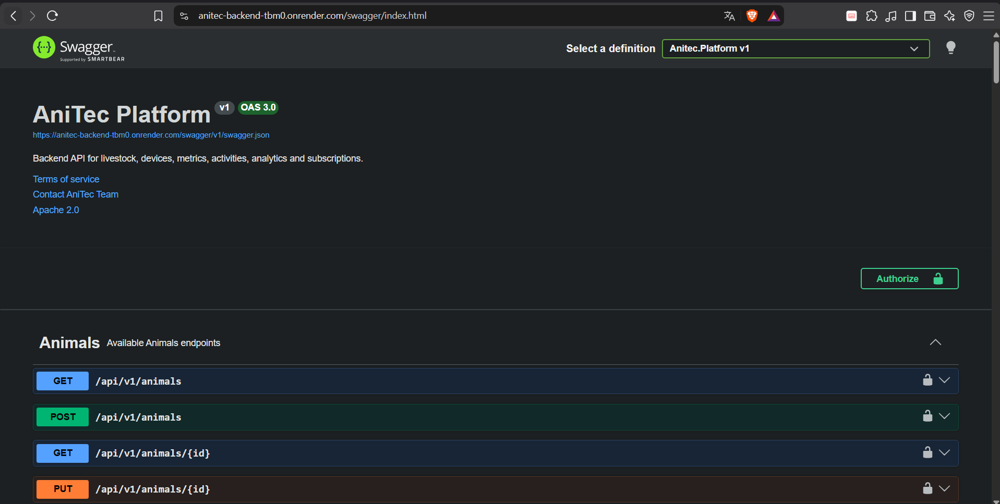
  <p><i><b>Fuente</b>: Swagger UI del backend desplegado.</i></p>
</div>

### Endpoints documentados

| Endpoint | Acción (verbo) | Sintaxis de llamada | Autenticación | Parámetros | Respuestas |
|---|---|---|---|---|---|
| `/api/v1/authentication/sign-in` | `POST` | `POST /api/v1/authentication/sign-in` | Pública | Cuerpo JSON: `username` (string), `password` (string). | **200**: usuario autenticado con su token. **400**: usuario o contraseña inválidos. |
| `/api/v1/authentication/sign-up` | `POST` | `POST /api/v1/authentication/sign-up` | Pública | Cuerpo JSON: `username`, `password`, `fullName` (opcional), `role` (`Rancher` o `Veterinarian`; por defecto `Rancher`). | **200**: usuario creado. **400**: rol no válido. **409**: el nombre de usuario ya existe. |
| `/api/v1/animals` | `GET` | `GET /api/v1/animals` | Token Bearer; roles `Rancher` y `Veterinarian` | Ninguno. | **200**: lista de animales. **401**: token ausente o inválido. |

### Ejemplos de petición y respuesta

**Inicio de sesión: petición**

```http
POST /api/v1/authentication/sign-in
Content-Type: application/json

{
  "username": "ganadero",
  "password": "anitec123"
}
```

**Respuesta 200:** el campo `token` es un JWT que se envía en las siguientes peticiones. Su validez es de 7 días.

```json
{
  "id": 1,
  "username": "ganadero",
  "fullName": "Carlos Mendoza",
  "role": "Rancher",
  "token": "<JWT>"
}
```

**Consulta de animales: petición**

```http
GET /api/v1/animals
Authorization: Bearer <JWT>
```

**Respuesta 200** (fragmento): cada animal incluye su hato y, si corresponde, su corral.

```json
[
  {
    "id": 1,
    "tag": "BOV-001",
    "name": "Luna",
    "species": "Bovino",
    "breed": "Brown Swiss",
    "gender": "Hembra",
    "birthDate": "2021-03-14",
    "weight": 410,
    "status": "Saludable",
    "herdId": 1,
    "corralId": null,
    "source": null,
    "ageRange": null,
    "imageUrl": null
  }
]
```

**Respuesta 401** (sin token):

```json
{
  "title": "Unauthorized",
  "status": 401,
  "detail": "Missing or invalid token"
}
```

**Commits relacionados con documentación en este Sprint:** la documentación OpenAPI se genera desde las anotaciones de los controladores, que se encuentran en el commit base `2258c2b` (06/09/2026) y se extendieron en `0c7acdc` (30/09/2026) para corrales y registro por lote.

## 5.3.1.6. Software Deployment Evidence for Sprint Review

Durante el Sprint 1 se crearon las cuentas y recursos cloud necesarios y se desplegaron los tres productos. El detalle paso a paso de la configuración está en la sección 5.2.4; aquí se presenta la evidencia de lo ejecutado, en el orden en que se hizo.

| Paso | Recurso | Qué se hizo | Resultado |
|---|---|---|---|
| 1 | Aiven | Crear la cuenta y un servicio MySQL en el plan gratuito. | MySQL 8.4.11 en estado *Running*. |
| 2 | Render (backend) | Crear un Web Service con Docker desde `anitec-backend`, con tres variables de entorno. | Despliegue exitoso del commit `0c7acdc` en 1 min 20 s; la API creó las tablas en Aiven al arrancar. |
| 3 | Render (frontend) | Crear un Static Site desde `anitec-frontend`, con variables de entorno de la API y regla de *rewrite*. | Sitio *Live* con el commit `0c0ec74`. |
| 4 | Datos de prueba | Ejecutar el seeder contra la base desplegada. | Siete usuarios de demostración en la tabla `users`. |
| 5 | GitHub Pages | Activar la publicación de la landing desde `main` y forzar la primera construcción con un commit. | Flujo *pages build and deployment* exitoso en 56 s. |
| 6 | Landing | Apuntar los botones de acción al frontend desplegado. | Commit `b56802f` publicado. |

**Base de datos en Aiven**

<div align="center">
  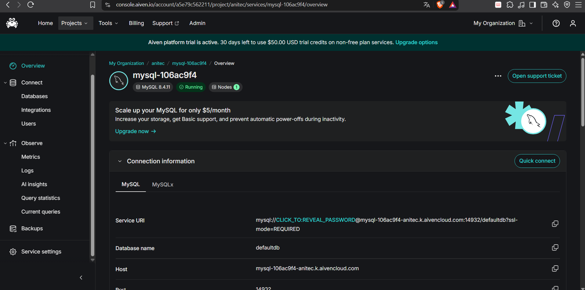
  <p><i><b>Fuente</b>: Consola de Aiven (https://aiven.io/).</i></p>
</div>

**Tablas creadas por las migraciones, consultadas con MySQL Workbench**

<div align="center">
  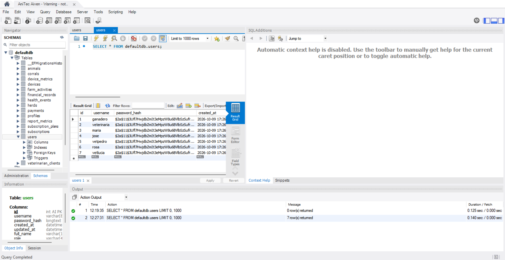
  <p><i><b>Fuente</b>: MySQL Workbench conectado a la base de datos de Aiven.</i></p>
</div>

**Backend en Render: despliegue y registros**

<div align="center">
  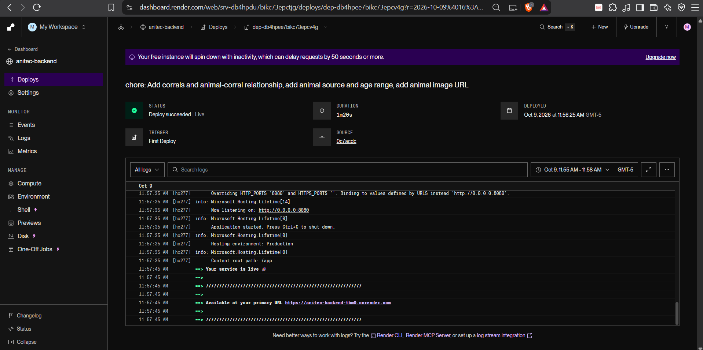
  <p><i><b>Fuente</b>: Render, servicio anitec-backend.</i></p>
</div>

<div align="center">
  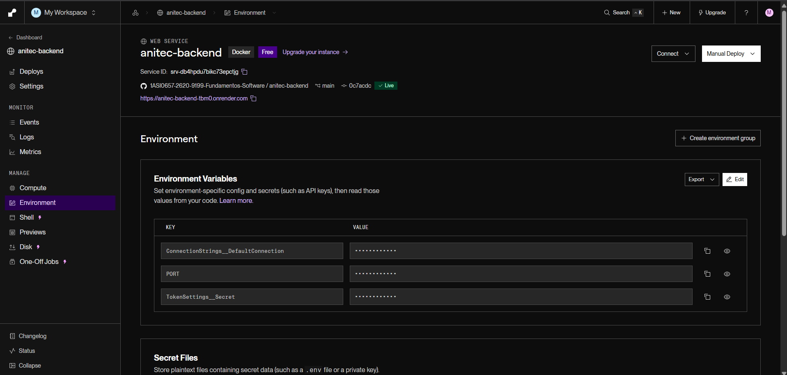
  <p><i><b>Fuente</b>: Render, pestaña Environment (los valores permanecen ocultos).</i></p>
</div>

**Frontend en Render**

<div align="center">
  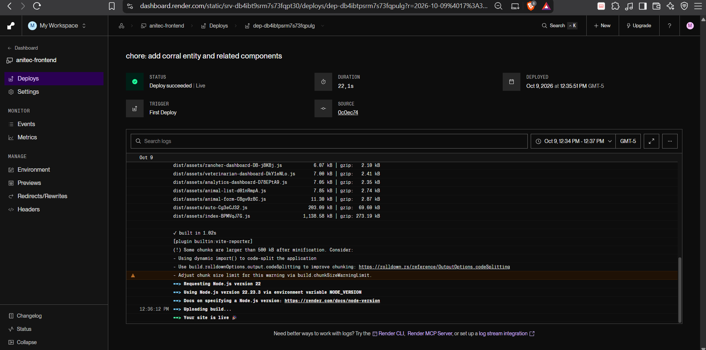
  <p><i><b>Fuente</b>: Render, servicio anitec-frontend.</i></p>
</div>

<div align="center">
  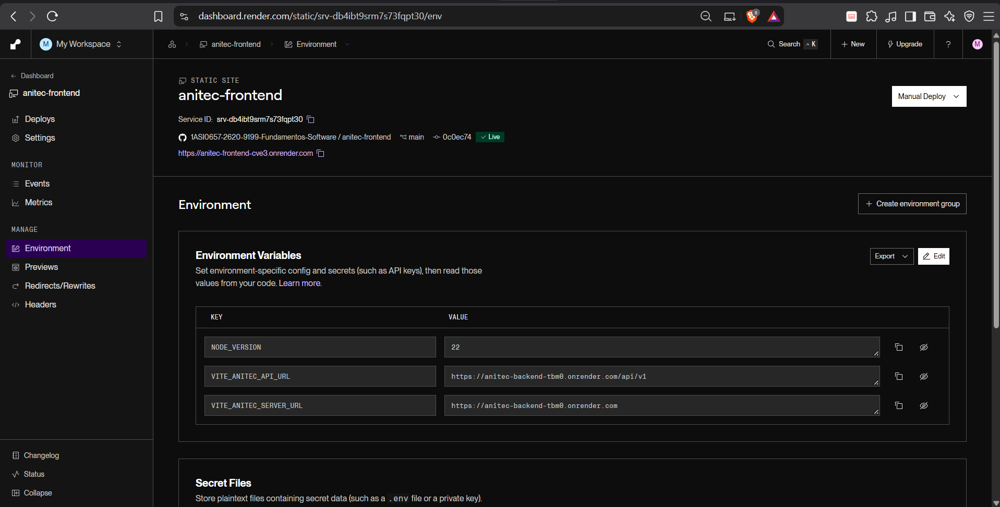
  <p><i><b>Fuente</b>: Render, pestaña Environment.</i></p>
</div>

**Landing page en GitHub Pages**

<div align="center">
  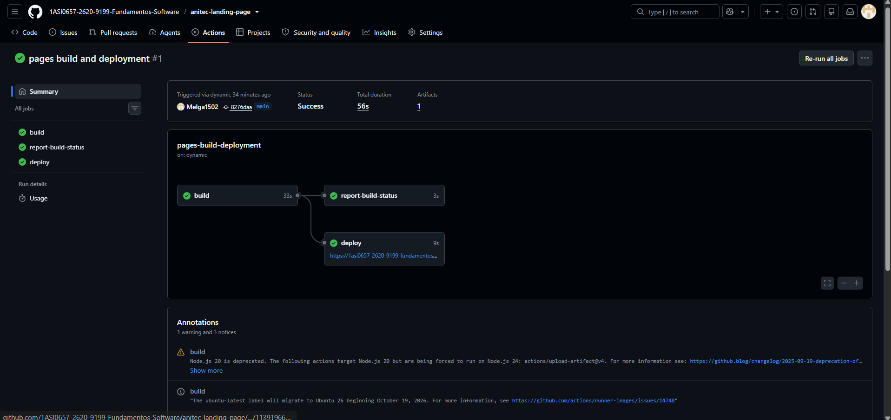
  <p><i><b>Fuente</b>: GitHub Actions, repositorio anitec-landing-page.</i></p>
</div>

### Problemas encontrados durante el despliegue

| Problema | Causa | Solución |
|---|---|---|
| La landing devolvía 404 aun con Pages activado. | GitHub Pages no construye el sitio hasta que hay un push posterior a su activación; no existía ninguna ejecución del flujo. | Commit vacío a `main` (`8276daa`) para lanzar el primer despliegue. |
| El inicio de sesión de demostración fallaba en producción. | El seeder solo corre en modo Development, de modo que la base desplegada quedó sin usuarios. | Ejecutar el backend localmente en modo Development apuntando a Aiven, una sola vez; el seeder es idempotente (no hace nada si ya hay usuarios). |
| El frontend podía seguir apuntando al backend anterior. | El archivo `.env.production` del repositorio contenía URL del despliegue previo. | Definir las variables `VITE_*` en Render (tienen prioridad en Vite) y actualizar el archivo (`fe4cc9c`). |
| Los nombres `anitec-backend` y `anitec-frontend` no estaban disponibles como subdominio. | Los nombres de servicio en Render son únicos de forma global. | Render agregó un sufijo: `anitec-backend-tbm0` y `anitec-frontend-cve3`. |

## 5.3.1.7. Team Collaboration Insights during Sprint

En esta sección se explica cómo se desarrollaron las actividades del Sprint y se presentan los analíticos de colaboración de GitHub.

**Distribución de trabajo planificada.** La tabla de control de 5.3.1.1 reparte las 18 tareas entre los tres integrantes de forma equilibrada (16, 17 y 17 horas estimadas). En términos de producto: Castro Picón se ocupó de la landing page (secciones principales, página Nosotros y reformulación de contenido) y del despliegue del frontend; Melgarejo Quiroz, del despliegue del backend y de la base de datos, y de las pruebas de autenticación; Baldeon Vivar, de la verificación del sistema desplegado, de la suite de pruebas y de la documentación.


**Lecciones aprendidas del Sprint** (derivadas de los problemas reales de la tabla de 5.3.1.6):

1. **Un despliegue en cloud tiene dependencias ocultas que solo aparecen al hacerlo:** el seeder que solo corre en desarrollo dejó la base sin usuarios, y el `.env.production` heredado apuntaba al servicio anterior. Conviene tener una lista de verificación de despliegue.
2. **Los límites del plan gratuito son requisitos de diseño, no detalles:** el sistema de archivos efímero de Render pone en riesgo las imágenes de animales (hallazgo R6, sección 5.1.4), y el apagado por inactividad retrasa la primera petición.
3. **Escribir pruebas sobre código existente revela defectos:** al probar el registro por lote apareció un error de dominio mal asignado (hallazgo R1) y una consulta que carga todos los animales para contar los de un corral (R2).
4. **Revisar el contenido heredado es parte de adoptar un producto:** la landing arrastraba el equipo anterior, testimonios presentados como reales y cifras sin respaldo; incorporar el código no basta, hay que validarlo contra la evidencia del proyecto.
5. **El trabajo en una sola rama oculta quién hace qué:** sin ramas por funcionalidad y sin cuentas por integrante, el historial no permite evidenciar la colaboración.

## 5.3.1.8. Kanban Board --> TP1

Estado del tablero del Sprint 1 al cierre del periodo. Cada tarjeta corresponde a una tarea de la tabla de 5.3.1.1.

| To-do | In-Process | To-Review | Done |
|---|---|---|---|
| | | | T-01 Verificar la página principal |
| | | | T-02 Verificar la sección de beneficios |
| | | | T-03 Verificar la página para ganaderos |
| | | | T-04 Verificar la página para veterinarios |
| | | | T-05 Actualizar la página Nosotros con el equipo actual |
| | | | T-06 Verificar el selector de idioma |
| | | | T-07 Reformular testimonios y cifras |
| | | | T-08 Enlazar los botones de acción |
| | | | T-09 Verificar el diseño responsive |
| | | | T-10 Verificar el inicio de sesión desplegado |
| | | | T-11 Automatizar las pruebas de autenticación |
| | | | T-12 Crear la base de datos en Aiven |
| | | | T-13 Desplegar el backend en Render |
| | | | T-14 Desplegar el frontend en Render |
| | | | T-15 Activar GitHub Pages para la landing |
| | | | T-16 Cargar datos de demostración |
| | | | T-17 Crear la suite de pruebas del backend |
| | | | T-18 Documentar configuración y despliegue |

**Revisión del objetivo:** el objetivo del Sprint, tener los tres productos en línea y el inicio de sesión verificado de punta a punta, **se cumplió**. Las 18 tareas y las 10 User Stories del Sprint quedaron en Done.

<div align="center">
  <!-- PLACEHOLDER: captura final del tablero de Trello al cierre del Sprint 1 -->
  
  <p><i><b>Fuente</b>: Tablero del Sprint 1 en Trello.</i></p>
</div>
